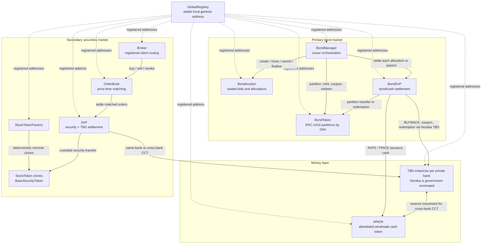

# Contract Topology

The deployed contract set contains two related market paths: the actively
operated primary bond lifecycle and a secondary securities/order-book path.
`GlobalRegistry` is address discovery, not an authorization boundary.

The bond and stock token models shown here are current. ADR 0002 adopts a
future migration to canonical ERC-3643 for securities, but that implementation
has not landed. `OrderBookFactory`, `BondOrderBook`, and
`BondOrderBookFactory` exist in source but are not instantiated by the default
deployment scripts; the deployed secondary-market path uses a directly created
`OrderBook` for the stock token.
