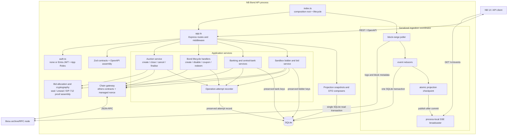

# NB Bond API Components

The service is a modular monolith. `index.ts` is the composition root and
`app.ts` composes the HTTP pipeline; feature services and projection snapshots
keep transaction orchestration separate from response mapping.

Reads for bonds and auctions are projection-backed and checkpoint-consistent;
they do not fan out to Besu during ordinary composition.
