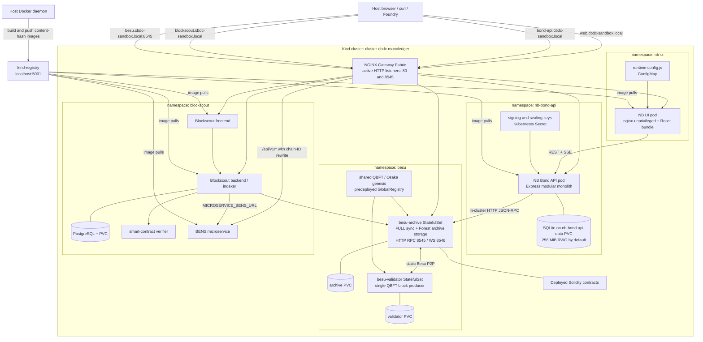

# Runtime Deployment

This view shows the default `./sandbox.sh start` deployment. Application,
indexing, deployment, and external JSON-RPC traffic uses the archive node; the
validator exposes only its minimal operator endpoint inside the cluster.

Besu WebSocket is enabled on `besu-archive` but is not routed through the
Gateway; it requires an in-cluster connection or explicit port-forward. The
NodePort service and Kind host mappings also reserve ports 443 and 8546, but
the current Gateway defines no listeners for either port. BENS has no separate
deployment toggle: it is built and deployed whenever the Blockscout step is
enabled.
