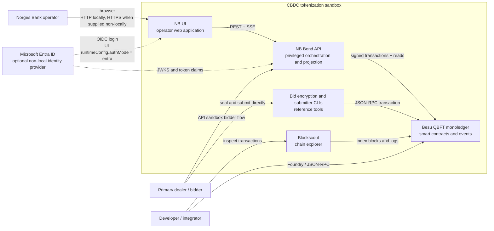

# System Context

The sandbox is a trusted-local environment for operating a CBDC-oriented
monoledger prototype. The browser operator path is the main supported product
surface; bidder CLIs and direct JSON-RPC remain reference/integration paths.

The local defaults are UI `runtimeConfig.authMode=none` (published to browser
`AUTH_MODE`) and API `NB_BOND_API_AUTH_MODE=none`. Entra is an optional
deployment mode, not part of the default Kind startup.
