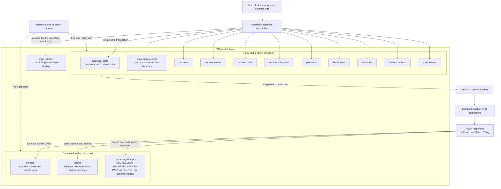

# Projection Data Model

The SQLite file deliberately combines two storage classes with opposite reset
semantics. Projection tables are disposable and rebuilt from chain events;
system-of-record tables preserve data the chain cannot reproduce.

`chain_identity` is preserved separately so the service can reject a database
whose chain ID/genesis pair does not match the connected RPC chain. Never add a
locally generated row to a projection table: resync will erase it.
