# Sandbox Startup Flow

`./sandbox.sh start` is an ordered orchestration script, not a parallel
deployment controller. Deployment flags can skip components, but enabled
components retain the dependency gates shown here.

```mermaid
flowchart TD
    start(["./sandbox.sh start"])
    prereq["Check local prerequisites"]
    config["Load .env.sandbox overrides<br/>and require generated local fixtures"]
    hosts["Ensure *.cbdc-sandbox.local host entries"]
    registry["Require local Kind registry"]
    infraQ{"DEPLOY_INFRA?"}
    infra["Start/reuse Kind cluster<br/>deploy Gateway + Besu"]
    blockQ{"DEPLOY_BLOCKSCOUT?"}
    block["Compose and deploy Blockscout stack<br/>Postgres + BENS"]
    infraReady["If infra enabled:<br/>wait for Besu and Gateway readiness"]
    blockReady["If Blockscout enabled:<br/>wait for explorer readiness"]
    contractsQ{"DEPLOY_CONTRACTS?"}
    contracts["Deploy and configure contracts<br/>register addresses"]
    verifyQ{"DEPLOY_VERIFY_CONTRACTS?"}
    verify["Verify contracts against Blockscout"]
    apiQ{"DEPLOY_NB_BOND_API?"}
    api["Build/push content-hash image<br/>Helm deploy NB Bond API"]
    uiQ{"DEPLOY_NB_UI?"}
    ui["Build/push content-hash image<br/>Helm deploy NB UI"]
    finalReady["Wait for enabled endpoints"]
    done(["Print service URLs and finish"])

    start --> prereq --> config --> hosts --> registry --> infraQ
    infraQ -->|"yes"| infra --> blockQ
    infraQ -->|"no"| blockQ
    blockQ -->|"yes"| block --> infraReady
    blockQ -->|"no"| infraReady
    infraReady --> blockReady --> contractsQ
    contractsQ -->|"yes"| contracts --> verifyQ
    contractsQ -->|"no"| apiQ
    verifyQ -->|"yes"| verify --> apiQ
    verifyQ -->|"no"| apiQ
    apiQ -->|"yes"| api --> uiQ
    apiQ -->|"no"| uiQ
    uiQ -->|"yes"| ui --> finalReady
    uiQ -->|"no"| finalReady
    finalReady --> done
```

On a fresh registry, the pinned Blockscout backend/frontend images must first
be built with `./sandbox.sh build-images`; `registry-sync` pre-warms pinned
third-party images but does not build those source-based images.
