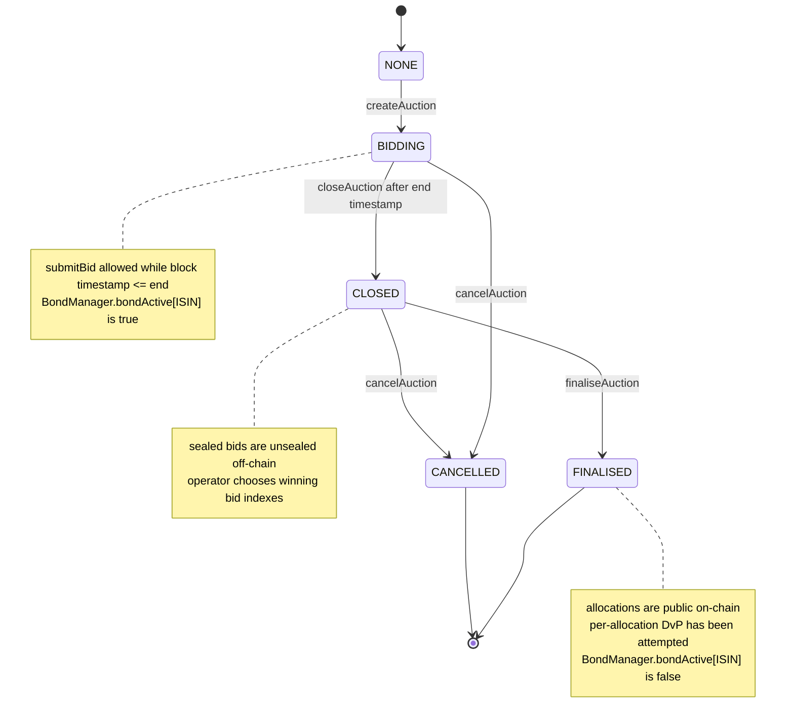
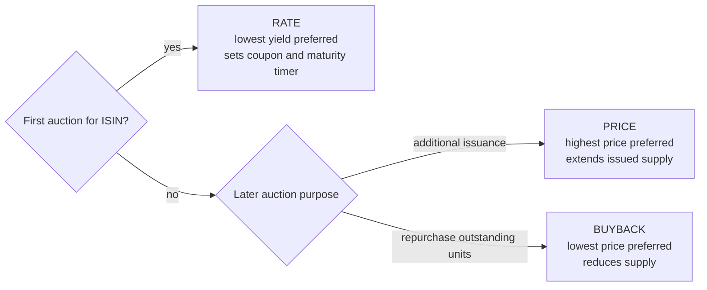

# Auction Lifecycle

`BondAuction` stores the authoritative state. The end timestamp soft-closes bid
submission, but an explicit issuer transaction performs the `BIDDING` to
`CLOSED` transition. Cancellation is allowed from bidding or closed.

Auction type constraints:

