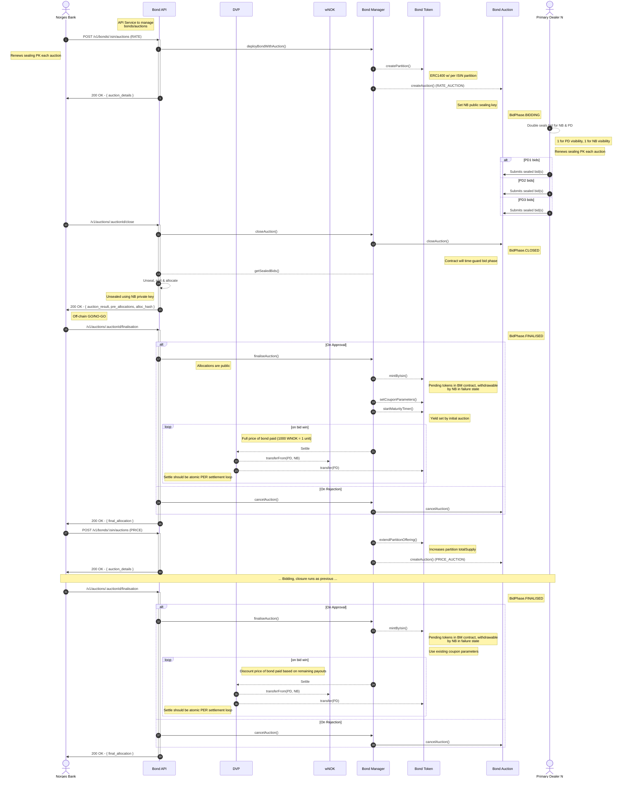

```mermaid
sequenceDiagram
    autonumber

    actor NB as Norges Bank
    participant API as Bond API
    participant DVP
    participant wNOK

    participant BM as Bond Manager
    participant BT as Bond Token
    participant BA as Bond Auction

    actor PD as Primary Dealer N

    note left of API: API Service to manage <br> bonds/auctions

    NB ->> API: POST /v1/bonds/:isin/auctions (RATE)
    activate API

    API ->> BM: deployBondWithAuction()

    note left of NB: Renews sealing PK each auction

    BM -->> BT: createPartition()
    note right of BT: ERC1400 w/ per ISIN partition

    BM -->> BA: createAuction() (RATE_AUCTION)

    API ->> NB: 200 OK - { auction_details }
    deactivate API

    note left of BA: Set NB public sealing key

    note right of BA: BidPhase.BIDDING

    PD --> PD: Double seals bid for NB & PD

    note right of PD: 1 for PD visibility, 1 for NB visibility
    note right of PD: Renews sealing PK each auction

    alt PD1 bids
        PD ->> BA: Submits sealed bid(s)
    else PD2 bids
        PD ->> BA: Submits sealed bid(s)
    else PD3 bids
        PD ->> BA: Submits sealed bid(s)
    end

    NB ->> API: /v1/auctions/:auctionId/close
    activate API

    API ->> BM: closeAuction()
    BM ->> BA: closeAuction()

    note right of BA: BidPhase.CLOSED
    note left of BA: Contract will time-guard bid phase

    API --> BM: getSealedBids()
    API -->> API: Unseal, sort & allocate
    note left of API: Unsealed using NB private key

    API ->> NB: 200 OK - { auction_result, pre_allocations, alloc_hash }
    deactivate API

    note right of NB: Off-chain GO/NO-GO

    NB ->> API: /v1/auctions/:auctionId/finalisation
    activate API

    note right of BA: BidPhase.FINALISED

    alt On Approval
        API ->> BM: finaliseAuction()
        note left of DVP: Allocations are public
        BM -->> BT: mintByIsin()
        note right of BT: Pending tokens in BM contract, withdrawable <br /> by NB in failure state

        BM -->> BT: setCouponParameters()
        BM -->> BT: startMaturityTimer()

        note right of BT: Yield set by initial auction

        loop on bid win
            note right of DVP: Full price of bond paid (1000 WNOK = 1 unit)
            BM -->> DVP: Settle
            DVP -->> wNOK: transferFrom(PD, NB)
            DVP -->> BT: transfer(PD)
            note left of DVP: Settle should be atomic PER settlement loop
        end
    else On Rejection
        API ->> BM: cancelAuction()
        BM ->> BA: cancelAuction()
    end

    API ->> NB: 200 OK - { final_allocation }
    deactivate API

    NB ->> API: POST /v1/bonds/:isin/auctions (PRICE)
    activate API

    BM -->> BT: extendPartitionOffering()
    note right of BT: Increases partition totalSupply

    BM -->> BA: createAuction() (PRICE_AUCTION)

    API ->> NB: 200 OK - { auction_details }
    deactivate API

    note over NB, PD: ... Bidding, closure runs as previous ...

    NB ->> API: /v1/auctions/:auctionId/finalisation
    activate API

    note right of BA: BidPhase.FINALISED

    alt On Approval
        API ->> BM: finaliseAuction()
        BM -->> BT: mintByIsin()
        note right of BT: Pending tokens in BM contract, withdrawable <br /> by NB in failure state

        note right of BT: Use existing coupon parameters

        loop on bid win
            note right of DVP: Discount price of bond paid based on remaining payouts
            BM -->> DVP: Settle
            DVP -->> wNOK: transferFrom(PD, NB)
            DVP -->> BT: transfer(PD)
            note left of DVP: Settle should be atomic PER settlement loop
        end
    else On Rejection
        API ->> BM: cancelAuction()
        BM ->> BA: cancelAuction()
    end

    API ->> NB: 200 OK - { final_allocation }
    deactivate API
```
