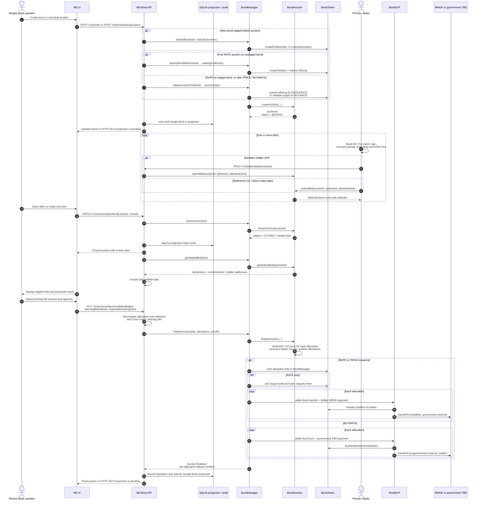

# Sealed-Bid Auction Sequence

This is the current API and contract flow for RATE, PRICE, and BUYBACK
auctions. The operator chooses winning on-chain bid indexes; the API recomputes
the result over exactly that selection and refuses a clearing-rate mismatch.

Each `BondDvP.settle` call is atomic. Auction settlement as a whole is not:
`BondManager` catches a failed allocation, emits `BondAllocationFailed`, and
continues. A RATE/PRICE failure can therefore leave minted units in
`BondManager` for `withdrawFailedIssuance` while the auction remains
`FINALISED`.
