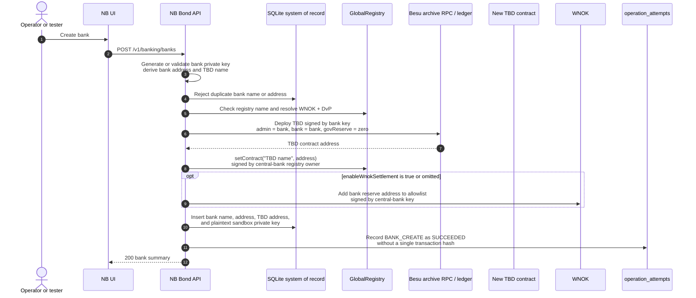

# Sandbox Bank Creation Sequence

Bank creation is a sandbox-only orchestration that creates a bank signing key,
deploys its TBD token, registers the token, optionally enables WNOK settlement,
and finally preserves the bank record in SQLite.

This is not an atomic workflow: contract deployment, registry registration,
optional WNOK allowlisting, and the SQLite insert are separate operations. A
failure after deployment can leave on-chain side effects without a bank row.
The current audit wrapper records the overall request as `REVERTED` or `FAILED`;
the reserved `PARTIAL` status is not yet assigned to this case.
