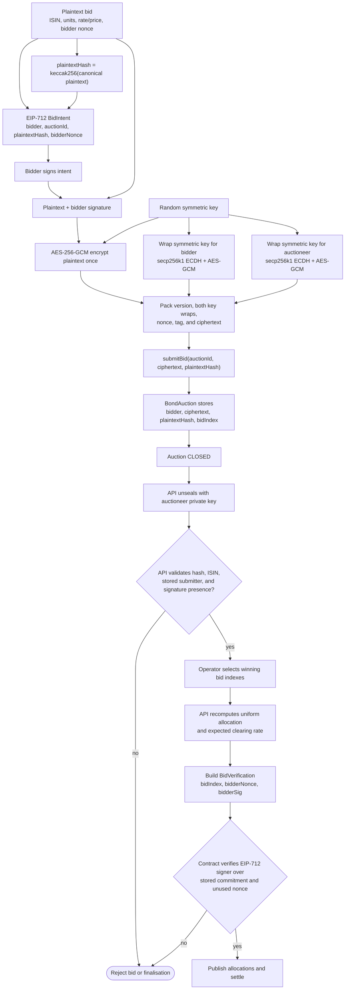

# Bid Cryptography Flow

The auction contract stores encrypted bids plus a plaintext commitment. Bid
contents are disclosed to the API only after off-chain unsealing; finalisation
proves that every allocated bidder signed the submitted bid intent.

The auctioneer sealing private key is operationally critical: losing or
rotating it while an auction is open makes those stored ciphertexts unusable.
