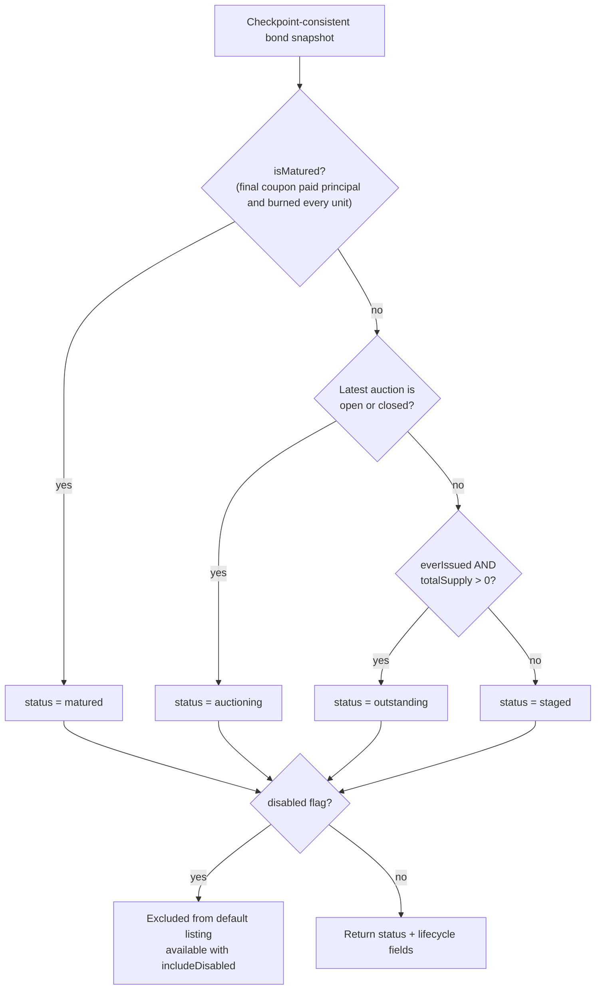
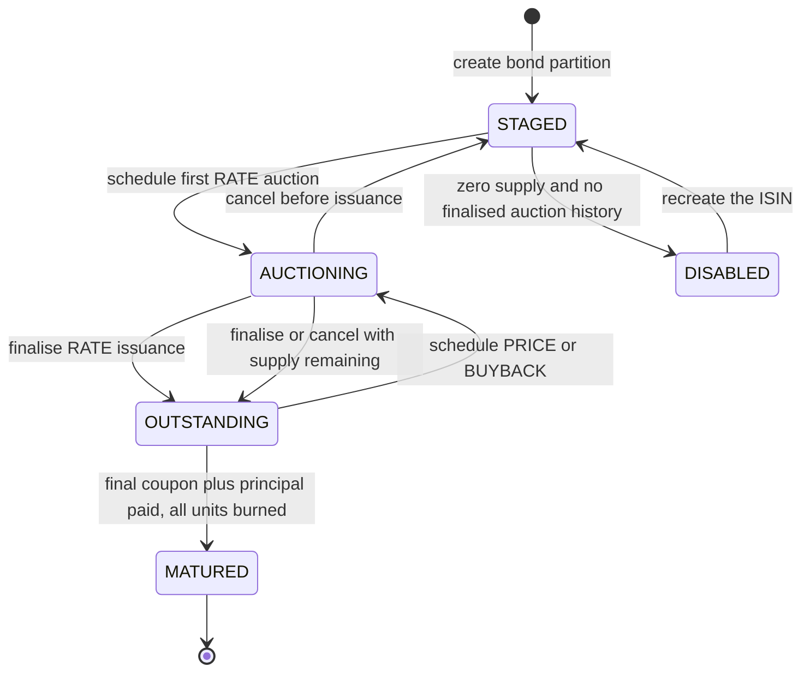

# Bond Lifecycle

The API derives a bond's displayed status from replayed events, current supply,
and the latest auction. `disabled` is a separate soft-delete flag rather than a
member of the public status enum.

The normal lifecycle is:

`MATURED` is terminal: the final `payCoupon` pays coupon plus principal to every
holder, burns unsold units the manager holds without payment, and emits
`BondMatured` once (ADR 0005). A full pre-maturity BUYBACK can reduce supply to
zero without maturing the bond; under the current classifier it falls back to
`staged`. That is current behavior, not a recommended domain model.
