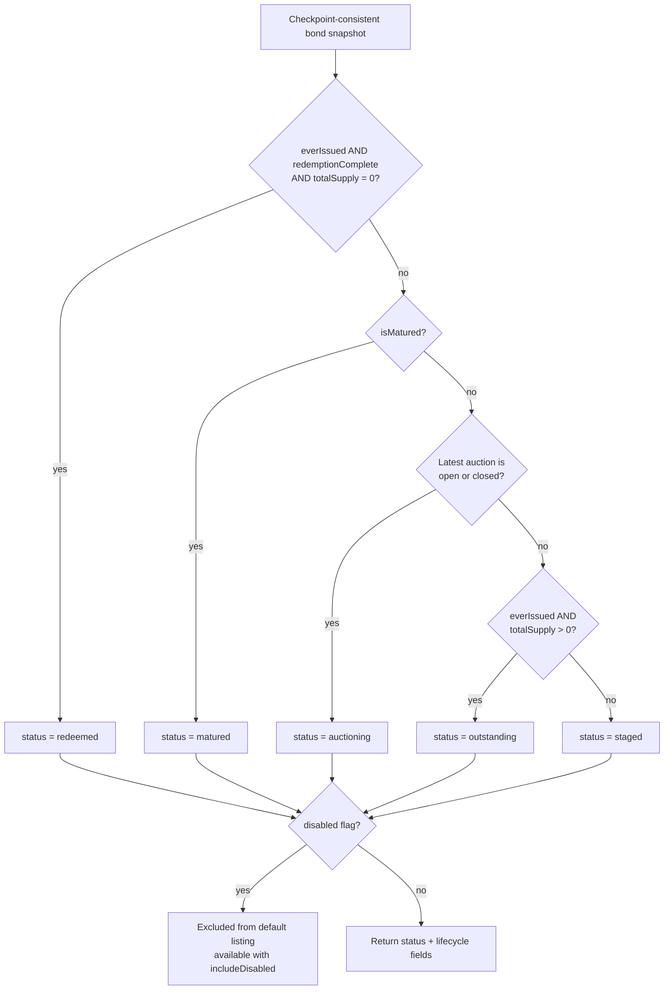
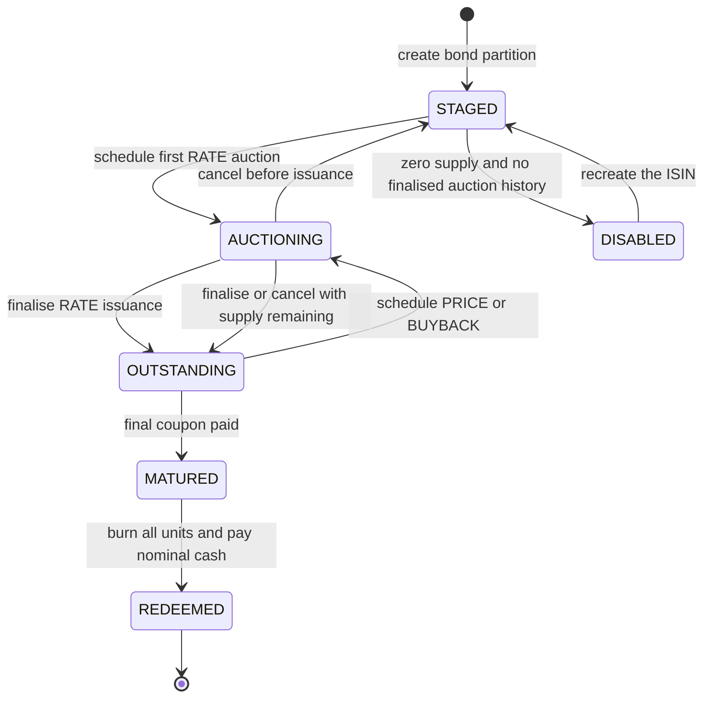

# Bond Lifecycle

The API derives a bond's displayed status from replayed events, current supply,
and the latest auction. `disabled` is a separate soft-delete flag rather than a
member of the public status enum.

The normal lifecycle is:

A full pre-maturity BUYBACK can reduce supply to zero without setting
`redemptionComplete`; under the current classifier it falls back to `staged`,
not `redeemed`. That is current behavior, not a recommended domain model.
