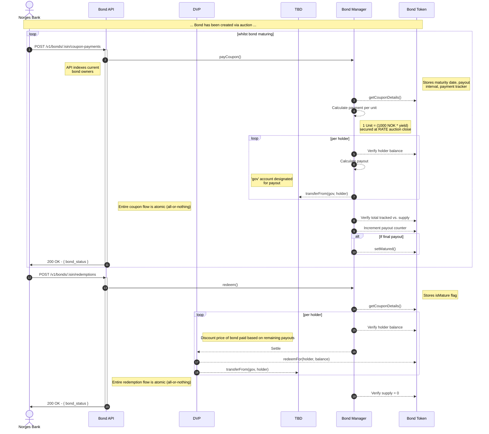

```mermaid
sequenceDiagram
    autonumber

    actor NB as Norges Bank
    participant API as Bond API
    participant DVP
    participant TBD as TBD

    participant BM as Bond Manager
    participant BT as Bond Token

    note over NB, BT: ... Bond has been created via auction ...

    loop whilst bond maturing
        NB ->> API: POST /v1/bonds/:isin/coupon-payments
        activate API

        API ->> BM: payCoupon()

        note left of API: API indexes current <br> bond owners

        note right of BT: Stores maturity date, payout <br> interval, payment tracker

        BM -->> BT: getCouponDetails()

        BM -->> BM: Calculate payment per unit

        note right of BM: 1 Unit = (1000 NOK * yield) <br> secured at RATE auction close

        loop per holder
            BM -->> BT: Verify holder balance
            BM -->> BM: Calculate payout
            note left of TBD: 'gov' account designated <br> for payout
            BM -->> TBD: transferFrom(gov, holder)
        end
        note left of DVP: Entire coupon flow is atomic (all-or-nothing)

        BM -->> BT: Verify total tracked vs. supply

        BM -->> BT: Increment payout counter

        alt If final payout
            BM -->> BT: setMatured()
        end

        API ->> NB: 200 OK - { bond_status }
        deactivate API
    end

    NB ->> API: POST /v1/bonds/:isin/redemptions
    activate API

    API ->> BM: redeem()

    note right of BT: Stores isMature flag

    BM -->> BT: getCouponDetails()

    loop per holder
        BM -->> BT: Verify holder balance
        note right of DVP: Discount price of bond paid based on remaining payouts
        BM -->> DVP: Settle
        DVP -->> BT: redeemFor(holder, balance)
        DVP -->> TBD: transferFrom(gov, holder)
    end
    note left of DVP: Entire redemption flow is atomic (all-or-nothing)

    BM -->> BT: Verify supply = 0

    API ->> NB: 200 OK - { bond_status }
    deactivate API
```
