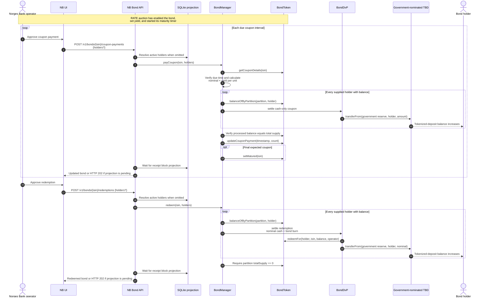

# Coupon and Redemption Sequence

Coupon and redemption cash is the government-nominated TBD, paid from its
configured government reserve. The API derives holders from the chain
projection unless the operator supplies an explicit list.

Unlike auction allocation settlement, these loops do not catch DvP failures.
Any failure reverts the entire coupon or redemption transaction. Coupon payout
also reverts unless the supplied holders account for the full partition supply;
redemption reverts unless no supply remains afterward.
