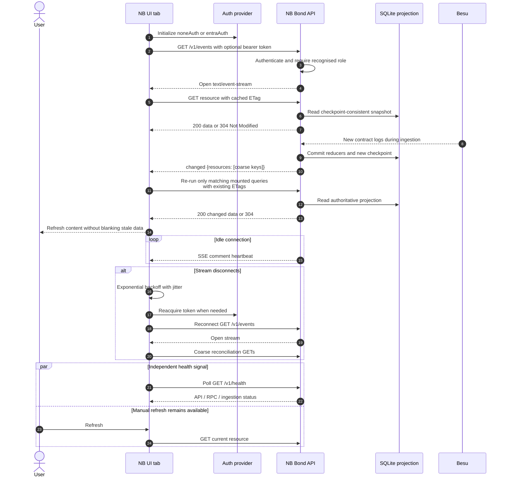

# Live Update and Revalidation Flow

SSE messages are notification-only. They carry coarse resource keys and never
replace the REST projection as the source of truth.

There is no replay buffer or `Last-Event-ID` contract. Reconciliation on every
connection recovers missed changes. The broadcaster is process-local, so this
implementation is intentionally deployed with one API replica.
