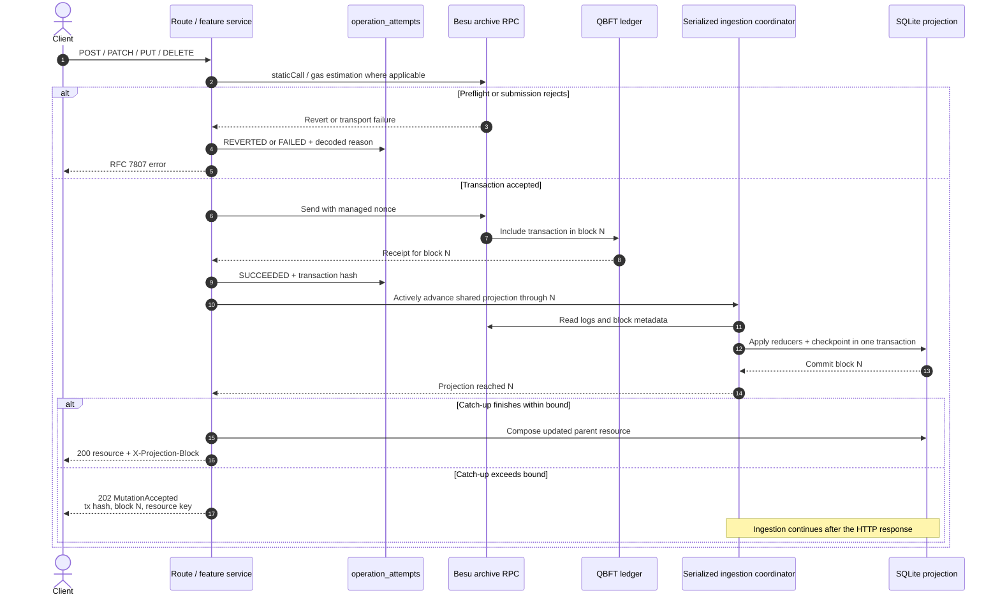

# Mutation and Projection Catch-Up

Mutation responses are projection-aligned. A mined transaction is never
reported as failed merely because ingestion did not catch up within the bounded
HTTP wait. This flow applies to projection-backed bond and auction mutations;
local-record mutations and direct WNOK/TBD administration compose their
responses through different paths.

Clients must not retry a `202` as though the transaction failed. They should
poll or revalidate the identified resource until its projection includes the
receipt block.
