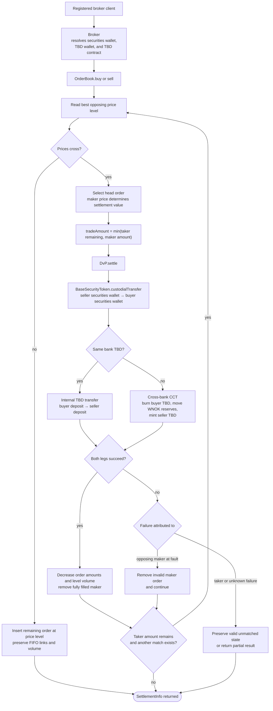

# Secondary-Market Matching and Settlement

Registered retail clients submit orders through their broker. The order book
resolves the best opposing price, applies price-time order, and invokes the
general DvP contract for the security and tokenized-deposit legs.

Each matched slice is one atomic DvP call. A larger order may fill through
multiple DvP calls inside the same submitted order transaction; caught failures
can therefore leave earlier successful slices settled. The order book reports
whether the order was fully settled, still valid, and how much traded.
