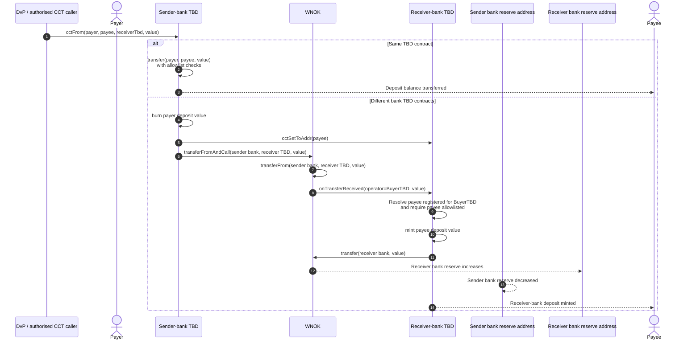

# TBD Cross-Bank Transfer

TBD is a liability of one bank. An inter-bank customer payment burns the
sender-bank deposit, moves WNOK reserves between banks, and mints an equal
deposit at the receiving bank through the ERC-1363 callback path.

All calls execute in one EVM transaction. Any allowlist, balance, role,
allowance, or callback failure reverts the burn, reserve movement, and mint.
