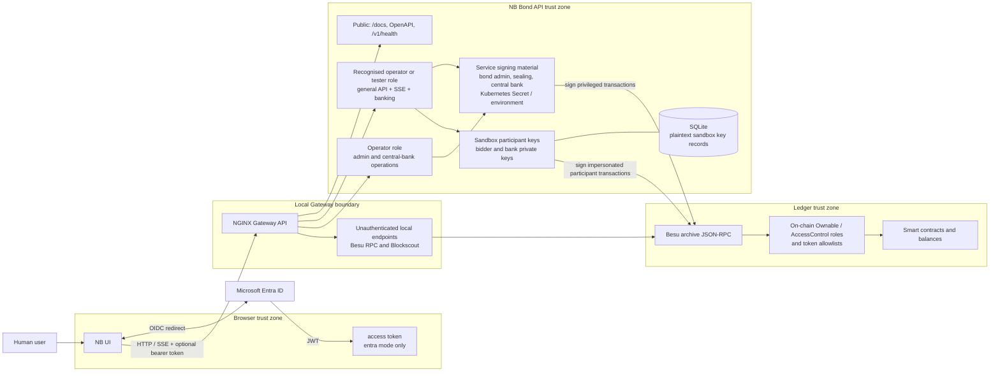

# Trust Boundaries

The entire default deployment is a trusted-local sandbox. The optional Entra
mode adds identity and role checks, but it does not turn the local topology,
fixture keys, or operational defaults into a production security design.

Security consequences:

- API `NB_BOND_API_AUTH_MODE=none` makes its role gates no-ops; UI
  `runtimeConfig.authMode=none` disables the login flow. Both are local defaults.
- API authorization and on-chain authorization are independent layers; a valid
  web role does not replace the contract role held by the signing address.
- The API intentionally stores fixture bidder and bank keys in plaintext and
  can hold issuer/central-bank keys. It must not be exposed as a real custody
  system.
- Failed gas-estimation attempts never reach the ledger; the preserved
  `operation_attempts` table is their only durable audit record.
- `PARTIAL` is a reserved audit status but is not currently written. A mined
  auction finalisation with failed allocations returns successfully and is
  therefore recorded as `SUCCEEDED`; allocation events must be inspected to
  identify its partial settlement outcome.
