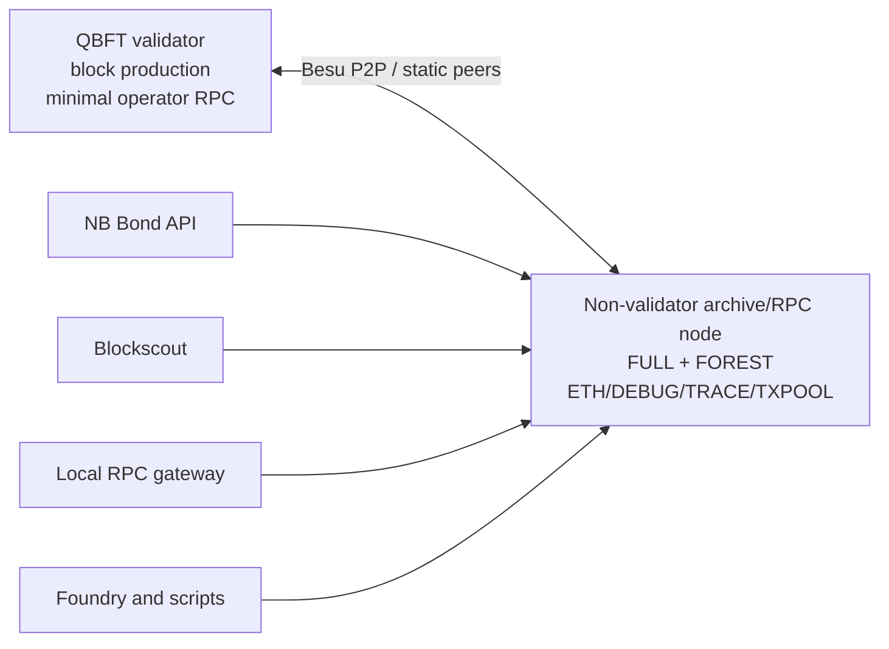

# Besu QBFT + Osaka Upgrade Plan

**Status:** Completed and archived after clean-cluster acceptance
**Last reviewed:** 2026-07-16
**Scope:** local sandbox baseline; Azure and production deployments must consume the
result deliberately rather than treating the local Helm chart as production-ready.

> **Post-acceptance note:** the repository's idle empty-block period was changed
> from the accepted 5-second spike value to 300 seconds for the low-TPS sandbox.
> The evidence below intentionally records the 5-second acceptance run; the
> later timing change alters genesis identity and requires a clean recreation.

## Objective

Replace the current Besu 26.1.0, single-node Clique + London chain with a clean
Besu 26.7.0 QBFT network that:

- activates the latest released Ethereum execution milestone, Osaka, from genesis;
- compiles contracts with Solidity 0.8.36 for the Osaka EVM;
- upgrades OpenZeppelin Contracts and Contracts Upgradeable from 5.4.0 to the latest
  stable 5.6.1 release;
- separates consensus/block production from application reads by running one QBFT
  validator and one non-validator Forest archive/RPC node;
- routes Blockscout, NB Bond API, deployment tools, and the local RPC gateway through
  the archive/RPC node;
- uses explicit Besu P2P connectivity suitable for adding more test nodes later;
- retains chain ID 2018, the zero-base-fee/free-gas model, and the deterministic
  genesis-predeployed `GlobalRegistry` address; and
- makes the required destructive chain replacement explicit and safe.

## Baseline at Assessment Time

Before this implementation, the tracked local chart ran one combined Besu node:

- `hyperledger/besu:26.1.0` is pinned in `common/images.yaml` and
  `infra/besu/values.yaml`;
- `infra/besu/config/genesis.json` selects Clique, activates London at block zero,
  disables empty blocks, and embeds one Clique signer in `extraData`;
- `infra/besu/config/config.toml` enables the Clique RPC namespace and configures
  `FULL` sync with `FOREST` storage;
- the same pod signs blocks, serves application RPC, supplies Blockscout traces, and
  stores historical state;
- `contracts/foundry.toml` pins Solidity 0.8.35, targets London, and pins both
  OpenZeppelin packages to 5.4.0; and
- contract deployment reuse is identified by chain ID and registry address, which is
  insufficient when a new genesis deliberately retains chain ID 2018.

Besu 26.4.0 removed pure Clique support. Moving beyond 26.1.0 therefore requires a
consensus change. A new QBFT genesis cannot be opened on the existing Clique data
directory, so this is a greenfield local-chain replacement rather than a rolling
upgrade.

## Target Decisions

| Concern | Decision |
|---|---|
| Besu image | `hyperledger/besu:26.7.0` |
| Consensus | QBFT with block-header validator selection |
| Validator count | One in the default local sandbox; explicitly not Byzantine fault tolerant |
| Read node | One non-validator archive/RPC node |
| Archive storage | `FULL` sync plus `FOREST` data storage |
| Execution milestone | Osaka active from genesis; do not activate draft Amsterdam |
| Solidity | 0.8.36, compiling for `evm_version = "osaka"` |
| OpenZeppelin | Contracts and Contracts Upgradeable 5.6.1; do not use 5.7.0 release candidates |
| Chain/network ID | 2018 |
| Fees | `zeroBaseFee: true`, `baseFeePerGas: 0`, minimum gas price and priority fee zero |
| Transaction pool | `SEQUENCED` on validator and archive/RPC; required for unfunded zero-fee signing roles |
| Block timing | 1-second block period; 5-second empty-block period initially |
| QBFT timeout | 2 seconds initially, tuned only from observed round-change logs |
| Block gas limit | 60,000,000 candidate baseline; every transaction remains subject to Osaka's 16,777,216 cap |
| Peer connectivity | Static nodes for the fixed validator/archive pair |
| Dynamic test nodes | Out of scope; extend static-peer configuration explicitly when needed |
| Migration | Full sandbox delete and clean recreation |

## Target Topology



The validator and archive node must have distinct node keys, data directories, PVCs,
services, and Kubernetes identities. Replicating a StatefulSet while sharing a
validator key is prohibited.

A beacon node is not part of this design. Beacon nodes such as Teku implement
Ethereum proof-of-stake consensus and control execution clients through the Engine
API. QBFT consensus runs inside Besu. A bootnode profile is also outside the agreed
scope; additional test nodes must be connected deliberately through explicit peer
configuration, independently of QBFT validator membership.

## Phase 0 — Isolated Compatibility Spike

Use disposable infrastructure that cannot mutate the working sandbox.

1. Start Besu 26.7.0 on an isolated Docker network with:
   - one QBFT validator;
   - one non-validator `FULL` + `FOREST` archive/RPC node;
   - distinct persistent test directories and node keys; and
   - static P2P connectivity.
2. Generate QBFT `extraData` using Besu's `rlp encode` command and decode it again to
   prove the initial validator list.
3. Exercise an Osaka-at-genesis, zero-base-fee candidate genesis.
4. Confirm:
   - the validator creates blocks, including empty blocks;
   - the archive node follows head but is absent from the validator set;
   - transactions submitted to the archive node are propagated and mined;
   - historical state, logs, and traces can be queried from the archive node;
   - stopping the archive does not stop consensus; and
   - stopping the sole validator stops new blocks while historical reads remain.
5. Compile the full contract suite with Solidity 0.8.36 and Osaka.
6. Compile and test against OpenZeppelin 5.6.1 using both standard and upgradeable
   packages.
7. Compare contract size, creation/runtime bytecode, storage layouts, CREATE2
   addresses, events, errors, and deployment gas against the old build.
8. Deploy the complete suite to the archive/RPC endpoint and prove that no
   transaction declares more than 16,777,216 gas.
9. Point an isolated Blockscout instance at the archive node and validate head sync,
   tracing, and Solidity 0.8.36 contract verification.

**Exit gate:** no tracked runtime baseline changes land until the validator/archive
spike, contract deployment, and Blockscout tests pass. Record commands and results in
the Phase 0 evidence section at the end of this document.

## Phase 1 — Besu Image, Genesis, and Consensus

Update the Besu image in:

- `common/images.yaml`;
- `infra/besu/values.yaml`; and
- any version-specific documentation and license inventory.

Replace the Clique genesis with a generated QBFT/Osaka genesis:

- retain chain ID 2018, zero base fee, and the existing `GlobalRegistry` address and
  owner storage;
- activate London, Shanghai, Cancun, Prague, and Osaka at genesis using the
  Besu-supported milestone fields;
- configure `blockperiodseconds: 1`, `emptyblockperiodseconds: 5`,
  `epochlength: 30000`, and `requesttimeoutseconds: 2`;
- generate rather than hand-assemble QBFT `extraData`;
- set header fields to Besu's QBFT-compatible values;
- use a 60,000,000 candidate block gas limit; and
- embed the final Solidity 0.8.36/Osaka/OpenZeppelin 5.6.1 `GlobalRegistry` runtime
  bytecode.

Do not configure BPO1/BPO2 unless blob transactions become an explicit sandbox
requirement. They adjust blob parameters and are not needed for the Osaka EVM opcode
baseline.

Replace `CLIQUE` with `QBFT` in the operator RPC namespace. Do not expose broad RPC
namespaces from the validator through the application gateway.

## Phase 2 — Split Validator and Archive/RPC Roles

Refactor `infra/besu/` into explicit roles rather than scaling the current pod:

- validator StatefulSet, service, config, key secret/config source, and PVC;
- archive StatefulSet, RPC/WS service, config, node key, and PVC;
- headless or stable node-specific P2P services; and
- role-specific readiness/liveness probes.

Validator configuration:

- QBFT validator key mounted only into the validator;
- no application-facing JSON-RPC/WS route;
- minimal operator APIs;
- unique data directory and node key; and
- `tx-pool = "SEQUENCED"` with local priority disabled, preserving zero-fee
  transactions from unfunded sandbox signing roles; and
- Bonsai is acceptable unless Phase 0 finds a QBFT-specific reason to retain Forest.

Archive configuration:

- non-validator identity absent from QBFT genesis `extraData`;
- `sync-mode = "FULL"`;
- `data-storage-format = "FOREST"`;
- ETH, NET, WEB3, DEBUG, TRACE, TXPOOL, and optional read-only QBFT inspection APIs;
- HTTP/WS bound only as needed for the trusted local cluster; and
- separate storage sizing from the validator.

Set `p2p-host` to the downward-API-injected pod IP rather than `127.0.0.1` or a
DNS name; Besu 26.7 requires a literal IP. Configure static node enodes for the
validator/archive pair by resolving their stable headless-service DNS names to
pod IPs in init containers, then verify restart and reconnection behavior.

Update all consumers to use the archive service:

- NB Bond API `RPC_URL`;
- Blockscout HTTP, WebSocket, and trace URLs;
- local gateway RPC backend;
- Foundry endpoint and deployment scripts; and
- readiness/wait helpers and operational documentation.

## Phase 3 — Solidity, OpenZeppelin, and Generated Artifacts

Update `contracts/foundry.toml`:

```toml
solc = "0.8.36"
evm_version = "osaka"
"@openzeppelin-contracts" = "5.6.1"
"@openzeppelin-contracts-upgradeable" = "5.6.1"
```

Update `contracts/soldeer.lock` and `contracts/remappings.txt` together. Do not use
OpenZeppelin 5.7.0 release candidates.

Keep source pragmas at `^0.8.29` unless a contract deliberately begins using a
0.8.36-only language feature. The pinned Foundry compiler determines the actual
compiler; mechanically increasing every pragma would create churn and unnecessarily
drop source compatibility.

Align CI and documented Foundry versions with a stable release supporting Solidity
0.8.36 and Osaka. Avoid relying on an unpinned nightly.

Verification requirements:

- `forge fmt --check`, `forge build --sizes`, full tests, and Slither;
- storage-layout comparison for upgradeable bases and `StockToken` clones;
- clone initialization exactly once and implementation initialization disabled;
- access-control, token, signature, EIP-712, SafeERC20, reentrancy, and CREATE2 tests;
- creation/runtime bytecode and deployment-gas comparison;
- regeneration of ABI, broadcast, documentation, and Blockscout verification
  artifacts; and
- license inventory verification after dependency changes.

## Phase 4 — Safe Chain Replacement and Identity Checks

The supported cutover is:

1. Stop writes.
2. Capture the old client version, genesis hash, head, validator/signer, and deployed
   addresses.
3. Export local-only bidder/bank records if the operator wants to preserve them.
4. Run `./sandbox.sh delete` to remove Besu, Blockscout, NB Bond API, contract markers,
   and their cluster-local persistent volumes together.
5. Sync the new images and recreate the sandbox from clean storage.
6. Deploy contracts, rebuild application projections, and allow Blockscout to index
   from the new genesis.

Do not silently delete data from `start`. When stale identity is detected, fail with
an actionable reset message.

Strengthen reuse checks:

- store genesis block hash with the contract deployment marker;
- query `eth_getCode` at the recorded registry address before skipping deployment;
- treat same chain ID plus different genesis hash as a different chain;
- prevent Blockscout from reusing a database belonging to the old genesis; and
- add an NB Bond API chain-identity check before accepting an existing projection
  checkpoint.

Rollback is also destructive: restore the old code and pins, delete the QBFT sandbox,
and recreate Clique/London from clean storage. Databases are not portable between the
two genesis blocks.

## Phase 5 — Consensus-Dependent Application Cleanup

Update code and tests that describe Clique or transaction-only block production,
including:

- `services/nb-bond-api/src/ingestion.ts`;
- `services/nb-bond-api/tests/ingestion.test.ts`;
- `services/nb-bond-api/src/env-vars.ts`; and
- auction-close known-issue/runbook text.

Keep the single-block ingestion regression test because it is consensus-independent.
Retain the explicit close-auction gas fallback for one release as defensive behavior,
then consider removing it separately after QBFT empty-block evidence shows normal
estimation is reliable.

Remove the documented `0x1ffffffffffffe` transaction gas limit. Osaka rejects every
transaction declaring more than 16,777,216 gas regardless of block gas limit.

## Phase 6 — Automated Baseline and Topology Validation

Add repository checks for:

- matching Besu image pins;
- QBFT present and Clique absent;
- generated QBFT `extraData` decoding to the expected validator list;
- chain ID/network ID consistency;
- Foundry Osaka target matching the genesis milestone;
- zero-base-fee consistency;
- compiled `GlobalRegistry` runtime matching genesis alloc code;
- distinct node keys, PVCs, and services;
- archive configuration remaining `FULL` + `FOREST`;
- application and Blockscout endpoints pointing only to archive/RPC; and
- Helm rendering and JSON/TOML validity.

CI should perform a small two-node startup smoke where feasible. It must at least
render both roles and validate their static-peer and key wiring.

## Phase 7 — Documentation and Architecture Decision

Create ADR 0003 covering:

- removal of Clique from modern Besu;
- the QBFT choice and one-validator local limitation;
- separate archive/RPC role;
- Osaka rather than draft Amsterdam;
- free gas, block timing, and static-peer decisions;
- destructive chain replacement; and
- static-peer scope and the rejected beacon-node/bootnode designs.

Mark ADR 0001 as superseded by ADR 0003 without rewriting its historical decision.

Update at minimum:

- `README.md` where the exposed RPC topology is described;
- `infra/README.md` and `infra/DEVELOPMENT.md`;
- `infra/besu/config/README.md`;
- `docs/ARCHITECTURE.md`, `docs/AZURE_BOUNDARY.md`, and `docs/KNOWN_ISSUES.md`;
- `docs/DOCUMENTATION_INDEX.md` and `docs/decisions/README.md`;
- contract build/deployment documentation;
- `docs/THIRD_PARTY_NOTES.md` and `THIRD_PARTY_LICENSES.md`; and
- Blockscout/Besu debugging instructions.

Run public-repository hygiene, Markdown-link, and third-party-license checks.

## End-to-End Acceptance Criteria

1. Besu reports version 26.7.0 on both nodes and chain ID `0x7e2`.
2. `qbft_getValidatorsByBlockNumber("latest")` returns only the expected validator.
3. Validator and archive report different node IDs and show each other as peers.
4. Empty blocks advance and chain timestamp remains within the configured tolerance.
5. Transactions submitted to archive/RPC are propagated and mined by the validator.
6. Stopping archive/RPC does not stop blocks; stopping the sole validator does.
7. Archive/RPC serves historical state, logs, receipts, and traces from old blocks.
8. Recreating archive from empty storage performs a verified full sync from genesis.
9. Applications and Blockscout contain no validator RPC URL.
10. Zero gas price/base fee behavior remains intact.
11. A transaction declaring more than 16,777,216 gas is rejected.
12. Solidity 0.8.36/Osaka and OpenZeppelin 5.6.1 build, test, lint, and analyze cleanly.
13. Clone initialization, storage layout, CREATE2, signatures, roles, and complete
    contract lifecycle tests pass.
14. Genesis `GlobalRegistry` has expected code, address, owner, and functionality.
15. Blockscout reaches head, traces transactions, and verifies a 0.8.36 contract.
16. NB Bond API ingestion reaches head and recovers after archive/RPC restart.
17. Full auction and settlement workflows pass.
18. Chain-identity guards prevent reuse of Clique-era markers and databases.
19. Repository hygiene, links, licenses, Helm rendering, and baseline checks pass.

## Suggested Delivery Sequence

- **PR 1:** Phase 0 evidence and reusable validation fixtures/scripts only.
- **PR 2:** Besu/QBFT two-role chart, generated genesis, P2P wiring, and chain-reset
  safety. Keep consumer endpoint changes in this PR so no intermediate deployment
  points applications at the validator.
- **PR 3:** Solidity 0.8.36, Osaka, OpenZeppelin 5.6.1, generated artifacts, and
  dependency/license updates. If bytecode review is large, split standard-library and
  artifact regeneration into reviewable commits within the same PR.
- **PR 4:** Application assumption cleanup, automated topology/baseline tests, ADR,
  and final documentation.

Do not deploy an image-only, genesis-only, or Clique-RPC-removal intermediate state.
Those combinations are intentionally invalid.

## Tracked Implementation Status

As of 2026-07-16, the repository contains the Besu 26.7.0 QBFT/Osaka genesis,
separate validator and Forest archive/RPC StatefulSets, static peer identities,
archive-only consumer routing, Solidity 0.8.36, OpenZeppelin 5.6.1, genesis-aware
contract/Blockscout/NB API reuse guards, automated baseline CI, ADR 0003, and
updated operator documentation.

The destructive Kind cutover was completed with explicit operator approval on
2026-07-16. All acceptance criteria passed subject to the documented Slither
baseline below.

Local Slither ran successfully over 67 contracts with the new compiler but still
reports the repository's existing warning baseline (182 findings) and exits 255.
No Solidity source changed in this migration, so resolving that broad warning set
is not bundled into the consensus/toolchain upgrade. Acceptance criterion 12 is
therefore satisfied for build/test/format but not yet for a clean static-analysis
result; the warning disposition remains explicit rather than being suppressed.

## Clean-Cluster Acceptance Evidence

The supported destructive cutover completed on 2026-07-16.

- Captured the legacy identity before deletion: Besu 26.1.0, chain ID 2018,
  genesis `0xab8ff9246f1801e2af4cf58195e5f7b166b8d2a76217afdcefe458686cb25a5a`,
  head 81, and a contract marker without a genesis hash.
- Deleted and recreated the Kind cluster. The QBFT chain has genesis
  `0x94720868ff6d700f8d4476cc2a88ddcfe8e39c2dedfbb9a93478ea22ff5f8b6a`;
  contract and Blockscout markers record that hash with chain ID 2018.
- Both nodes report Besu 26.7.0. The archive and validator have distinct node
  IDs, see one mutual peer, and agree on the head. QBFT reports exactly validator
  `0xc777bfe2c2398beb62cd6897f913f1b64ee57ea6`.
- Live Kubernetes startup found that Besu rejects DNS for both `--p2p-host` and
  static enodes. The chart now advertises pod IPs and uses init containers to
  resolve stable peer DNS names into runtime static-node files. Validator and
  archive pod replacement both recovered with one peer.
- Empty blocks advanced on the configured five-second period. Transactions mined
  with zero effective gas price, while a transaction declaring 16,777,217 gas was
  rejected with `Transaction gas limit cap exceeded`.
- Archive/RPC returned historical code, receipts, block traces, and transaction
  traces. With archive scaled to zero, the validator continued producing blocks,
  the gateway returned 503, and NB Bond API reported `down`; all recovered after
  archive restart.
- With the sole validator scaled to zero, the archive head did not advance. Block
  production and the peer connection recovered after validator restart.
- Deleted `besu-archive-pvc`, recreated the `FULL` + `FOREST` archive from empty
  storage, caught it up to the validator, and re-read and re-traced the block-29
  DvP deployment.
- Blockscout recovered after both archive interruptions, indexed to the live head,
  and verified DvP with Solidity `v0.8.36+commit.8a079791`, Osaka, optimizer enabled,
  and 200 runs. Forge cannot verify the genesis-predeployed registry through the
  legacy creation-transaction API because no creation transaction exists; this is
  a Blockscout/Forge workflow limitation, not a bytecode mismatch.
- NB Bond API recovered to a healthy genesis-bound projection and completed a live
  RATE issuance: created bond `NO2026071601`, accepted DNB/Nordea sealed bids,
  closed at clearing rate 425, finalised 100 units, and projected 60/40 holdings.

## Phase 0 Evidence

Phase 0 started and completed on 2026-07-16. The spike uses a dedicated
Docker bridge, disposable volumes, and host ports 18545/28545; it does not use or
mutate the running Kind sandbox.

### Completed checks

- Pulled and started `hyperledger/besu:26.7.0` with image digest
  `sha256:8c6738c8a8ec9388a88914b5896fb710754320c93a5d5f213a7a1267bae22686`.
- Generated QBFT `extraData` with Besu's RLP command. Besu accepted an Osaka-at-
  genesis QBFT schedule and reported `Osaka:0`.
- Started one validator using Bonsai and one non-validator archive/RPC node using
  `FULL` + `FOREST`, with distinct keys/data volumes and mutual static peers.
- Confirmed both nodes have one peer, follow the same head, and report only
  `0xc777bfe2c2398beb62cd6897f913f1b64ee57ea6` in the QBFT validator set.
- Confirmed 5-second empty blocks, zero base fee, archive-submitted transaction
  propagation, successful mining, and zero effective gas price.
- Confirmed the archive serves historical balances, historical contract code, logs,
  receipts, and `debug_traceTransaction` call traces.
- Confirmed the validator continued producing blocks with the archive stopped; the
  archive caught up after restart. With the sole validator stopped, the archive head
  stayed fixed while historical reads remained available.
- Recreated the archive with an empty volume and confirmed a full Forest resync from
  genesis to validator head.
- Confirmed an Osaka transaction declaring gas `16,777,217` is rejected with
  `Transaction gas limit cap exceeded`.
- Compiled all 125 contract source/dependency files with Solidity 0.8.36, Osaka,
  OpenZeppelin Contracts 5.6.1, and Contracts Upgradeable 5.6.1.
- Ran all 23 Foundry suites under that matrix: 383 tests passed and 0 failed,
  including clone/CREATE2, invariant, access-control, signature, and integration
  coverage.
- Deployed the complete 11-script suite through the archive RPC endpoint: 75
  transactions (14 creates and 61 calls), 75 successful receipts, and no failed
  receipts. The maximum declared transaction gas was 4,968,056 and maximum actual
  gas used was 3,821,582, both safely below Osaka's 16,777,216 cap.
- Confirmed the deployed registry code (1,302 bytes) is readable at its deployment
  block and at latest from the archive, is also visible from the validator, emitted
  13 queried logs, and can be traced historically.
- Compared both complete production artifact sets (30 contracts) using fresh builds
  that included storage layouts. Twenty contracts have expected bytecode changes,
  but no public function, event, error, constructor, or return ABI changed. Every
  changed runtime became smaller; for example, `BondManager` decreased from 17,221
  to 16,990 bytes and `GlobalRegistry` decreased from 1,332 to 1,302 bytes.
- Compared actual gas across the same 74 transactions in deployment scripts 02–11.
  Total gas decreased from 27,292,515 to 26,758,468 (1.96%), and no compared
  transaction increased. The new 359,817-gas registry deployment is excluded because
  the old baseline predeploys that contract in genesis.
- Confirmed OpenZeppelin 5.6.1 changes storage layout only for `OrderBook` and
  `BondOrderBook`: `ReentrancyGuard` moves `_status` from sequential slot 1 to its
  namespaced slot, shifting the contracts' own sequential fields down one slot. Both
  contracts are non-upgradeable and will be recreated on the new chain, so this is
  acceptable for the greenfield replacement but is not compatible with in-place
  state reuse or a proxy upgrade.
- Confirmed both CREATE2 order-book address families change because their child
  creation bytecode changes. Determinism within the new build still passes tests, but
  old predicted addresses must not be carried across the chain reset.
- Started an isolated Blockscout backend 11.2.1 with PostgreSQL 18.4 and indexed from
  genesis through the archive node with internal-transaction fetching enabled. After
  the live workflow below it held 705 consensus blocks through head 704, 81
  transactions, 109 internal transactions, 98 logs, and all 14 created contracts.
  The API returned the maximum-gas deployment and its three internal calls, and the
  final auction transaction and its nine internal calls, with no trace errors.
- Started NB Bond API against the archive and new registry. It resolved the expected
  manager, auction, token, and WNOK contracts and reached head with zero ingestion
  lag and no failures.
- Completed a live application workflow on the disposable chain: created bond
  `NOQBFT000001`, scheduled a RATE auction, submitted and unsealed a bid, closed the
  auction, approved the allocation, finalised settlement, and confirmed 100 issued
  units held by the winning bidder with a 425-basis-point coupon.
- Stopped the archive during live ingestion. The validator continued, the API
  correctly reported the chain down, and both API and Blockscout recovered
  automatically after archive restart. Validator, archive, API projection, and
  Blockscout returned to the same head.
- After the repository-required double approval for its GPL-3.0 license, pulled the
  already-pinned `ghcr.io/blockscout/smart-contract-verifier:v1.10.3` image at digest
  `sha256:7d895b6de54bff18576cfebafcbcff1c4c63c91505c0a324284a19166930bb8a`.
  Verified the deployed `GlobalRegistry` through Blockscout using Solidity
  `v0.8.36+commit.8a079791`, Osaka, optimizer enabled with 200 runs, and the proposed
  OpenZeppelin 5.6.1 remappings. Blockscout returned `Pass - Verified` and exposes the
  15-entry ABI.

### Finding that changes the implementation

Besu 26.7.0's default layered transaction pool left a valid zero-fee contract
creation from an unfunded non-validator signing role pending indefinitely, even while
the validator continued creating empty blocks. Restarting the validator with
`tx-pool = "SEQUENCED"` immediately mined that transaction and allowed the remaining
deployment scripts to finish. Both roles must therefore retain the repo's sequenced
pool behavior. Merely setting `min-gas-price = 0` and `min-priority-fee = 0` is not
sufficient for this sandbox's current unfunded account model.

### Warnings and remaining exit-gate work

- Besu logs that Prague/Osaka system-contract request processors are skipped for PoA
  consensus when their addresses are absent. This is expected to be irrelevant to a
  QBFT chain with no Ethereum consensus layer, but it must be documented as an
  explicit private-chain decision and covered by a genesis/configuration check.
- Foundry emitted an upstream OpenZeppelin 5.6.1 warning that `error` may become a
  future Solidity keyword. It does not fail Solidity 0.8.36 compilation or tests.
- The local Foundry binary is a 1.6.0 nightly. The implementation must pin a stable
  Foundry release that supports Solidity 0.8.36 and Osaka.
- Blockscout indexing, tracing, Solidity 0.8.36 source verification, and the live NB
  Bond API workflow all pass. Phase 0's exit gate is open; tracked runtime work may
  begin in the atomic sequence defined above.
