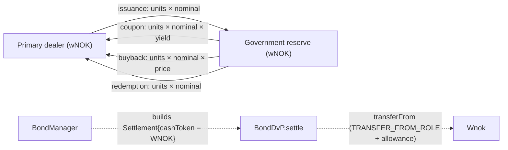

# Bond cash leg in wNOK — Design

**Status:** Draft
**Created:** 2026-09-07
**Intent:** [`intent.md`](intent.md)
**Builds on:** `docs/plans/closed-loop-settlement-and-omnibus-custody-plan.md` (Proposed; this
design precedes its Phase 1 and removes the two-token split its Phase 6 would otherwise have to
bridge), `docs/decisions/0004-settle-all-bond-cash-legs-in-wnok.md` (Proposed).

## Decision Summary

`BondManager` settles all four cash legs in one token, `WNOK`, against one government account,
`GOV_RESERVE`, passed to the constructor as an address. The `ITbd` import, `GOV_TBD`, and the
`govReserve()` lookup disappear. `BondDvP`, `IBondDvP`, `Wnok`, and `Tbd` are unchanged: the
DvP already takes the cash token per settlement, and `Wnok.transferFrom` under
`TRANSFER_FROM_ROLE` plus an allowance from the reserve account is the same mechanism the
issuance leg uses today. The deploy scripts move the reserve approval from the government TBD
to wNOK. The API replaces the "government settlement bank" field with the reserve account and
its wNOK balance. Docs and the two known issues are rewritten to match.



## Current-State Evidence

### Repository Evidence

| Finding | Evidence | Consequence |
|---|---|---|
| **Verified.** Issuance already settles in wNOK: `cashToken: WNOK, cashFrom: bidder, cashTo: _GOV_RESERVE` | `contracts/src/norges-bank/BondManager.sol` `_settleIssuance` | The auction leg needs no functional change; only its NatSpec and tests are touched |
| **Verified.** Buyback, coupon, and redemption settle in the government TBD: `cashToken: GOV_TBD, cashFrom: _GOV_RESERVE, cashTo: holder` | `_settleBuyback`, `payCoupon`, `redeem` in the same file | These three call sites are the cutover |
| **Verified.** `_GOV_RESERVE` is derived from `ITbd(GOV_TBD).govReserve()` in the constructor and rejected when zero | `BondManager` constructor | The reserve account already exists as a wNOK holder; the TBD is only the lookup path |
| **Verified.** A TBD transfer out of the reserve account pulls wNOK from the reserve into the TBD contract and mints TBD 1:1 (`_mintFromGovReserve`) | `contracts/src/private-bank/Tbd.sol` `_update` | Today every coupon is a wNOK debit plus a TBD mint; after the change it is one wNOK debit |
| **Verified.** `BondDvP._settleCashLeg` calls `IERC20(p.cashToken).transferFrom` and maps `ERC20InsufficientBalance`, `ERC20InsufficientAllowance`, and `AllowlistViolation` to `FailureReason.Cash` | `contracts/src/norges-bank/BondDvP.sol` | Works unchanged for wNOK; `Wnok.transferFrom` reverts with those same errors |
| **Verified.** `Wnok.transferFrom` requires the caller to hold `TRANSFER_FROM_ROLE` and enforces the allowlist on both parties; `BondDvP` already holds the role | `contracts/src/norges-bank/Wnok.sol`; `11_BondSetup.s.sol` | The only missing piece for the outbound leg is the reserve account's wNOK allowance to `BondDvP` |
| **Verified.** Local deploy: `07_WnokSetup.s.sol` allowlists the reserve account and mints it wNOK; `11_BondSetup.s.sol` allowlists both dealers on wNOK and on the government TBD, and has the reserve approve the government TBD for `BondDvP` | `contracts/script/norges-bank/07_WnokSetup.s.sol`, `11_BondSetup.s.sol` | Dealers can already receive wNOK; the TBD allowlisting and TBD approval become dead wiring |
| **Verified.** `10_Bond.s.sol` resolves `TBD_NORDEA_CONTRACT_NAME` from `GlobalRegistry` to pass as `_govTbd` | `contracts/script/norges-bank/10_Bond.s.sol` | Replace with the reserve address from `PK_GOV_RESERVE`; the bond stack no longer depends on the TBD scripts having run |
| **Verified.** `BondDvP.t.sol` already exercises cash-only coupon settlement in wNOK with a `couponEoa` payer | `contracts/test/norges-bank/BondDVP.t.sol` | The DvP layer is proven for this shape; the new tests live at the `BondManager` layer |
| **Verified.** `BondManager.t.sol` and `BondLifecycle.t.sol` deploy a `Tbd`, fund it, and assert payout deltas on `govTbd.balanceOf` | test fixtures and assertions listed in `plan.md` | Fixtures shrink; assertions move to `wnok.balanceOf` |
| **Verified.** The API exposes `govSettlementBank {name, address}` on the Central Bank resource by calling `BondManager.GOV_TBD()` and matching it against the TBD roster; failures degrade to `null` | `services/nb-bond-api/src/banking-tbd.ts` `getGovSettlementBank`, `contracts/central-bank.ts`, `app.ts` | Contract change is API-visible; a contracts-only PR degrades gracefully (KPI shows a dash) |
| **Verified.** Coupon and redemption revert decoding passes the TBD ABI; the coupon 409 hint says "not allowlisted on the government settlement TBD" | `services/nb-bond-api/src/app.ts` coupon and redemption routes, `features/auctions/service.ts` | Swap to the wNOK ABI and reword the hint |
| **Verified.** The UI Central Bank page shows "Government bank — settles bond coupon / redemption"; the pay-coupon modal warns about "the government TBD's allowlist" | `services/nb-ui/src/pages/CentralBankPage.jsx`, `PayCouponModal.jsx` | Presentation-only updates |
| **Verified.** Ingestion stores `CouponPaid` and `BondRedeemed` events by amount only; no TBD address or token is projected | `services/nb-bond-api/src/ingestion.ts` | No projection schema change |
| **Verified.** The only chain-event consumers in this repo are the NB Bond API ingestion loop and Blockscout. Ingestion pulls logs from `BondManager`, `BondToken`, and `BondAuction` only (never `Wnok`, `Tbd`, or `BondDvP`), and no event signature changes: the constructor is the only ABI change and `BondRedeemed` already carries `wnokAmount` | `services/nb-bond-api/src/ingestion.ts` log fetch and event switch; `IBondManager.sol` | No ingestion, projection, or event-protocol change; Blockscout needs nothing beyond the existing `BondManager` verify mapping in `contracts/contracts.sh` |
| **Verified.** The coupon and redemption routes publish no `changedResources`; chain ingestion of `CouponPaid` / `BondRedeemed` marks only `bonds`. Bidder wNOK balances render on the Bidders page (`wnokBalance`, live on `bidders`) and the Central Bank page (`central-bank`, `bidders`) | `services/nb-bond-api/src/app.ts` coupon and redemption routes, `ingestion.ts`; `services/nb-ui/src/pages/BiddersPage.jsx`, `CentralBankPage.jsx` | After the cutover a payout moves dealer and reserve wNOK, which those pages show, so the routes must publish `bidders` and `central-bank` or the new reserve balance and dealer balances go stale until a manual reload |
| **Verified.** Two known issues are rooted in the TBD leg: "hard-codes `GOV_TBD`" and the treasury-held-units allowlist deadlock | `docs/KNOWN_ISSUES.md` | First is narrowed, second is reworded (the allowlist that blocks the manager becomes wNOK's) |
| **Verified.** The `BondRedeemed` event already names its cash parameter `wnokAmount` while the implementation names the local `tbdAmount` | `IBondManager.sol` vs `BondManager.redeem` | The interface already expressed the intended model |

### Runtime Evidence

- **Verified:** full `forge test` baseline on `development`: 24 suites, 390 tests, 0 failures
  (2026-09-07).
- **Not applicable:** the Kind cluster booted on this workstation belongs to a different
  repository, so no live claim about this repo's deployment was checked. Phase 4 produces the
  runtime evidence on a fresh local sandbox.

### Existing Test Coverage and Gaps

- Covered: coupon per-holder and fuzz distribution, redemption of all supply, buyback with a
  cash-leg failure via a removed allowance, issuance cash-leg failure leaving failed issuance.
- Gaps this plan closes: conservation of wNOK total supply across a payout, an underfunded
  reserve, a holder missing from the wNOK allowlist at coupon time, and a compile-level
  guarantee that the bond stack has no `private-bank` import.

## Significant Findings

| Priority | Finding | Why it matters | Plan response |
|---|---|---|---|
| Important | Outbound legs pay commercial-bank deposit money for an asset bought with reserves, and each payout mints TBD | Wrong economic model; extra allowlist and approval to keep in sync; source of two known issues | The cutover itself |
| Important | Treasury-held units still deadlock coupon payout after the change, now on the wNOK allowlist (the manager is not allowlisted on wNOK in `11_BondSetup.s.sol`) | The API hint and UI warning would point at the wrong contract | Reword hint, warning, and known issue; the sandbox workaround becomes "allowlist the manager on wNOK from the Central Bank page"; contract-side fix stays a follow-up |
| Follow-up | `Tbd` government nomination (`govReserve`, `_mintFromGovReserve`) has no remaining consumer in the bond stack | Dead mechanism unless the Banking page demo still wants sovereign-money issuance | Leave in place; record in `progress.md` follow-ups and `docs/KNOWN_ISSUES.md` if the operator accepts |
| Follow-up | The stale fixture comment "needed to receive WNOK in finaliseAuction" allowlists the manager on wNOK in tests but not in the deploy script | Test and deploy differ on whether the manager can hold wNOK | Keep the test allowlisting (it is what the treasury-held workaround needs) and note the difference; do not change deploy wiring beyond the task |

## Invariants

- Cash in equals cash out in the same token: a dealer that paid wNOK receives wNOK.
- No payout mints money. `Wnok.totalSupply()` is constant across coupon, buyback, and
  redemption; only `Wnok.mint` by `MINTER_ROLE` changes supply.
- Every wNOK debit of the reserve account is role-gated (`BondDvP` holds `TRANSFER_FROM_ROLE`)
  and allowance-bounded until the closed-loop authority model replaces the allowance.
- Both parties to every cash leg are on the wNOK allowlist, enforced by `Wnok.transferFrom`.
- Issuance behaviour, failure tolerance (`BondAllocationFailed` per allocation, no revert), and
  the coupon and redemption all-or-nothing semantics are unchanged.
- `BondManager` depends on `norges-bank` and `common` only.

## Field and Source Classification

| Field or concept | Current source | Target source | Class/owner | Freshness or fallback rule |
|---|---|---|---|---|
| Reserve account address | `ITbd(GOV_TBD).govReserve()` at construction | `BondManager.GOV_RESERVE` immutable, set from `PK_GOV_RESERVE` at deploy | configured, contract-owned | Read on demand by the API; `null` when the manager is unreachable |
| Cash token for payouts | `GOV_TBD` immutable | `BondManager.WNOK` immutable | configured, contract-owned | Same as today for issuance |
| Reserve funding level | not surfaced | `Wnok.balanceOf(GOV_RESERVE)` | derived, chain-authoritative | Live read per Central Bank request, same as the CB's own balance |
| Coupon / redemption amounts | `CouponPaid`, `BondRedeemed` events | unchanged | projected | unchanged |
| Central Bank `govSettlementBank` | `GOV_TBD` matched to TBD roster | removed; replaced by `govReserve {address, wnokBalance}` | presentation-only | `null` when the manager is unreachable |

## Target Architecture

### Ownership and Dependency Direction

`BondManager` owns the settlement parameters (which token, which payer, which payee, how
much). `BondDvP` owns atomic execution and failure classification. `Wnok` owns eligibility
(allowlist) and authority (`TRANSFER_FROM_ROLE`). Deploy scripts own funding and approvals.
The API only reads `GOV_RESERVE` and `WNOK`; the UI only renders them.

### Contract Change

`BondManager`:

- Constructor takes `address _govReserve` in place of `address _govTbd`; reverts with a
  dedicated zero-address error. Store as `address public immutable GOV_RESERVE`.
- Remove the `ITbd` import, `GOV_TBD`, and `_GOV_RESERVE`.
- `_settleIssuance`: `cashTo: GOV_RESERVE` (unchanged behaviour).
- `_settleBuyback`, `payCoupon`, `redeem`: `cashToken: WNOK, cashFrom: GOV_RESERVE`.
- Rename the `tbdAmount` local in `redeem` to match the event's `wnokAmount`; refresh NatSpec
  that says "TBD".
- `Errors.InvalidGovTbd` becomes unused by the bond stack; remove it only if nothing else
  references it (check `Errors.sol` consumers), otherwise leave it.

Deploy:

- `10_Bond.s.sol`: pass `vm.addr(vm.envUint("PK_GOV_RESERVE"))`; drop the
  `TBD_NORDEA_CONTRACT_NAME` lookup.
- `11_BondSetup.s.sol`: drop the government-TBD allowlisting of dealers and the TBD approval;
  add `wnok.approve(address(bondDvp), type(uint256).max)` broadcast from `PK_GOV_RESERVE`.
  Keep the dealer wNOK approvals (issuance leg) and the `TRANSFER_FROM_ROLE` grant.

### API and Zod Contract

The Central Bank resource loses `govSettlementBank` and gains:

```text
govReserve: { address: Address, wnokBalance: string } | null
```

The field is nullable for the same reason as its predecessor (manager unreachable). This is a
breaking change to one read-only resource consumed only by the NB UI; the API has no external
consumers in the sandbox, so no compatibility alias is kept. `openapi.json` is regenerated from
the Zod schema and the UI reads the new field in the same PR. Apply the repository's API
conventions (resource shape, ETag, error envelope) as documented in
`services/nb-bond-api/docs/`.

Revert decoding for coupon, redemption, and finalisation passes the wNOK ABI in place of the
TBD ABI. The treasury hint text names wNOK.

### Consistency and Failure Semantics

Freshness: the coupon and redemption mutations publish `changedResources: ['bidders', 'central-bank']` in addition to what chain ingestion marks, so the Bidders page and the Central Bank page (including the new reserve balance) refresh after a payout the same way they do after a wNOK mint or transfer. Everything else is unchanged. Coupon and redemption remain all-or-nothing transactions; the API maps reverts to
409 with the decoded inner error. Issuance and buyback keep per-allocation failure events. A
reserve shortfall is now a plain `ERC20InsufficientBalance` inside `SettlementFailure(Cash)`
rather than a TBD mint failure, which is easier to read and to test.

### Security and Deployment Boundary

- No new roles. `BondDvP` keeps `TRANSFER_FROM_ROLE` on wNOK; the reserve's allowance is the
  only new grant, made by the reserve key in the setup script, exactly as the dealers' today.
- The reserve account key stays a local fixture generated by
  `scripts/generate-local-sandbox-fixtures.mjs`; the plan references it by name only.
- Non-local portability: the constructor argument is an address, so a separate deployment
  supplies its own reserve account through its existing env-var mechanism. No hostnames,
  no new configuration keys in the API.

## Alternatives Considered

- **Fold in authority settlement (`Wnok.settle` under a new role) now.** Rejected: it mixes
  two decisions in one diff and the closed-loop plan already specifies it at diff level. Doing
  the token cutover first lets that change apply to all four legs at once.
- **Keep `GOV_TBD` and pay coupons from the TBD's wNOK backing.** Rejected: still routes
  reserves through a commercial bank contract and keeps the second allowlist.
- **Make the reserve account mutable with an admin setter.** Rejected for this change: it is a
  governance decision (who can redirect state payouts) that deserves its own record. The
  immutable address is strictly simpler than today's immutable contract-plus-lookup.
- **Dedicated treasury contract holding wNOK.** Rejected: nothing in the sandbox needs a
  contract between the reserve EOA and `BondDvP` yet; a contract would need its own approval
  or authority path, which the closed-loop plan covers.

The load-bearing choice (one token, one reserve account, allowance kept for now) is recorded
in `docs/decisions/0004-settle-all-bond-cash-legs-in-wnok.md`.

## Decisions

| Decision | Recommendation | Rationale | Operator action required |
|---|---|---|---|
| D1 Reserve designation | Immutable `GOV_RESERVE` address, constructor-supplied | Matches the existing posture; no new governance surface | None |
| D2 Authorization model for the outbound leg | Keep `transferFrom` with allowance | Same as the inbound leg today; the closed-loop plan replaces both together | None |
| D3 Central Bank API field | Replace `govSettlementBank` with `govReserve {address, wnokBalance}` | Balance is what an operator needs before a payout; name no longer implies a bank | None |
| D4 `Tbd` and Banking page | Untouched | Different demo (customer money); out of scope | None |
| D5 Local rollout | Fresh sandbox (`./sandbox.sh delete` then `start`) rather than an in-place redeploy | The contracts start path skips deploy when a registry marker exists; a redeploy on the same chain would also need an API projection reset | Explicit go-ahead before deleting local chain state |
| D6 Known issues | Narrow the `GOV_TBD` entry to "reserve account is immutable"; reword the treasury-held entry to the wNOK allowlist | Keep the register truthful | None |

## Residual Risks

- A separate deployment that relied on the government-TBD wiring must supply a reserve address
  and fund it with wNOK; the plan flags this as an environment-neutral rollout note.
- The manager is not on the wNOK allowlist in the deploy script, so a partial allocation still
  cannot pay coupons without the operator workaround; unchanged in severity, changed in place.
- Reserve underfunding now surfaces as a coupon revert instead of a TBD mint failure; the
  Central Bank page shows the balance so the operator can top up with `Wnok.mint`.
