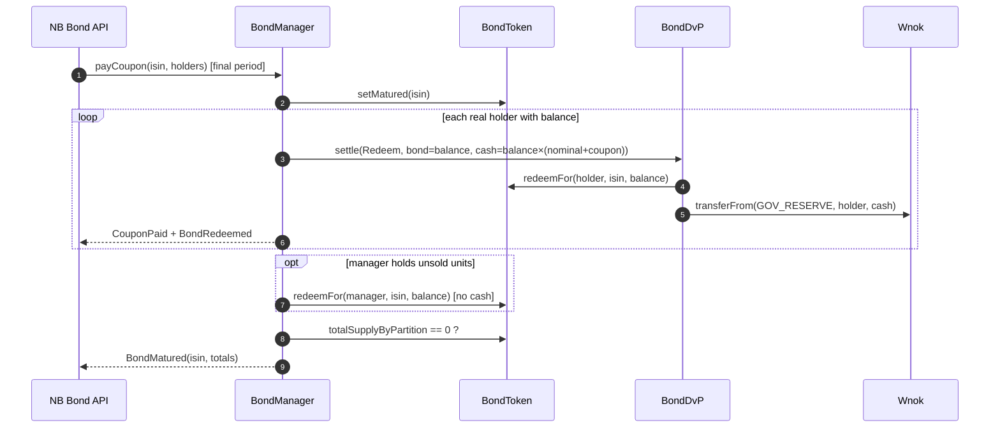

# Redeem with the final coupon — Design

**Status:** Draft
**Created:** 2026-09-09
**Intent:** [`intent.md`](intent.md)
**Builds on:** ADR 0004 and `docs/plans/archive/bond-cash-leg-wnok/` (every cash leg in wNOK
from `GOV_RESERVE`); `docs/decisions/0005-redeem-principal-with-the-final-coupon.md` (Proposed).

## Decision Summary

`BondManager.payCoupon` becomes the only lifecycle exit. On interim periods it behaves as
today for real holders and skips units held by the manager itself. On the final period it
marks the partition matured, then for each real holder runs one `BondDvP.settle` with
`Operation.Redeem`, `bondAmount = balance`, and `cashAmount = balance × (UNIT_NOMINAL +
couponPerUnit)`; burns the manager's own units through `BondToken.redeemFor` with no cash;
requires partition supply to be zero; and emits `BondMatured`. `BondManager.redeem`, the
redemption API route, and the `AllCouponsPaid` / `BondRedemptionComplete` events go away. The
projection treats `BondMatured` as the terminal transition, so a bond's status goes
`outstanding → matured` with zero supply in one block.

## Current-State Evidence

### Repository Evidence

| Finding | Evidence | Consequence |
|---|---|---|
| **Verified.** The final coupon only sets a flag: `payCoupon` calls `BOND_TOKEN.setMatured` and emits `AllCouponsPaid` when `newPaymentCount == expectedPayments` | `contracts/src/norges-bank/BondManager.sol` `payCoupon` | Principal is not part of the final payout today |
| **Verified.** Principal is paid by `BondManager.redeem(isin, holders)`, which settles `Operation.Redeem` per holder at `balance × UNIT_NOMINAL` and requires supply zero afterwards | same file, `redeem` | The per-holder settlement shape already exists and is reused, with the coupon added to the cash amount |
| **Verified.** `BondToken.redeemFor` refuses to burn unless `isMatured[partition]` is set; `setMatured` is controller-only | `contracts/src/norges-bank/BondToken.sol` `redeemFor`, `setMatured` | Set the flag before the final-period loop and keep the gate as protection against direct misuse |
| **Verified.** `BondDvP.settle` requires `cashFrom` and `cashTo` non-zero and always runs the cash leg, so it cannot burn without paying | `contracts/src/norges-bank/BondDvP.sol` `settle`, `_settleCashLeg` | Manager-held units are burned by `BondManager` calling `BondToken.redeemFor` directly (it is a controller), not through the DvP |
| **Verified.** `payCoupon` requires the processed holder balances to equal total supply and reverts with `CouponPaymentBalanceMismatch` otherwise; the API's default holder list includes the manager when it holds units | `BondManager.payCoupon`; `services/nb-bond-api/src/app.ts` coupon route comment | Manager-held units must count towards coverage while receiving nothing |
| **Verified.** No UI page calls the redemption client; only `BondsApi.redeem` exists | `services/nb-ui/src/api/bondsApi.js`; grep of `services/nb-ui/src/pages` | Removing the route loses no operator capability |
| **Verified.** The projection derives `redeemed` from `ever_issued && redemption_complete && supply == 0`, else `matured` from `is_matured`; the reducer sets `is_matured` on `AllCouponsPaid` and `redemption_complete` on `BondRedemptionComplete` | `services/nb-bond-api/src/projection/compose-projection.ts` `bondStatus`; `projection/bond-state.ts`; `ingestion.ts` | Replace both flags' sources with `BondMatured`; the status enum loses `redeemed` |
| **Verified.** The Bonds page offers `matured` and `redeemed` filters; Bond detail tooltips describe a separate redemption; the Coupon payout page lists bonds with supply > 0 | `services/nb-ui/src/pages/BondsPage.jsx`, `BondDetailPage.jsx`, `CouponPayoutPage.jsx` | UI text and filters follow the new lifecycle |
| **Verified.** Operation type `REDEMPTION` is part of the audit-trail enum and appears in stored rows | `services/nb-bond-api/src/operations.ts`, `contracts/operations.ts` | Keep the enum value so old rows still validate; nothing new produces it |
| **Verified.** `BondToken` already emits `IsinRedeemed(isin, holder, value, operator)` on every burn; `BondManager` emits `BondRedeemed(isin, holder, value, wnokAmount)` | `IBondToken.sol`, `IBondManager.sol` | Per-holder redemption events exist; the missing piece is one closure event with totals |
| **Verified.** The known issue "Partially allocated bonds deadlock coupon payment and redemption" names skipping self-held units as one of two contract-side fixes | `docs/KNOWN_ISSUES.md` | This plan implements that fix and closes the entry |
| **Needs verification (Phase 0).** Whether ingestion applies a block's manager and token logs in `logIndex` order across contracts, which matters once `CouponPaid`, `IsinRedeemed`, `BondRedeemed`, and `BondMatured` share one block | `services/nb-bond-api/src/ingestion.ts` log fetch and apply loop | If not ordered, the reducer must be order-independent for these events (it largely is: flags and counts, supply from token deltas) |

### Runtime Evidence

- **Verified (2026-09-08, local sandbox):** two bonds went `outstanding → matured → redeemed`
  through the API; `matured` persisted between the final coupon and the separate redemption
  call, and the Coupon payout page kept the matured bond listed until redemption.
- **Verified:** the wNOK cash leg and the reserve allowance work for the redemption cash leg
  (redemption of 70 and 100 units settled from the reserve).

### Existing Test Coverage and Gaps

- Covered: interim coupon amounts and fuzzed distribution; redemption of all supply; not-matured
  gate; DvP `Redeem` operation.
- Gaps this plan closes: final coupon paying principal; a partially allocated bond reaching
  maturity; underfunding at the final payout; `BondMatured` emission and ingestion; UI final
  payout breakdown.

## Significant Findings

| Priority | Finding | Why it matters | Plan response |
|---|---|---|---|
| Important | Redemption is unreachable from the UI | Bonds can mature but never close in the operator flow | Fold principal into the final coupon; remove the separate step |
| Important | Partially allocated bonds cannot pay any coupon | Deadlock recorded in `docs/KNOWN_ISSUES.md` | Skip and later burn manager-held units in `payCoupon` |
| Follow-up | A full buyback that drives supply to zero leaves the bond `staged` in the projection (no `redemption_complete`) | Misleading status after a total buyback | Out of scope; record in `progress.md` and `docs/KNOWN_ISSUES.md` if accepted |
| Follow-up | The `REDEMPTION` operation type stays in the audit enum with no producer | Minor dead value | Keep for stored rows; note in the enum description |

## Invariants

- A real holder's final payout equals `balance × UNIT_NOMINAL + balance × couponPerUnit`, in
  one wNOK transfer from `GOV_RESERVE`; the interim coupon amount is unchanged.
- After the final payout, partition supply is zero and no address holds units; the transaction
  reverts entirely if any leg fails (`CouponPaymentBalanceMismatch`, `RedemptionIncomplete`,
  or a `SettlementFailure`).
- Units held by the manager receive no cash at any point and are burned at maturity.
- `wnok.totalSupply()` is unchanged by the final payout.
- Exactly one `BondMatured` per closed bond; `CouponPaid` and `BondRedeemed` remain per holder.
- `BondToken.isMatured` is set before any `redeemFor` in the closure transaction.

## Field and Source Classification

| Field or concept | Current source | Target source | Class/owner | Freshness or fallback rule |
|---|---|---|---|---|
| Bond status `matured` | `AllCouponsPaid` sets `is_matured` | `BondMatured` sets `is_matured` and `redemption_complete`; supply from token burns | projected | Terminal; `redeemed` removed from the enum |
| Bond history `MATURED` entry | none | `BondMatured` payload: `paymentCount`, `principalPaid`, `couponPaid`, `unsoldBurned` | projected | Appended once |
| Final payout preview | UI computes coupon only | UI computes coupon plus principal per holder from `holders`, `coupon.rateBps`, and `coupon.payments.remaining == 1` | derived, presentation-only | Warn when `govReserve.wnokBalance` from the Central Bank resource is below the total |
| Redemption operation | `POST /v1/bonds/{isin}/redemptions` | removed | unsupported | 404 after the change |

## Target Architecture

### Contract Change

`IBondManager`:

- Add `event BondMatured(string indexed isin, uint256 paymentCount, uint256 principalPaid,
  uint256 couponPaid, uint256 unsoldBurned)`. Block timestamp is available from the log.
- Remove `AllCouponsPaid` and `BondRedemptionComplete`. Keep `CouponPaid` and `BondRedeemed`.

`BondManager.payCoupon`:

1. Read coupon details; compute `expectedPayments`, `paymentPerBond` as today; revert on
   `AllCouponsPaid` (rename the error to `BondAlreadyMatured` for clarity, optional) and
   `CouponNotReady`.
2. `bool finalPeriod = paymentCount + 1 == expectedPayments`. If final, call
   `BOND_TOKEN.setMatured(_isin)` first.
3. Loop holders. `holder == address(this)`: add balance to `unsold`, continue. Zero balance:
   continue. Otherwise, if final: `settle(Redeem, bondAmount = balance, cashAmount = balance ×
   (UNIT_NOMINAL + paymentPerBond))`, then emit `CouponPaid(coupon part)` and
   `BondRedeemed(isin, holder, balance, principal part)`. If interim: cash-only settle as today
   and `CouponPaid`.
4. Coverage: `processed + unsold == totalSupplyBefore`, else `CouponPaymentBalanceMismatch`.
5. `updateCouponPayment` as today. If final: burn `unsold` via
   `BOND_TOKEN.redeemFor(address(this), _isin, unsold, msg.sender)` when `unsold > 0`; require
   `totalSupplyByPartition == 0` else `RedemptionIncomplete`; emit `BondMatured`.
6. Delete `redeem`.

`withdrawFailedIssuance` still lets the issuer pull unsold units out before maturity; if it has
been used, `unsold` is simply zero at closure.

### API and Zod Contract

- `BondStatus` enum: `staged | auctioning | outstanding | matured`. `matured` means closed:
  final coupon and principal paid, supply zero. `redeemed` is removed; nothing can produce it
  on the new contracts and the sandbox is redeployed from genesis.
- Bond history event type `MATURED` with the `BondMatured` payload; `COUPON_COMPLETE` and
  `REDEMPTION_COMPLETE` are no longer produced (keep the union members only if stored rows must
  still parse; the projection is rebuilt on a fresh sandbox, so removal is acceptable).
- Remove the `/v1/bonds/{isin}/redemptions` path and `redeem` operation. `HoldersBody` stays
  for coupon payments. The `payCoupon` summary states that the final payment also pays
  principal and closes the bond.
- Operation type `REDEMPTION` stays in the enum with a "legacy, no longer produced" note.
- Follow the repository API conventions (resource shape, ETag, error envelope); regenerate
  `openapi.json` from the Zod source.

### Consistency and Failure Semantics

Unchanged all-or-nothing transaction. A failure on any holder, on the unsold burn, or on the
zero-supply check reverts the whole final payout; the API maps it to a 409 through the existing
`describeRevert` path with the WNOK ABI. The coupon route already publishes `bidders` and
`central-bank` live changes, which now also cover the principal movement.

### Security and Deployment Boundary

No new roles. `BondManager` already holds `BOND_CONTROLLER_ROLE` on `BondToken` for
`setMatured` and is a controller for `redeemFor`. The reserve's existing allowance bounds the
larger final transfer. Non-local deployments get the behaviour by redeploying `BondManager`;
no configuration is added.

## Alternatives Considered

- **Keep two steps and add a Redeem button.** Rejected: keeps the "matured but held" state and a
  second code path that the wNOK work showed drifts (route without UI, differing error mapping).
- **Burn unsold units at finalisation instead of at maturity.** Rejected for this plan: it
  changes finalisation, `withdrawFailedIssuance`, and the partial-allocation accounting the API
  shows; burning at maturity touches only `payCoupon`.
- **Reuse `AllCouponsPaid` as the closure event.** Rejected: the operator asked for an explicit
  closure record with totals that later processing can key on; a new event with a new name
  avoids consumers confusing the old semantics.
- **Keep `redeemed` as the terminal status name.** Rejected: on the new model the bond is closed
  by maturing; `matured` is the term the walkthrough, ADR, and UI already use.

The load-bearing choice is recorded in
`docs/decisions/0005-redeem-principal-with-the-final-coupon.md`.

## Decisions

| Decision | Recommendation | Rationale | Operator action required |
|---|---|---|---|
| D1 Closure mechanism | Final `payCoupon` pays coupon plus principal and burns | One action, matches the instrument | None |
| D2 Unsold units | Skipped on coupons, burned at maturity with no cash | Owed nothing; closes the deadlock | None |
| D3 Closure event | New `BondMatured(isin, paymentCount, principalPaid, couponPaid, unsoldBurned)` | Explicit, total-bearing hook for later processing | None |
| D4 Separate redemption | Remove contract function, API route, UI client | One exit path | None |
| D5 Terminal status | `matured` (closed); drop `redeemed` | Truthful naming; fresh deploy, no migration | None |
| D6 Reserve shortfall at closure | Whole revert; UI warns from the reserve balance beforehand | Honest failure; operator can top up | None |
| D7 Local rollout | Fresh sandbox (`delete` + `start`) | Constructor and ABI change; projection rebuilt | Go-ahead before deleting local chain state |

## Residual Risks

- The final payout is the largest single wNOK movement; an underfunded reserve blocks closure
  rather than one coupon. Mitigated by the UI warning and the Central Bank page balance.
- Ingestion ordering within the closure block is assumed order-tolerant; Phase 0 verifies it.
- A bond fully bought back before maturity still ends as `staged` with zero supply; unchanged
  and recorded as a follow-up.
