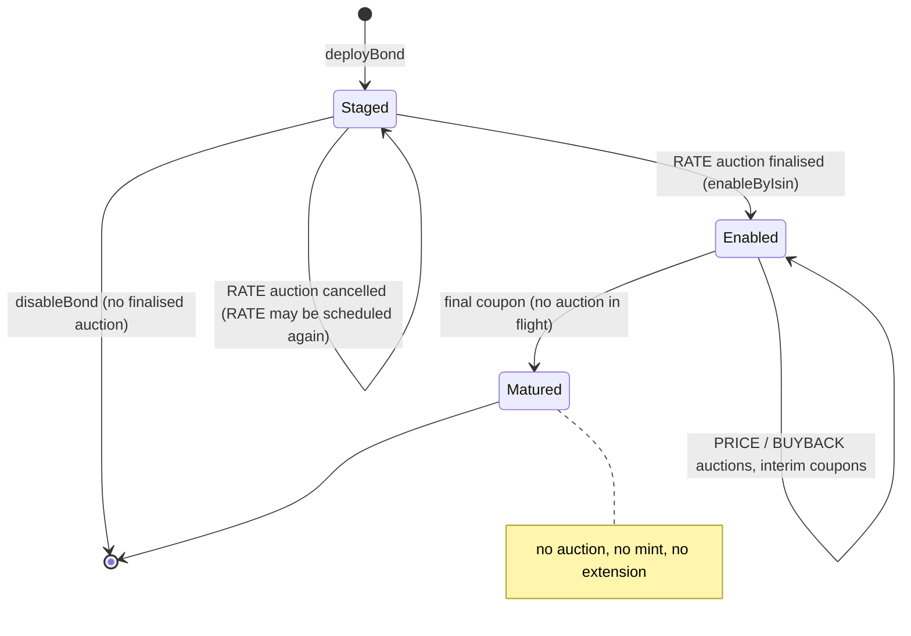

# Bond coupon and maturity correctness — Design

**Status:** Draft
**Created:** 2026-09-28
**Intent:** [`intent.md`](intent.md)
**Builds on:** [ADR 0004](../../decisions/0004-settle-all-bond-cash-legs-in-wnok.md) (every bond
cash leg in wNOK from the government reserve), [ADR 0005](../../decisions/0005-redeem-principal-with-the-final-coupon.md)
(the final coupon pays principal and closes the bond), and
[`coupon-closure-review-fixes`](../archive/coupon-closure-review-fixes/plan.md) (#278:
`DuplicateHolder`, `CouponPeriodPaid`, empty-holder closure, preview aligned to the contract).

## Decision Summary

Fix each defect in the contract that owns the invariant, keep every event signature unchanged,
and make the API and UI mirror the new rules rather than the old ones.

1. **Coupon per holding, rounded down once.** `payCoupon` computes each holder's coupon as
   `balance × UNIT_NOMINAL × couponYield / 10000`, rounded down to whole wNOK. The rounding
   remainder (under 1 wNOK per holder per period) stays with the reserve and is not tracked.
   Period and closure totals remain sums of the per-holder amounts, so they agree with the
   per-holder events by construction.
2. **"RATE first" means "not yet enabled".** A bond is *enabled* when `BondToken` holds coupon
   parameters for it (`couponDuration(partition) != 0`), which only a cleared RATE auction sets
   and only `disablePartition` clears. `BondManager` refuses PRICE and BUYBACK on a bond that is
   not enabled and RATE on one that is. `BondAuction` keeps only the rules that are true without
   lifecycle knowledge: the first auction ever created for an ISIN is RATE, and a previous
   auction must be terminal. `payCoupon` reverts with `BondNotEnabled` before dividing by the
   coupon duration.
3. **Matured is terminal for supply.** `BondManager` refuses to schedule any auction on a
   matured bond; `BondToken` refuses `mintByIsin` and `extendPartitionOffering` on a matured
   partition; the final coupon reverts with `AuctionInFlight` while `bondActive[isin]` is set.
   Because an in-flight buyback must always be clearable before maturity, cancelling a BUYBACK
   auction stops reducing the partition offering (it never raised it).
4. **Bond holders must be able to receive wNOK.** A virtual transfer hook in `ERC1410Minimal`
   lets `BondToken` reject any transfer whose recipient is not on the wNOK allowlist, reusing
   `AllowlistViolation` so `BondDvP` classifies it as a security-leg failure. `payCoupon`
   requires a strictly ascending holder list, replacing the quadratic duplicate scan with one
   comparison per holder. Pending operator decision D6.
5. **Previews stay mirrors.** The API has no coupon arithmetic (verified); the UI keeps its
   mirror of the contract math, moved into one domain helper with the new formula.

## Current-State Evidence

### Repository Evidence

| Finding | Evidence | Consequence |
|---|---|---|
| **Verified.** Coupon per unit is computed once and truncated: `paymentPerBond = (UNIT_NOMINAL * couponYield) / PERCENTAGE_PRECISION`; each holder gets `_balance * _p.paymentPerBond` | `contracts/src/norges-bank/BondManager.sol` `payCoupon` (line 526), `_payHolder` (line 604) | Per unit `floor(yield / 10)` wNOK: 42 instead of 42.5 at 425 bps; loss up to 0.9 wNOK per unit per period |
| **Verified.** wNOK has 0 decimals; 1 wNOK = 1 NOK | `contracts/src/norges-bank/Wnok.sol` `decimals()`; `services/nb-ui/src/utils/format.js` `formatWnok` | Whole-wNOK rounding is unavoidable; the question is only where it happens |
| **Verified.** Totals already accumulate per-holder amounts: `totals.coupon += couponAmount` feeds `CouponPeriodPaid.couponPaid` and `BondMatured.couponPaid` | `BondManager._payHolders`, `payCoupon` | Changing the per-holder formula keeps totals consistent without extra work |
| **Verified.** Tests pin the truncated value: `assertEq(paymentPerBond, 42)`, fuzz and period-event expectations use `balance × 42` | `contracts/test/norges-bank/BondManager.t.sol` (`test_PayCoupon`, `test_PayCoupon_EmitsCouponPeriodPaid`, `testFuzz_PayCoupon_*`); `contracts/test/integration/BondLifecycle.t.sol` `_paymentPerBond` | These expectations change with the fix |
| **Verified.** The UI preview mirrors the truncation (`couponPerUnit = UNIT_NOMINAL × rateBps / 10000`, then `balance × perUnit`); its test asserts 25.20 K NOK for 600 units while the comment beside it states 25 500 NOK | `services/nb-ui/src/pages/PayCouponModal.jsx` lines 22–36; `services/nb-ui/tests/CouponPayoutPage.test.jsx` lines 212–215, 266 | Preview must change with the contract |
| **Verified.** The NB Bond API performs no coupon arithmetic: it exposes `coupon.rateBps` and holders, and stores event amounts as emitted | `services/nb-bond-api/src/projection/compose-projection.ts`; `ingestion.ts` `CouponPaid` / `BondMatured` branches | No API preview to align; the reviewer's "API preview math" item does not exist |
| **Verified.** `BondAuction.createAuction` decides the type by count: `previousCount == 0` requires RATE, otherwise the previous auction must be `>= FINALISED` and the type PRICE or BUYBACK. `CANCELLED` orders after `FINALISED` | `contracts/src/norges-bank/BondAuction.sol` lines 108–118; `IBondAuction.AuctionStatus` | After a cancelled RATE auction only PRICE/BUYBACK pass |
| **Verified.** `disablePartition` clears every per-partition field, but `isinToAuctionCount` lives in `BondAuction` and is never reset; `disableBond` iterates the whole count | `BondToken.disablePartition`; `BondManager.disableBond` | A re-used ISIN can never take a RATE auction; `test_DisableBond_AllowsIsinReuse` never schedules one |
| **Verified.** A PRICE finalisation mints via `mintByIsin` but calls `enableByIsin` only for RATE | `BondManager._settleIssuance` | Units in a bond with `couponDuration == 0` |
| **Verified.** `payCoupon` divides `maturityDuration / couponDuration` with no zero check | `BondManager.payCoupon` line 512 | `Panic(0x12)` on a never-enabled bond |
| **Verified.** `disableBond` reverts when any auction for the ISIN is `FINALISED` | `BondManager.disableBond` | Stranded units cannot be cleaned up by disabling |
| **Verified.** `payCoupon` has no `bondActive` check; `_deployAuctionForBond`, `mintByIsin`, and `extendPartitionOffering` check only `activePartitions`, never `isMatured` | `BondManager.sol`, `BondToken.sol` lines 235–242, 355–376 | A PRICE auction open across, or scheduled after, the final coupon mints into a matured partition; `payCoupon` then reverts `AllCouponsPaid` forever |
| **Verified.** `cancelAuction` always calls `reducePartitionOffering(isin, offering)`, but a BUYBACK auction never raised the offering | `BondManager.cancelAuction`, `_deployAuctionForBond` | On a fully issued bond (offering == supply) cancelling a buyback reverts `ReductionBelowSupply`; with no acceptable bids `finaliseAuction` reverts `NoAllocations`; the auction and `bondActive` stay stuck. No test cancels a BUYBACK auction |
| **Verified.** Bond transfers have no eligibility check: `transferByPartition` / `operatorTransferByPartition` → `_transferByPartition` → `_move` | `contracts/src/norges-bank/ERC1410/ERC1410.sol` lines 178–295; ADR 0002 context | A holder at a non-allowlisted address makes every coupon revert (`docs/KNOWN_ISSUES.md`, "Every bond holder must be on the WNOK allowlist…") |
| **Verified.** Duplicate detection is a nested loop over `_holders`, and each holder costs one `BondDvP.settle` call | `BondManager._payHolders` | Quadratic comparisons; the per-holder settle bounds holders per transaction |
| **Verified.** `BondDvP.settle` returns `true` or reverts; `_settleHolderPayout`'s `!ok` branch reverts with `SettlementFailure(Unknown, "coupon settle returned false")` | `BondDvP.settle`; `BondManager._settleHolderPayout` | Unreachable today; a string in revert data |
| **Verified.** `BondToken.redeemFor` NatSpec and body mention a "mock DVP … REDEEM_EOA" that no longer exists; `createPartition` repeats the duplicate and zero-maturity checks that `_createPartition` performs | `BondToken.sol` lines 405–408, 427, 151–181 | Misleading comments; redundant code |
| **Verified.** `ERC1410Minimal.DECIMALS = 18` while units are indivisible (`granularity 1`); no API or UI code reads `BondToken.decimals()`; `BondToken` emits no ERC-20 `Transfer` event, so explorers do not index it as a token (ADR 0002 context) | `ERC1410.sol`; grep of `services/`; ADR 0002 | Cosmetic but wrong; safe to change |
| **Verified.** The API pre-checks auction types with `isinToAuctionCount` ("first auction for ISIN must be RATE", "subsequent auctions cannot be RATE"); the UI picker uses `bond.auctions.length` | `services/nb-bond-api/src/features/auctions/service.ts` lines 74–81; `services/nb-ui/src/pages/CreateAuctionModal.jsx` lines 34–55 | Both replicate the defective rule and must follow the new one |
| **Verified.** The projection resets bond state on `BondCreated`, so a re-used ISIN starts with `couponYield = null`; `coupon` is `null` in the API resource until `IsinEnabled` | `services/nb-bond-api/src/projection/bond-state.ts` `created`; `compose-projection.ts` | The UI can derive "enabled" from `bond.coupon?.rateBps` |
| **Verified.** Ingestion applies a batch's manager events before its token events; reducers must be order-tolerant | `services/nb-bond-api/src/ingestion.ts`; `coupon-closure-review-fixes` progress | This plan adds no events, so replay order is unaffected |
| **Verified.** `BondOrderBook` (contract-level only; not deployed by `contracts/script/`) moves bond units with `operatorTransferByPartition` against TBD cash and maps any security-leg revert to `FailureReason.Seller` | `contracts/src/norges-bank/BondOrderBook.sol` `_dvpsettle` | Under D6 an ineligible buyer surfaces as a seller failure; acceptable for an undeployed contract, noted |

### Runtime Evidence

- **Verified (2026-09-28):** `forge test` on `development` at `db92409`: 24 suites, 390 tests
  passed. `payCoupon` gas in `BondManagerTest` (1–2 holders): median 180 157, max 211 884.
- **Verified (earlier plan, 2026-09-09):** the sandbox paid `CouponPaid` 2 520 wNOK for 60 units
  at 425 bps (see the archived `redeem-with-final-coupon` progress), i.e. the truncation is live.
- **Needs verification (Phase 0):** per-holder gas of an interim and a final coupon, to size the
  holders-per-transaction limit against the local 60 000 000 block gas limit
  (`infra/besu/config/genesis.json`).
- **Needs verification (Phase 0):** the stranded-ISIN, matured-mint, and buyback-cancel paths
  reproduced by scratch Foundry tests before the fixes.

### Existing Test Coverage and Gaps

- Covered: interim and final coupon amounts at the truncated rate; duplicate holders; empty-holder
  closure; unsold units; reserve underfunding; non-allowlisted holder revert; disable and reuse
  without a new auction; first-auction-not-RATE on `BondAuction` directly.
- Gaps: coupon for a yield not a multiple of 10 bps; RATE after a cancelled RATE; RATE after
  reuse; PRICE before enablement; `payCoupon` on a never-enabled bond; any auction or mint on a
  matured bond; final coupon with an auction in flight; BUYBACK cancel; bond transfer
  eligibility; holder ordering.

## Significant Findings

| Priority | Finding | Why it matters | Plan response |
|---|---|---|---|
| Blocking | Per-unit truncation underpays every coupon | Wrong cash on every payment | D1, Phase 1 |
| Blocking | Count-based RATE rule strands ISINs | Unpayable units, undisableable bond | D2, D3, Phase 2 |
| Blocking | Mint into a matured bond | Unpayable units | D4, Phase 3 |
| Important | Cancelling a BUYBACK reduces the offering and can revert | Stuck auction; with D4 it would also block maturity | D5, Phase 3 (prerequisite of D4's final-coupon rule) |
| Important | One non-allowlisted holder blocks the coupon for all | Operational deadlock, known issue | D6, D7, Phase 4 |
| Follow-up | Coupon timestamp is set to `block.timestamp` at payment, so a late payment shifts every later period | Schedule drift | Out of scope; recorded in `progress.md` |
| Follow-up | `BondAllocationFailed` carries a free-text reason; event `isin` indexing is inconsistent across `BondManager` events | ABI hygiene | Out of scope (event signature changes; no consumer need) |

## Invariants

- A holder's coupon for a period is `floor(balance × UNIT_NOMINAL × couponYield / 10000)`
  wNOK; on the final period the payout adds `balance × UNIT_NOMINAL`.
- `CouponPeriodPaid.couponPaid` and `BondMatured.couponPaid` equal the sum of that period's
  `CouponPaid.paymentAmount` values; `BondMatured.principalPaid` equals the sum of the
  `BondRedeemed.wnokAmount` values.
- The reserve never pays more than the unrounded coupon; wNOK total supply is unchanged by any
  coupon or closure.
- Units exist in a partition only if the bond is enabled and not matured, or are being burned in
  the closure transaction.
- RATE is schedulable exactly while the bond is staged (exists, not enabled); PRICE and BUYBACK
  exactly while it is enabled and not matured.
- Auction IDs stay unique per ISIN across lifecycles (`isinToAuctionCount` is never reset).
- The final coupon never runs while `bondActive[isin]` is set.
- Every holder of a bond unit was on the wNOK allowlist when it received the unit (under D6).
- No event signature changes; the projection's replay order assumptions are untouched.

## Field and Source Classification

| Field or concept | Current source | Target source | Class/owner | Freshness or fallback rule |
|---|---|---|---|---|
| Coupon paid per holder | `balance × floor(1000 × yield / 10000)` in `BondManager` | `floor(balance × 1000 × yield / 10000)` in `BondManager` | authoritative (chain) | Emitted in `CouponPaid` |
| Period and closure coupon totals | Sum of per-holder amounts | Unchanged rule, new per-holder values | authoritative (chain) | `CouponPeriodPaid`, `BondMatured` |
| Payout preview | `PayCouponModal.jsx` local math | `services/nb-ui/src/domain/coupon.js` helper, same formula as the contract | derived, presentation-only | From `holders` and `coupon.rateBps`; server re-checks on submit |
| Bond "enabled" | Implicit (auction count) | `BondToken.couponDuration(partition) != 0`; projected as `coupon.rateBps != null` | authoritative (chain) / projected | Projection resets on `BondCreated` |
| Allowed auction types | `BondAuction` count rule; API count pre-check; UI `auctions.length` | `BondManager` enabled/matured rule; API reads the same chain state; UI derives from `coupon` and `status` | authoritative (chain); API and UI mirror | Contract is final arbiter; API uses `staticCall` before sending |
| Holder eligibility | None on transfer; wNOK allowlist at payment | wNOK allowlist on every bond transfer (D6) | authoritative (chain) | Removal from the allowlist after receipt still blocks payment |

## Target Architecture

### Contract Changes

**`BondManager`**

- `Period` carries `couponYield` instead of `paymentPerBond`. `_payHolder` computes
  `couponAmount = (_balance * UNIT_NOMINAL * _p.couponYield) / PERCENTAGE_PRECISION`. Update the
  comment at the old line 525 with a worked example (60 units at 425 bps → 2 550).
- `payCoupon`: after reading coupon details, `if (couponDuration == 0) revert
  Errors.BondNotEnabled(_isin);` before the division; after computing `finalPeriod`,
  `if (finalPeriod && bondActive[_isin]) revert Errors.AuctionInFlight(_isin);`. If the added
  locals push `payCoupon` past solc's stack limit (it sits close to it under via-IR), move the
  coupon-detail read and checks into a `_loadPeriod(_isin) returns (Period memory, uint256
  supplyBefore)` helper, following the existing `Period` / `PayoutTotals` pattern.
- `_payHolders`: replace the nested duplicate loop with
  `if (i > 0 && _holders[i] <= _holders[i - 1])` → `DuplicateHolder` when equal,
  `HoldersNotSorted(isin, previous, current)` when lower (D7).
- `_deployAuctionForBond`: after the existence check, read `couponDuration(partition)` and
  `isMatured(partition)`; revert `BondAlreadyMatured(isin)` if matured; for RATE revert
  `AuctionTypeMustBePrice()` if enabled; for PRICE and BUYBACK revert
  `FirstAuctionMustBeRate()` if not enabled. Reusing the two existing error names keeps the
  API's revert descriptions meaningful. Update the `deployAuctionForBond` NatSpec that says the
  rule is "enforced by BondAuction".
- `cancelAuction`: read the auction type (`BOND_AUCTION.getAuction(id).auctionType`) and call
  `reducePartitionOffering` only for RATE and PRICE.
- `_settleHolderPayout`: replace the string revert with `Errors.SettlementNotConfirmed(holder)`.

**`BondAuction`**

- `createAuction` keeps `FirstAuctionMustBeRate` for `previousCount == 0` (still true: no bond
  can be enabled without a RATE auction) and `PreviousAuctionActive`; it drops the
  `AuctionTypeMustBePrice` branch for later auctions. Its NatSpec states that type sequencing
  across a bond's lifecycle is the admin's (`BondManager`'s) responsibility.

**`BondToken` and `ERC1410Minimal`**

- `mintByIsin` and `extendPartitionOffering` (via `_updatePartitionOffering` when increasing)
  revert `PartitionMatured(isin)` when `isMatured[partition]`. `reducePartitionOffering` stays
  allowed (a cancel after maturity cannot happen once D4 holds, but reducing is harmless).
- `createPartition` drops the checks `_createPartition` already performs.
- `redeemFor`: NatSpec and inline comment describe the real flow (`BondManager` final coupon via
  `BondDvP` `Redeem`, or a direct controller burn of unsold units).
- `ERC1410Minimal.DECIMALS = 0` (D9).
- Under D6: `ERC1410Minimal._transferByPartition` calls a new
  `_beforeTransferByPartition(bytes32 fromPartition, bytes32 toPartition, address from, address to, uint256 value)`
  internal virtual hook (empty by default) before `_move`. `BondToken` gains an immutable
  `HOLDER_ALLOWLIST` (the wNOK contract, constructor argument, non-zero) and overrides the hook:
  `if (!Allowlist(HOLDER_ALLOWLIST).allowlistQuery(to)) revert Errors.AllowlistViolation("BondToken", to, "recipient not on WNOK allowlist")`.
  Mint and burn do not pass through the hook, so manager-held unsold units are unaffected.

**`Errors`**: add `BondNotEnabled(string isin)`, `AuctionInFlight(string isin)`,
`BondAlreadyMatured(string isin)`, `PartitionMatured(string isin)`,
`HoldersNotSorted(string isin, address previous, address current)`,
`SettlementNotConfirmed(address holder)`. `AuctionTypeMustBePrice` and
`FirstAuctionMustBeRate` move from BondAuction-only use to BondManager use.

### API and Zod Contract

- No schema or OpenAPI change: no new fields, no new routes, no event changes.
- `features/auctions/service.ts`: replace the count-based pre-checks with chain reads of
  `BondToken.couponDuration(partition)` and `isMatured(partition)` (the service already reads
  `activePartitions` the same way). Messages: "RATE auctions are only valid before the bond is
  enabled", "PRICE and BUYBACK auctions require a cleared RATE auction", "bond has matured".
- Coupon route (`app.ts`): sort `requested` ascending by address value (lower-case hex string
  order equals numeric order for fixed-length addresses) before calling `payCoupon`. The
  `HoldersBody` duplicate refine stays.
- ABI artifacts `src/abi/BondManager.json`, `BondToken.json`, `BondAuction.json` refreshed.
  Errors raised inside `BondToken` (`PartitionMatured`, `AllowlistViolation`) reach the API
  wrapped or raw; the manager-level `BondAlreadyMatured` check exists so the common path decodes
  through the `BondManager` interface. Confirm decoding in Phase 3 and add the `BondToken`
  interface to the relevant `describeRevert` calls if a raw selector surfaces.
- Health probe: extend the existing `bondManagerCompatible` idea only if cheap — probing
  `BondToken.HOLDER_ALLOWLIST()` (under D6) flags an API running against pre-change contracts.

### UI

- New `services/nb-ui/src/domain/coupon.js`: `UNIT_NOMINAL`, `couponForHolding(balance,
  rateBps)`, `principalForHolding(balance)`, all BigInt. `PayCouponModal.jsx` uses it;
  `utils/format.js` `formatNok` imports `UNIT_NOMINAL` instead of the literal 1000.
- `PayCouponModal`: on the final period, when the bond has an auction in `open` or `closed`
  state, show why the payment will be refused and disable Confirm.
- `CreateAuctionModal.jsx`: `rateAvailable = selectedBond && !enabled && !matured`,
  `priceAvailable = buybackAvailable = enabled && !matured`, with
  `enabled = selectedBond.coupon?.rateBps != null`; hints reworded accordingly.

### Consistency and Failure Semantics

All changes are all-or-nothing reverts in existing transactions. A refused final coupon or
auction schedule leaves no state change; the API maps reverts to 409/400 through the existing
paths. No projection or live-event change.

### Security and Deployment Boundary

No role changes. The eligibility hook adds a cross-contract read from `BondToken` to `Wnok`
(view only). `BondToken`'s constructor gains one argument (D6), so `contracts/script/norges-bank/10_Bond.s.sol`
passes the wNOK address it already resolves. A non-local deployment receives the behaviour by
redeploying the bond contracts; no configuration is added.

## Alternatives Considered

- **S3: compute the period total on total supply and distribute remainders (largest
  remainder).** Pays the exact total but needs a second pass and a tie-break order; rounding per
  holding is the conventional rule for paying coupons in the smallest currency unit and keeps the
  single-pass loop.
- **S3: keep a per-unit coupon but in a higher-precision unit.** wNOK has 0 decimals; any
  per-unit value still has to be rounded per holding at payment.
- **S3: move wNOK to øre (2 decimals).** Correct long-term but touches every cash leg, the
  allowlisted balances, the API, and the UI; out of scope.
- **S4: a `rateFinalised[isin]` flag in `BondAuction`.** Needs a reset hook on `disableBond`,
  coupling `BondAuction` to the bond lifecycle; the coupon parameters in `BondToken` already
  carry the same fact and are already cleared on disable.
- **S4: reset `isinToAuctionCount` on disable.** Auction IDs are `keccak256(isin, index)`, so a
  reset would re-issue IDs of the previous lifecycle's auctions and collide with their stored
  status, bids, and allocations.
- **S5: forbid finalising an auction after maturity instead of forbidding the final coupon while
  one is open.** Leaves an auction with bids that can only be cancelled, and still needs the
  matured-mint guard; blocking the final coupon keeps one ordering rule the operator can see.
- **S5: forbid every coupon while an auction is in flight.** Interim coupons are unaffected by
  concurrent PRICE or BUYBACK auctions (units are minted or burned atomically at finalisation),
  so the broader rule adds operator friction for no safety gain.
- **S6: skip failing holders and let them claim later.** Needs a claims ledger and breaks the
  all-or-nothing final burn; too large for the sandbox.
- **S6: forbid holder-initiated transfers entirely.** Breaks ERC-1410 semantics, the
  distribution tests, and the order book.
- **S6: wait for ERC-3643 (ADR 0002).** Correct target, but the migration is not scheduled; the
  interim check is small, reuses an existing allowlist, and is removed with `BondToken`.
- **S6: transient-storage or mapping dedupe.** Works but needs inline assembly (no transient
  mappings in Solidity 0.8.36) or storage writes; a sorted list is the common, cheapest
  pattern and the API controls the order.

## Decisions

| Decision | Recommendation | Rationale | Operator action required |
|---|---|---|---|
| D1 Coupon rounding | Per holding, round down to whole wNOK; remainder stays with the reserve, untracked; totals are sums of per-holder amounts | Conventional, single pass, totals consistent by construction; loss < 1 wNOK per holder per period | Confirm; decide whether to record it as an ADR (recommended: it changes a numeric convention that `contracts/docs/contracts-versioning.md` lists as breaking) |
| D2 Auction-type rule | Enabled state in `BondToken` decides; enforced in `BondManager`; `BondAuction` keeps only lifecycle-free rules | Single source already cleared on disable; no ID collisions | None |
| D3 `payCoupon` on a non-enabled bond | `BondNotEnabled(isin)` before the division | Named error instead of a panic | None |
| D4 Matured bonds | Manager refuses auctions (`BondAlreadyMatured`); token refuses mint and extension (`PartitionMatured`); final coupon refuses while an auction is in flight (`AuctionInFlight`) | Defence in depth at both layers; one visible ordering rule | None |
| D5 BUYBACK cancel | Do not reduce the offering when cancelling a BUYBACK auction | Pre-existing bug that would otherwise let a stuck buyback block maturity under D4 | None (in scope because D4 depends on it) |
| D6 Holder eligibility | Bond transfers require the recipient on the wNOK allowlist, via an `ERC1410Minimal` hook and a `BondToken` constructor argument | Removes the common cause of the coupon deadlock; interim until ERC-3643 | **Explicit approval**: new transfer rule and constructor change; may merit a short ADR |
| D7 Holder list | Strictly ascending; API sorts | Linear check; API already owns the list | None (lands with D6's slice) |
| D8 Preview alignment | UI mirror in one domain helper; no API field | API has no math today; composer-computed previews stay a follow-up | None |
| D9 `DECIMALS` | 0 | Matches indivisible units; no consumer reads it | None |
| D10 Events | No signature changes; `isin` indexing unchanged | Keeps ingestion and replay untouched | None |
| D11 Tests | New `contracts/test/norges-bank/BondManagerLifecycle.t.sol` with its own fixture for the new cases; existing files only get amount updates | `BondManagerTest` is near the via-IR assembly tag limit; `BondLifecycle.t.sol` sets the precedent of a separate fixture | None |
| D12 Local rollout | Fresh sandbox (`./sandbox.sh delete` then `start`) after the last contract slice | New constructor, new behaviour, new addresses; projection rebuilt | **Go-ahead** before deleting local chain state |

## Residual Risks

- Rounding per holding means the reserve pays up to `holdersPaid − 1` wNOK less than the
  unrounded period total; documented, not reconciled.
- A holder removed from the wNOK allowlist after receiving units still blocks the coupon for
  everyone; the known issue stays, narrowed to that case.
- Holders per transaction remain bounded by gas (one `settle` per holder); pagination is a
  follow-up sized by the Phase 0 measurement.
- `BondOrderBook` would report an ineligible buyer as a seller failure; the contract is not
  deployed by the sandbox scripts.
- A separate hardening change also edits contract code; whichever lands second
  rebases onto the other.
