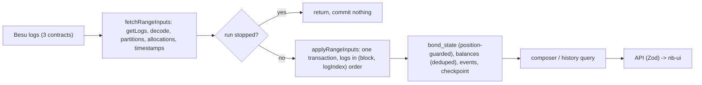

# Ingestion and projection correctness — Design

**Status:** Draft
**Created:** 2026-09-28
**Intent:** [`intent.md`](intent.md)
**Builds on:** projection schema v6 and the replay fixes recorded in
[`coupon-closure-review-fixes/progress.md`](../archive/coupon-closure-review-fixes/progress.md);
graceful shutdown from [`sandbox-stop-keeps-state`](../archive/sandbox-stop-keeps-state/design.md).

## Decision Summary

- **Chain stays authoritative; the projection becomes replay-safe.** Every log of a batch is
  applied in `(blockNumber, logIndex)` order across `BondManager`, `BondToken`, and `BondAuction`,
  and a `bond_state` reducer event is applied only if its chain position is after the bond's last
  applied position (`updated_block`, `updated_log_index`). Chain order is what makes the position
  check valid, so ordering lands first.
- **Stopping a loop means it can no longer commit.** Each loop run carries a `stopped` flag that
  the range processor checks immediately before its synchronous SQLite transaction. Because the
  transaction is synchronous, nothing can commit after `stopIngestionLoop()` returns. Starts carry
  a generation number, so an older start that finishes late closes its connection and installs
  nothing. The loop's connection is closed after the shared ingestion queue settles.
- **The minimum refactor that makes this testable:** split `processBlockRange` into
  `fetchRangeInputs` (all RPC reads) and `applyRangeInputs` (one synchronous transaction), share
  one log decoder, and pass the chain reader into the loop. No other restructuring.
- **History pages come from SQL**, newest first by `(block, log_index)`, with the boundary query
  validated by the existing (fixed) Zod schema.
- **An undecryptable bid is data, not an error.** It becomes an `invalid` bid with a reason code,
  is excluded from allocation, and cannot be selected at finalisation.
- **One schema bump (v7)** after the ordering and idempotency fixes, so existing projections are
  rebuilt with corrected rules, historical allocation failures are backfilled, and two unused
  columns disappear.

## Current-State Evidence

All paths are under `services/nb-bond-api/` unless stated. Line numbers are as of `db92409`.

### Repository Evidence

| Finding | Evidence | Consequence |
|---|---|---|
| **Verified.** `BondCreated` always applies the `created` transition; `reduceBondState` starts from `emptyBondState` on `created` (supply `0`, offering `0`, flags cleared) | `src/ingestion.ts:944-971`; `src/projection/bond-state.ts:70-79` | Re-applying `BondCreated` wipes all later facts for the ISIN |
| **Verified.** `supply-delta` is applied only when `applyBalanceDelta` inserted a new `balance_events` row; on replay the row exists and the delta is skipped | `src/ingestion.ts:1103-1121`, `:376-428` | After a replay through `BondCreated`, projected supply stays `0` while `balances` keeps the holders: wrong status (`staged`), `payable`, holders vs supply |
| **Verified.** Other replayed facts recover because later events are replayed in order (offering, coupon count, `isMatured`, `everIssued`); only supply depends on deduplicated rows | reducer cases, `bond-state.ts:80-118` | The visible damage of A1 is supply-driven; the fix must still make every transition idempotent |
| **Verified.** A window's rows and its checkpoint commit in one better-sqlite3 transaction; a failed tick commits nothing | `src/ingestion.ts:713-1127`, `:1227-1266` | Process crash or RPC error does **not** cause re-processing |
| **Verified.** `stopIngestionLoop()` only clears the interval, nulls the advancer, and sets `loopRunning = false` | `src/ingestion.ts:105-112` | In-flight and already-queued `processTo` calls keep running with the old closure |
| **Verified.** `processTo` loops windows until the target block with no stop check; the new loop reads its checkpoint (`loadCheckpoint`) after six awaited RPC calls, before its first queued tick | `src/ingestion.ts:1219-1258`, `:1188-1202` | **Plain restart re-processes:** if the old loop commits a window after the new loop read the checkpoint, the new loop replays that window (triggers A1). Near-certain during a backfill, possible in steady state |
| **Verified.** `resetProjectionAndRestart()` drops tables right after `stop()` without waiting; `startIngestionLoop()` recreates them in `openDatabase()` | `src/admin.ts:100-117`; `src/ingestion-db.ts:448-487` | **Reset race:** the old loop can write a later window plus its checkpoint into the fresh tables; the new loop then skips blocks `0..N`, or replays partial data |
| **Verified.** `startIngestionLoopWithRetry()` has no single-flight guard; `restartIngestionLoop()` calls `stop()` then `start()` fire-and-forget | `src/ingestion.ts:1377-1403`; `src/admin.ts:76-82` | Restart during a boot retry, or two restarts before the first start finishes, installs two loops; the first interval handle is overwritten and never cleared, and each loop re-processes the other's windows |
| **Verified.** The loop's connection lives only in the tick closure and is never closed; it is opened before four more RPC reads that can throw | `src/ingestion.ts:1193-1202` | One leaked connection per restart and per failed boot attempt; shutdown exits with it open |
| **Verified.** The live API pod holds three `ingestion.sqlite` and three `-wal` descriptors (history, bidders, loop) | `/proc/1/fd` in the pod, 2026-09-28 | Baseline for the leak check |
| **Verified.** Per batch the apply order is: all manager logs, then all auction logs, then token events, then transfers | `src/ingestion.ts:728`, `:1005`, `:1051`, `:1094` | Cross-contract order inside a transaction is lost |
| **Verified.** `disableBond` emits `IsinDisabled` (token) then `BondDisabled`; `_deployBond` emits `IsinIssued` (token) then `BondCreated` | `contracts/src/norges-bank/BondManager.sol:214,443`; `BondToken.sol:165,344` | Disable plus re-create in one batch: manager pass leaves `disabled = false`, then the token pass applies the old `IsinDisabled` → `bond_state.disabled = 1` |
| **Verified.** The listing filters on `partitions.disabled` (manager events only); the DTO reads `bond_state.disabled` | `src/ingestion-db.ts:809-826`; `src/projection/compose-projection.ts:260` | Re-created bond is listed but reports `disabled: true` |
| **Verified.** The timestamp prefetch is a hand-kept name list; a missing entry projects `0` silently | `src/ingestion.ts:666-678`, `blockTimestamps.get(block) ?? 0n` | `CouponPeriodPaid` was once missing (recorded in the coupon-closure progress); `AuctionFinalized` is listed but its handler never reads a timestamp |
| **Verified.** `getAuctionEventsByIsin` and `getBondEventsByIsin` order `ASC` with `LIMIT limit*4`; `composeBondHistory` filters `before`, sorts descending, slices | `src/ingestion-db.ts:489-503`, `:547-562`; `src/compose.ts:117-149` | The newest events of a bond with more than `4 × limit` rows per table are never returned; `before` can only page backwards from rows already read |
| **Verified.** The route converts `?limit` with `Number()`; `NaN` reaches SQLite as a `LIMIT` bind ("datatype mismatch" → 500); a negative value becomes an unbounded `LIMIT` | `src/app.ts:567-569`; probe against better-sqlite3 13.0.3 | 500 on bad input; negative limit reads everything |
| **Verified.** `historyQuerySchema` is defined and unused; as written (`.nullable()`, not optional) it would reject a request with no query parameters | `src/contracts/bonds.ts:134-139` | Must be fixed before wiring |
| **Verified.** The OpenAPI history parameters are hand-written (`before` ≥ 0; `limit` 1–500, default 100) and the read responses already include 400 | `src/contracts/bonds.ts:258-283`; `src/openapi/shared-responses.ts:65-73` | Runtime validation can match the published contract without a spec change |
| **Verified.** `BondSnapshot.events` (up to 1000 bond events per bond) is loaded for every bond read and never used | `src/projection/snapshots.ts:86,109`; only `AuctionSnapshot.events` is read (`compose-projection.ts:48`) | Dead read; its function is the one A4 changes |
| **Verified.** `finalise` unseals every on-chain sealed bid before looking at the selection; `unsealBid` throws on decrypt, schema, hash, ISIN, bidder, or signature failure | `src/features/auctions/service.ts:267-272`; `src/bid.ts:16-49` | One bad bid → unhandled `Error` → 500 for every finalisation attempt |
| **Verified.** `BondAuction.submitBid` accepts any caller during bidding and only checks non-empty ciphertext | `contracts/src/norges-bank/BondAuction.sol:271-295` | Any address can plant an undecryptable bid |
| **Verified.** The composer unseals all bids in one `try`; any failure shows every bid as `sealed` and the allocation preview as `null` | `src/projection/compose-projection.ts:74-88,155-165` | Operator cannot see or select the valid bids |
| **Verified.** nb-ui assumes a homogeneous bid list (`bids[0].state`) and parses `rate` on every unsealed row; `FinaliseAuctionModal` selects only `unsealed` bids | `services/nb-ui/src/pages/AuctionDetailPage.jsx:57-58,319`; `FinaliseAuctionModal.jsx:14` | A new bid state needs a small UI change in the same slice |
| **Verified.** `BondAllocationFailed(id, isin, bidder, reason)` and `BondBuybackComplete(id, isin, total)` are in the ABI artifact and emitted by `BondManager`; ingestion has no branch for them; `BondAuctionFinalised` history payload drops `dvpSuccess` | `src/abi/BondManager.json`; `BondManager.sol:416,667`; `src/ingestion.ts:790-809` | DvP failures leave no trace in the API |
| **Verified.** `BondAuction` never emits `BidCancelled` (declared in the interface only); ingestion handles it and every bid read filters `cancelled = 0` | `contracts/src/norges-bank/BondAuction.sol` emits; `src/ingestion.ts:323-333,1044-1045`; `compose-projection.ts:76,165` | Dead handler and filter |
| **Verified.** `bond_state.redemption_complete` is created but never written or read by code | `src/ingestion-db.ts:133,238` | Dead column (reducer field already removed in #278) |
| **Verified.** Schema changes that alter reducer semantics are shipped as a `SCHEMA_VERSION` bump that drops and rebuilds all projection tables in one transaction, preserving system-of-record tables | `src/ingestion-db.ts:6-50,434-487`; `DEVELOPMENT.md` §7.4 | v7 follows the established path |

### Runtime Evidence

- **Verified (2026-09-28):** local sandbox up; `/v1/health` `ok`, head 219, ingestion lag 0, no
  bonds projected; API pod holds 3 + 3 `ingestion.sqlite` descriptors.
- **Verified (2026-09-28):** `npm test` in `services/nb-bond-api`: 37 suites, 252 tests pass; Jest
  prints "A worker process has failed to exit gracefully". `--detectOpenHandles` attributes it to
  the 60 s timer created by the third test in `tests/shutdown.test.ts`, not to a database handle.
- **Needs verification (Phase 7):** each defect reproduced or disproved live — disable and
  re-create followed by `fromBlock=0`, restart during backfill against on-chain supply, a
  malformed bid, an unfunded bidder's failed allocation.

### Existing Test Coverage and Gaps

- Covered: reducer transitions (`tests/bond-state-reducer.test.ts`), event-table and balance
  idempotency helpers (`tests/ingestion-idempotency.test.ts`), window arithmetic and projection
  wait helpers (`tests/ingestion.test.ts`), admin reset through injected fakes
  (`tests/admin.test.ts`), auction persistence helpers (`tests/auction-projection.test.ts`).
- Not covered: `processBlockRange` dispatch and ordering, replay through the real apply path,
  disable and re-create in one batch, stop during an in-flight window, overlapping starts,
  connection close, history ordering and paging, finalisation with an invalid bid.

## Significant Findings

| Priority | Finding | Why it matters | Plan response |
|---|---|---|---|
| Blocking | A2 restart/reset race and overlapping starts | The only live trigger for A1 today; can also skip blocks | Phase 2 |
| Blocking | A1 non-idempotent `created` transition | Wrong supply/status/payability after any replay | Phase 4 (after ordering) |
| Important | A3 manager-before-token order | Wrong `disabled`; blocks a position-based idempotency rule | Phase 3 |
| Important | A4 history returns oldest rows; 500 on bad `limit` | Newest lifecycle events unreachable | Phase 5 |
| Important | A5 one bad bid blocks finalisation | Permissionless griefing; also hit when the sealing key is not pinned across restarts (`DEVELOPMENT.md` §7.1) | Phase 6 |
| Important | Silent `0` timestamp when the prefetch list is incomplete | Recurring replay bug class | Phase 3 (handler-declared timestamps, strict getter) |
| Follow-up-sized, included | A15 allocation failure events not ingested | Invisible DvP failures | Phase 3 |
| Cleanup, included | Dead `BidCancelled` path, `redemption_complete`, `AuctionFinalized` prefetch, unused bond event read | Misleading code next to the code being fixed | Phases 3–4 |
| Corrected | "Jest leaked worker is likely the DB handle" | It is the shutdown test's timer | Follow-up in `progress.md` |

## Invariants

- The chain is authoritative; every projection table stays rebuildable by a `fromBlock=0` resync.
- A window's rows and its checkpoint commit together or not at all.
- Once `stopIngestionLoop()` returns, the stopped loop commits nothing.
- At most one loop run is installed at a time; only the newest start may install one.
- Within a batch, logs are applied in `(blockNumber, logIndex)` order.
- Each chain log drives at most one `bond_state` transition, and a transition at or before the
  bond's `(updated_block, updated_log_index)` is a no-op once the bond row exists.
- Reducer transitions remain order-tolerant (defence in depth; the `enabled` guard stays).
- System-of-record tables (`bidders`, `banks`, `operation_attempts`, `chain_identity`) are never
  dropped or written by ingestion.
- A bid that cannot be unsealed never enters an allocation or an on-chain finalisation.

## Field and Source Classification

| Field or concept | Current source | Target source | Class/owner | Freshness or fallback rule |
|---|---|---|---|---|
| `Bond.totalSupply` | `bond_state.total_supply` via `supply-delta` gated on new `balance_events` rows | Same, plus position guard | projected | Rebuilt on v7 bump |
| `Bond.disabled` | `bond_state.disabled` (order-dependent) | Same, chain-ordered | projected | Must agree with `partitions.disabled` |
| `Bond.status`, `coupon.payable` | Derived from `bond_state` and checkpoint time | Unchanged | derived | Correct once supply is correct |
| History rows | Oldest-first reads trimmed in JS | SQL page, newest first by `(block, log_index)` | projected | Checkpoint-consistent read |
| `ALLOCATION_FAILED`, `BUYBACK_COMPLETE` rows | Not ingested | `BondAllocationFailed`, `BondBuybackComplete` | projected | Backfilled by the v7 rebuild |
| `Bid.state = invalid`, `Bid.reason` | Not represented | Unsealed per bid in the composer | derived (sealing key + projected ciphertext) | Depends on the running sealing key |
| Block timestamps | Name allowlist, `0` fallback | Declared per handler, strict | projected input | Missing timestamp fails the tick |

## Target Architecture

### Ownership and Dependency Direction

`src/ingestion.ts` keeps the loop, the queue, and the handlers; the new seams are internal. The
composer (`src/compose.ts`, `src/projection/compose-projection.ts`) owns history paging and bid
presentation; `src/bid.ts` owns unsealing and its failure taxonomy; `src/contracts/*.ts` own the
Zod contracts; nb-ui only renders the states the API names.

### Ingestion seams (Phase 1)

- `decodeLogs(logs, iface, source)` replaces the identical `decodeManagerEvents` and
  `decodeTokenEvents`, tagging each entry with its source contract.
- `type ChainReader = Pick<JsonRpcProvider, 'getLogs' | 'getBlock' | 'getBlockNumber'>` and a narrow
  contracts type (`interface`, `target`, and the two reads `partitionToIsin`, `getAllocations`).
- `fetchRangeInputs(chain, contracts, db, from, to)`: the three `getLogs`, decoding, partition
  resolution, final allocations, and block timestamps. Returns a plain `RangeInputs` object.
- `applyRangeInputs(db, inputs, nextCheckpoint)`: today's transaction body, unchanged in Phase 1.
- `processTo(run, targetBlock)` at module level over an `IngestionRun { db, chain, contracts,
  nextBlock, stopped }`; `startIngestionLoop(deps = defaultDeps)` builds the run. `deps` carries the
  chain reader, contract factory, `openDatabase`, and `getBondManagerAddress`, following the
  existing seam style (`AdminDeps`, `RetryOptions`).

### Loop lifecycle (Phase 2)

- `stopIngestionLoop()`: marks the current run `stopped`, bumps `loopGeneration`, clears the timer
  and advancer, sets `loopRunning = false`, detaches the run's connection and closes it after
  `ingestionQueue` settles (`closeQuietly`, logging instead of throwing). Stays synchronous.
- `processTo`: checks `run.stopped` at the top of each window and again after
  `fetchRangeInputs` resolves, immediately before `applyRangeInputs`. A stopped run returns
  `false` without counting a failure or recording an error.
- `startIngestionLoopWithRetry()` takes `const generation = ++loopGeneration` and stops retrying once
  the generation moves on; `startIngestionLoop()` checks the generation after each await and, if
  superseded, closes the connection it opened and returns without installing anything. Any
  failure after `openDatabase()` closes that connection before rethrowing.
- `waitForIngestionIdle()` resolves after the queue and any pending close.
- `resetProjectionAndRestart()`: `stop()`, then a bounded `waitIdle()` (default 5 s; on timeout it
  logs and proceeds, which is safe because the stopped run cannot commit), then drop, then start.
  `AdminDeps` gains `waitIdle`.
- `IngestionDatabase` declares `close(): void`; the cast in `src/admin.ts` goes.

This keeps the earlier design point that closing must wait for the queue (a run between two
awaits must never find its connection closed) and adds the abort, which is what actually
prevents the race: waiting alone could not stop a multi-window backfill from committing.

### Chain-ordered application (Phase 3)

- `applyRangeInputs` merges the decoded manager, auction, and token entries into one list sorted by
  `(blockNumber, index)` and dispatches each to `applyManagerLog`, `applyAuctionLog`, or
  `applyTokenLog` (the existing branch bodies, moved). `TransferByPartition` is applied at its own
  position by `applyTokenLog`. Partition mappings are still upserted first.
- Handlers are declared in one table per source: `{ name, needsTimestamp, apply }`. The prefetch
  set is built from `needsTimestamp`; the apply context exposes `timestampOf(block)`, which throws
  `missing prefetched timestamp for block N (EventName)` instead of returning `0`.
- New manager handlers: `BondAllocationFailed` → `auction_events` row `ALLOCATION_FAILED`
  `{ bidder, reason }`; `BondBuybackComplete` → `bond_events` row `BUYBACK_COMPLETE` `{ total }`
  (mirrors `ISSUANCE_COMPLETE`). Neither needs a timestamp or a reducer transition.
  `BondAuctionFinalised` history payload gains `{ dvpSuccess }`.
- Removed: `BidCancelled` handler and `cancelAuctionBid`, `cancelled` filtering in the composer,
  `AuctionFinalized` in the timestamp set, `BondSnapshot.events`.

### Idempotent bond state (Phase 4)

- `applyBondStateEvent` loads the row; if it exists and `(block, logIndex) <= (updated_block,
  updated_log_index)`, it returns without writing. A pure helper `isAfterPosition(state, position)`
  in `bond-state.ts` carries the comparison so the reducer tests cover it.
- `SCHEMA_VERSION = 7`, with history note "chain-ordered, position-guarded `bond_state`; allocation
  failure rows; `auction_bids.cancelled`, `idx_auction_bids_active`, and
  `bond_state.redemption_complete` removed". `BondStateRow` and `AuctionBidRow` lose the fields.

### History (Phase 5)

- `listBondHistoryPage(db, isin, { before, limit })` in `src/ingestion-db.ts`: `UNION ALL` of
  `auction_events` and `bond_events` for the ISIN, `block < before` when given, `ORDER BY block
  DESC, log_index DESC LIMIT limit`. If the page is full, a second query adds the remaining rows
  of the oldest block on the page, so `before = <oldest block>` never skips events. A page can
  therefore exceed `limit` by the rest of one block.
- `composeBondHistory` maps rows only. `getAuctionEventsByIsin` loses its last caller and is
  removed with its test lines; `getBondEventsByIsin` stays for tests only if still used, otherwise
  removed.
- `historyQuerySchema`: `before: z.coerce.number().int().nonnegative().optional()`, `limit:
  z.coerce.number().int().min(1).max(500).default(100)`; the route adds
  `validateRequest(historyQuerySchema, 'query')` and reads the parsed values. The hand-written
  OpenAPI parameters already state these bounds; the `limit` description gains the block-completion
  note, then `openapi.json` is regenerated.

### Invalid bids (Phase 6)

- `src/bid.ts`: `unsealBid` throws `BidUnsealError` with `code` in `undecryptable`,
  `malformed-plaintext`, `hash-mismatch`, `isin-mismatch`, `bidder-mismatch`, `unsigned`; new
  `unsealBids(isin, bids)` returns `{ valid: UnsealedBid[]; invalid: { bidIndex, bidder, reason }[] }`.
- Composer: uses `unsealBids`; bids are listed in `bidIndex` order as `unsealed` or `invalid`
  (`{ bidder, state: 'invalid', bidIndex, reason, plaintextHash, md5 }`); the allocation preview uses
  valid bids only. Open auctions without test mode stay `sealed`.
- Service `finalise`: uses `unsealBids`; a selected index that is invalid → 400 `bidIndex N is
  invalid (reason)`; unknown index keeps its 400. Allocation and proofs use valid bids only.
- Contract: `invalidBidSchema`, `bidStateSchema` gains `invalid`, `bidReasonSchema` enum;
  `openapi.json` regenerated.
- nb-ui: `BidsCard` renders unsealed rows and a separate invalid list (bidder, index, reason);
  totals use unsealed bids only; the detail KPI shows the invalid count; `FinaliseAuctionModal`
  shows "N invalid bids excluded" when N > 0.

### Consistency and Failure Semantics

- A mutation whose projection wait is cut short by a restart gets `false` from the aborted
  `processTo` and is reported as accepted/pending, the existing honest path.
- A tick that fails because of a missing timestamp commits nothing and appears in
  `recentErrors`; it is a code defect, not a data state.
- The v7 bump rebuilds the projection on first boot after upgrade; reads during the rebuild show a
  partial projection, as today after `fromBlock=0`.

### Security and Deployment Boundary

- No auth, exposure, or secret change. Invalid-bid reasons are fixed codes; no plaintext or key
  material is echoed.
- Non-local deployment note: a persistent projection volume is rebuilt once by the v7 bump; the
  existing backup guidance in `DEVELOPMENT.md` §7.4 applies. No other portability impact.

## Alternatives Considered

- **Apply a reducer event only when its event row is newly inserted** (the balance pattern). Token
  lifecycle events (`IsinIssued`, `IsinEnabled`, `IsinExtended`, `IsinReduced`, `IsinDisabled`)
  have no event rows, so this needs a new `applied_logs(tx_hash, log_index)` table and schema bump.
  Order-independent, but adds a table that duplicates what the position already says; A3 needs
  chain order anyway. Rejected in favour of the position guard.
- **Position guard without merged ordering.** Would skip real events: in a finalisation the mint
  `TransferByPartition` and `IsinEnabled` have lower log indices than `BondIssuanceComplete`, so a
  manager-first pass would advance the position past them. Rejected.
- **Position-aware reducer that ignores events before the lifecycle's `created` position**
  (targeted A3 fix). Fixes the one symptom but keeps cross-contract order wrong for every other
  transition. Rejected.
- **Only wait for idle before dropping (no abort).** A backfill can run many windows; waiting
  lets them all commit into the old tables and the new loop still reads a stale checkpoint unless
  it also waits. Abort is simpler and closes every path. Rejected as the sole mechanism; the wait
  stays for the reset path and the connection close.
- **Close the connection immediately in `stopIngestionLoop()`.** A run paused on an RPC call would
  then fail on its next statement and record a false error. Rejected.
- **Composite history cursor** (`before=<block>:<logIndex>`). Exact page sizes but changes the
  public query contract. Rejected for block completion; revisit if a block can hold more events
  than a sandbox page.
- **Skip undecryptable bids silently.** Hides griefing and a mis-pinned sealing key from the
  operator. Rejected for the explicit `invalid` state.
- **Full ingestion rewrite into per-event modules.** Beyond the request; the fetch/apply split and
  per-source handler tables are enough to test and fix every finding.

## Decisions

| Decision | Recommendation | Rationale | Operator action required |
|---|---|---|---|
| Replay idempotency mechanism | Position guard on `bond_state`, after chain-ordered apply | No new table; uses existing columns; order fix is needed anyway | Acknowledge |
| Projection schema v7 bump | Yes, in Phase 4 | Reducer semantics change; rebuilds any projection damaged by A1–A3, backfills allocation failures, drops two unused columns | Acknowledge the one-time rebuild on upgrade |
| New public bid state `invalid` | Yes, additive union member, nb-ui updated in the same PR | Honest representation; the only client is in this repo | Acknowledge the API contract change |
| History page size | Complete the oldest block; a page may exceed `limit` by the rest of one block | Keeps the `before` contract; no lost events | Acknowledge |
| Remove the `BidCancelled` handler | Yes | Contract never emits it; the known issue on `cancelBid` already describes adding ingestion with the contract change | None |
| Timestamp prefetch | Declared per handler; strict getter | Removes a recurring silent-`0` bug class | None |
| Live verification | Phase 7 on the local sandbox: bonds created, a malformed bid submitted, allocation failure provoked, restarts and a `fromBlock=0` resync; no `./sandbox.sh delete` | Unit tests alone missed earlier replay bugs | Explicit go-ahead before the chain and projection mutations |
| ADR | Not recommended; document the invariants in `DEVELOPMENT.md` §7.4 | Internal projection rule, reversible by a schema bump | Operator may ask for one |

## Residual Risks

- A hung RPC call keeps a stopped run's connection open until it returns; shutdown and reset bound
  their own waits.
- The position guard assumes one `bond_state` transition per log; a future handler that emits two
  from one log must combine them into one transition. Recorded as an invariant and a code comment.
- Changes to events from the contracts plan must add a handler-table entry; the strict timestamp
  getter and dispatch tests surface omissions only for timestamp-dependent handlers.
- Invalid-bid classification depends on the running sealing key; a key change makes all earlier
  bids `invalid (undecryptable)`, which is now visible rather than a 500.
