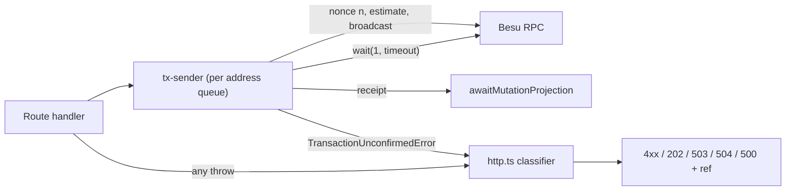

# nb-bond-api operational hardening — Design

**Status:** Draft
**Created:** 2026-09-28
**Intent:** [`intent.md`](intent.md)
**Builds on:** the operator audit trail (#213), the committed-mutation `202` semantics
(`MutationAcceptedError`), the health indicator and self-healing plan
([`docs/plans/archive/health-indicator-and-self-healing-plan.md`](../archive/health-indicator-and-self-healing-plan.md)),
graceful shutdown (`src/shutdown.ts`), and the auctions service extraction
(`src/features/auctions/service.ts`).

## Decision Summary

- **One transaction sender per signer address.** A new `src/tx-sender.ts` owns nonce
  assignment for every key the API signs with. Its state is a map keyed by checksummed
  address, holding a cached nonce and a serialising queue. `sendWithManagedNonce` stays as
  the `BOND_ADMIN` convenience wrapper, so the auctions service does not change shape. The
  Central Bank, bank TBD, bidder, and created-bank paths move onto it.
- **The lock is held through confirmation, but bounded.** `tx.wait(1, NB_BOND_API_TX_WAIT_TIMEOUT_MS)`
  replaces the unbounded wait. On timeout the sender resets that signer's nonce cache,
  releases the queue, and throws `TransactionUnconfirmedError { hash }`. The review suggested
  releasing the lock right after broadcast. That was not adopted: with a 1-second QBFT block
  period it gains about a second per queued transaction, and it breaks the invariant that
  each preflight (`staticCall` or `eth_estimateGas`) sees the effects of the previous
  transaction from the same signer (see Alternatives).
- **Failure classification lives in one error middleware.** `http.ts` becomes the only place
  that maps errors to HTTP. Client errors (body-parser, validation) keep their 4xx. A chain
  that cannot be reached, or a registry entry that cannot be resolved, gives `503`. A
  broadcast-but-unconfirmed transaction gives `202` `MutationAccepted` where a bond or auction
  resource is known, and `504` ProblemDetails with the hash otherwise. Anything else gives a
  `500` with a sanitised message plus a reference id that is also logged. Only that last
  group is logged at `error` as "unhandled".
- **Liveness is process-local, and health is time-bounded.** `GET /livez` touches neither
  the provider nor SQLite. `/v1/health` races its chain reads against a short bound, so it
  always answers inside the probe timeout. It never hangs behind the ethers
  network-detection retry loop.
- **The chart enforces one pod per volume.** It uses `strategy: Recreate`, and the template
  fails to render when `replicaCount > 1`. Probe, security, strategy, and resource defaults
  move from `values.local.example.yaml` into the chart's `values.yaml`, because the example is
  copied once into a gitignored file and would never reach an existing sandbox.
- **Correctness before cleanup.** The stale `TbdBytecode.json` is refreshed in the cleanup
  slice, because it is an artifact defect and not a style issue. Drift guards and the
  route-module refactor come last and are optional.



## Current-State Evidence

### Repository Evidence

| Finding | Evidence | Consequence |
|---|---|---|
| **Verified.** Only `BOND_ADMIN` sends go through `sendWithManagedNonce`. It has a single global `cachedNonce` and mutex | `src/chain.ts:51-92`; callers in `src/app.ts` (bond create, disable, coupon) and `src/features/auctions/service.ts` | Other signers have no coordination |
| **Verified.** Central Bank writes call `wnok.add/remove/mint/burn/transfer` without a nonce, then `tx.wait()` | `src/central-bank.ts:166-216` | Concurrent CB mutations read the same pending nonce |
| **Verified.** Bank creation signs `GlobalRegistry.setContract` and the WNOK allowlist add with the same CB wallet. The TBD deploy uses the bank key, and its comment says fresh keys need no coordination | `src/banks.ts:197-240` | A bank create that overlaps a CB mutation collides. An operator-supplied bank key is not necessarily fresh |
| **Verified.** Bank TBD writes build `new Wallet(match.privateKey)` per call and `tx.wait()` | `src/banking-tbd.ts:214-238` | Concurrent TBD mutations for one bank collide |
| **Verified.** Bidder bids build `new Wallet(input.bidder.privateKey)` and `tx.wait()` | `src/bidder-bid.ts:217-226` | Concurrent bids by one bidder collide |
| **Verified.** Nordea's configured bank key and the seeded Nordea bidder key are the same key: both resolve through `fixtureRoleKey('PK_NORDEA')` | `src/banking-tbd.ts:45-62`, `src/bidders.ts:51-121` | A bid and a TBD Nordea mutation can collide across features. Keying by instance or by module would not catch this; keying by address does |
| **Verified.** `sendWithManagedNonce` awaits `tx.wait()` inside the lock, with no timeout | `src/chain.ts:80-91` | One unconfirmed transaction blocks every later `BOND_ADMIN` mutation indefinitely |
| **Verified.** `express.json()` errors (`status` 400 or 413, `type: 'entity.parse.failed'`/`'entity.too.large'`) reach the app-level wrapper. It only special-cases `HttpError`, logs everything else as "unhandled", and `problemErrorMiddleware` answers 500 with `err.message` | `src/app.ts:143`, `src/app.ts:1509-1520`, `src/http.ts:186-187` | Client mistakes look like server faults. Live: `POST /v1/bidders` with `{bad` returned 500 on 2026-09-28 |
| **Verified.** No catch-all route before the error middleware | `src/app.ts` (last route is `/v1/banking/tbd/:address/transfer`) | Live: `GET /v1/nope` returned `404 text/html` on 2026-09-28 |
| **Verified.** `MutationAcceptedError` and `DependencyUnavailableError` also pass through the "unhandled" `logger.error` before becoming 202 or 503 | `src/app.ts:1511-1519` | Successful 202s produce error-level stack traces |
| **Verified.** `RpcUnavailableError` and `RegistryResolutionError` are thrown on request paths (`assertProviderReady`, `getBondManagerAddress`) but are not mapped | `src/chain.ts:19-43`, `166-233`; `src/http.ts:152-188` | Chain outage returns 500; the open known issue |
| **Verified.** The `500` detail is `err.message`, and an existing test pins that behaviour. The OpenAPI `InternalError` description says the detail carries the thrown message | `tests/http.test.ts` "exposes the thrown message for unknown sandbox errors"; `openapi.json` `components.responses.InternalError` | Changing it is a deliberate contract-text change, not a bug fix in passing |
| **Verified.** `/v1/health` (unauthenticated) and `POST /v1/admin/restart-ingestion` return `recentErrors[].message` verbatim from `pushError` | `src/ingestion.ts:73-82`, `src/app.ts:278-290`, `src/admin.ts:85,120` | ethers `SERVER_ERROR`/`NETWORK_ERROR` messages embed request payloads and `requestUrl` |
| **Verified.** `entra` 401 detail is `Invalid token: ${err.message}` | `src/auth.ts:108-113` | Tells a caller which claim check failed |
| **Verified.** `If-None-Match` is compared with `===` against the strong tag | `src/http.ts:76-81` | Weak tags, lists, and `*` never give 304 |
| **Verified.** The gateway does not weaken the ETag today (no `Content-Encoding`, strong `ETag` through `bond-api.cbdc-sandbox.local`) | `curl -D -` on 2026-09-28 | The ETag fix is spec correctness, not a live outage |
| **Verified.** Liveness and readiness both probe `/v1/health` with the default `timeoutSeconds: 1` | `helm/values.local.example.yaml`; live `livenessProbe` JSON | See Runtime Evidence |
| **Verified.** `/v1/health` does up to five sequential chain reads: block number, network, `BOND_AUCTION()`, `BOND_TOKEN()`, `GOV_RESERVE()`, plus registry lookups until cached | `src/app.ts:222-261` | Slow RPC makes the probe exceed one second |
| **Verified.** ethers 6.17 `JsonRpcProvider._start()` retries network detection every second while the RPC is down, and queued requests wait instead of rejecting. Without `staticNetwork`, account-level calls re-detect the network | `node_modules/ethers/lib.commonjs/providers/provider-jsonrpc.js` `_start` and `_detectNetwork` | When Besu is down at boot, every chain read, including health, hangs |
| **Verified.** Two providers exist: request path `src/chain.ts:14` and ingestion `src/ingestion.ts:41`. Neither sets a request timeout; the `FetchRequest` default is 300 s | source | A stalled RPC can hold a request for five minutes |
| **Verified.** Deployment has no `strategy`, `resources`, or checksum annotations, and `replicas` comes from `.Values.replicaCount` | `helm/templates/deployment.yaml` | See Runtime Evidence |
| **Verified.** Probes, `securityContext`, and `podSecurityContext` live only in `values.local.example.yaml`. The fixture generator copies it once into the gitignored `values.local.yaml` (no `--force`) | `scripts/generate-local-sandbox-fixtures.mjs:24-33`; `common/helpers.sh` `requireNBBondApiHelmValues` | Editing the example never reaches an existing sandbox. The live `values.local.yaml` already differs from the example |
| **Verified.** Runtime stage copies the whole pruned workspace `node_modules` | `Dockerfile:44-47` | Live image has `react`, `react-dom`, and nb-ui's browser-auth package; `node_modules` is 96 MB |
| **Verified.** `CMD` touches `data/ingestion.sqlite` because `createApp()` opens the read-only handle before the writable one | `Dockerfile:51`; `src/app.ts:173-183`; `src/ingestion-db.ts:448-486` | Opening the writable handle first creates the file and schema, so the `touch` becomes unnecessary |
| **Verified.** `check-node-version-consistency.py` requires `NB_BOND_API_RUNTIME_BASEIMAGE=$SANDBOX_NODE_IMAGE` and rejects hard-coded `node:<digit>` in the Dockerfiles and `common/helpers.sh` | `scripts/verification/check-node-version-consistency.py:105-135` | A slim runtime needs a new pin variable and a matching check change |
| **Verified.** `TbdBytecode.json` was last written in #200 (2026-07-03). #232 (2026-07-16) moved the compiler to 0.8.36, the EVM target to `osaka`, and OpenZeppelin to 5.6.1. A current `contracts/out` build differs at most byte positions. All six ABIs match `contracts/out` | `git log`; local compare on 2026-09-28 | Created banks deploy stale TBD code. The ABI "in sync" claim holds; the bytecode claim does not |
| **Verified.** `openapi.json` equals a fresh generation from `src/schemas.ts` | scratch regeneration and `diff` on 2026-09-28 | A snapshot guard would pass today |
| **Verified.** `REDEMPTION` stays in the API enum on purpose: the comment and #276 keep it so stored `operation_attempts` rows (a preserved system-of-record) still validate. Only the write-side `OPERATION_TYPES` list lacks that comment | `src/contracts/operations.ts:16-17`; `src/operations.ts:25-46`; commit 49dd2ed | The finding "leftover to remove" is corrected: removing it would break stored rows. Plan clarifies instead |
| **Verified.** The global `requireAnyRole(recognizedRoles)` already covers `/v1/banking`, so the second gate at `app.use('/v1/banking', ...)` is a no-op | `src/app.ts:325`, `src/app.ts:1219` | Dead code |
| **Verified.** The comment "Central Bank is operator-only…" sits above `/v1/registry` and `/v1/operations`; the guard it describes is further down | `src/app.ts:941-966` | Misleads readers about what `/v1/registry` requires |
| **Verified.** The `NB_BOND_API_CLOSE_GAS_LIMIT` comment says "during the migration"; the QBFT migration shipped in #232 | `src/env-vars.ts:57-63` | Stale note |
| **Verified.** `.env.example` lacks `PK_NORDEA`/`PK_DNB`/`PK_ALICE_TBD`, the `NB_BOND_API_AUTH_*` variables, the `TBD_*`/`DVP_CONTRACT_NAME` names, `CORS_ALLOWED_ORIGINS`, `NB_BOND_API_SSE_HEARTBEAT_MS`, and `NB_BOND_API_CLOSE_GAS_LIMIT` | `services/nb-bond-api/.env.example` vs `src/env-vars.ts` | Direct `npm run dev` users miss settings |
| **Verified.** The amount parse block (`BigInt(body.amount)` plus the positive check) appears 6 times, and the address regex 8 times in `app.ts`. `bigIntStringSchema` already rejects non-digits, so the `try/catch` never fires, but nothing bounds the value to `uint256` | `src/app.ts` central-bank and banking routes; `src/contracts/common.ts:21-28` | Duplication; an amount above 2^256−1 reaches ethers and returns 500 |
| **Verified.** `createBidder` only checks hex shape. A zero or out-of-range scalar makes `secp256k1.getPublicKey` throw a plain `Error`, which becomes 500. `env-vars.ts` and `banks.ts` already range-check | `src/bidders.ts:141-150,265-289`; `src/env-vars.ts:125-147`; `src/banks.ts:262-267` | Inconsistent validation |
| **Verified.** `reconcileFixtureBidderOverrides` deletes and inserts without a transaction | `src/bidders.ts:235-236` | A crash between the two statements loses the fixture row |

### Runtime Evidence

- **Verified (2026-09-28, read-only `kubectl`):** pod `nb-bond-api` restarted 44 minutes
  earlier after `SandboxChanged` (host restart). Events show `Readiness probe failed` and
  `Liveness probe failed` on `/v1/health` with "context deadline exceeded". The Deployment
  strategy is `RollingUpdate` with `maxSurge` and `maxUnavailable` at 25%. For one replica
  that means one surge pod and zero unavailable, so an upgrade runs two pods side by side.
  `resources` is `{}`. The PVC is `ReadWriteOnce` on `standard`.
- **Verified:** container memory is about 182 MiB current and 203 MiB peak (cgroup
  `memory.current` and `memory.peak`).
- **Verified:** the live image is about 2.0 GB uncompressed, built on the full `node:26.5.0`
  base.
- **Needs verification (Phase 0):** time for `/v1/health` and `/livez` with `RPC_URL`
  pointing at a closed port, before and after the change. Whether `npm ci --omit=dev
  --workspace nb-bond-api` (or an equivalent prune) yields a working runtime tree with the
  `better-sqlite3` native binding. That `node:26.5.0-slim` shares the builder's glibc line so
  the compiled binding loads. That `--force` regeneration of `values.local.yaml` reproduces
  the same deterministic fixture keys.

### Existing Test Coverage and Gaps

- `tests/http.test.ts` covers md5, ETag exact match, ProblemDetails, 202 and 503 mapping, and
  pins the raw 500 detail (this plan updates that test deliberately).
- `tests/app.test.ts` boots `createApp` against in-memory SQLite. It is the right place for
  404, body-parser, and `/livez` checks.
- `tests/auction-service.test.ts` mocks `sendWithManagedNonce`; keeping that export stable
  avoids churn.
- Gaps: no test for nonce assignment or concurrency, wait timeouts, chain-unavailable
  mapping, weak or listed `If-None-Match`, `createBidder` key range, or health sanitisation.

## Significant Findings

| Priority | Finding | Why it matters | Plan response |
|---|---|---|---|
| Important | Nonce collisions on every non-admin signer, including across features on the shared Nordea key | Operator actions fail intermittently under normal UI concurrency | Phase 2 per-address sender |
| Important | Unbounded `tx.wait()` under the admin lock | One stuck transaction blocks every bond and auction mutation until the pod restarts | Phase 2 wait timeout |
| Important | Liveness depends on the chain; health hangs while ethers retries network detection | Restart loop during Besu outages; observed probe failures on 2026-09-28 | Phase 3 `/livez` and bounded health |
| Important | `RollingUpdate` on one RWO SQLite volume | Two ingestion loops and two nonce caches on `BOND_ADMIN` during every upgrade | Phase 3 `Recreate` and replica guard |
| Important | Stale `TbdBytecode.json` | Created banks run older compiled code than fixture banks; nothing detects it | Phase 5 refresh; Phase 6 optional guard |
| Important | Chart defaults live only in the copied example | Probe and security fixes would silently never apply to existing sandboxes | Phase 3 moves defaults into `values.yaml`, plus a one-time regeneration |
| Follow-up | Error responses use `application/json`, not `application/problem+json` | Convention gap, not a defect; changing it touches the UI client's content negotiation | Recorded in `progress.md` |

## Invariants

- A signer never has two unconfirmed transactions from this process at once. Every
  preflight sees the chain state produced by that signer's previous transaction.
- A response never claims failure after a durable mutation: once a hash exists, the client
  gets `202` or `504` with the hash, never `503` "retry".
- `/v1/health` keeps its documented shape and never answers 5xx for chain reasons.
- `/livez` never touches the provider, SQLite, or the ingestion module.
- One API process per SQLite volume at any time.
- The system-of-record tables (`bidders`, `banks`, `operation_attempts`) are untouched by any
  schema change. No projection schema version bump is needed.
- `openapi.json` is regenerated from `src/schemas.ts`, never edited by hand.
- Stored `REDEMPTION` audit rows keep validating.

## Target Architecture

### Ownership and Dependency Direction

- `src/tx-sender.ts` (new) owns nonce state and confirmation bounds. It depends on ethers
  and `env-vars` only. `chain.ts` re-exports `sendWithManagedNonce` as
  `(send) => sendSigned(adminWallet, send)`.
- `src/http.ts` owns error classification. A new `src/error-text.ts` (or a section of
  `http.ts`) owns sanitising. The app-level wrapper in `app.ts` is deleted, and the
  middleware takes the logger by parameter.
- `src/app.ts` keeps route wiring. Parsing helpers move to `src/parsing.ts`, and address
  params become Zod param schemas next to `bidderAddressParamSchema`.
- The chart owns the pod lifecycle. `values.yaml` carries defaults, and
  `values.local.yaml` carries only secrets, env, and per-workstation overrides.

### Transaction Sender

```ts
// src/tx-sender.ts (shape, not final code)
export class TransactionUnconfirmedError extends Error { hash: string; signer: string; timeoutMs: number }
export async function sendSigned<T extends TransactionResponse>(
  wallet: Wallet,
  send: (nonce: number) => Promise<T>,
): Promise<{ tx: T; receipt: TransactionReceipt | null }>;
```

- The state is `Map<address, { nonce: number | null; queue: Promise<void> }>`. The queue is
  the existing promise-chain mutex, lifted per address.
- Inside the queue: resolve the nonce (cached, or `getTransactionCount(address, 'pending')`),
  `send(nonce)`, then `tx.wait(1, NB_BOND_API_TX_WAIT_TIMEOUT_MS)`, then `nonce + 1`.
- On any error, reset that address's nonce to `null`. This is always correct because the
  lock is held through confirmation, so no in-flight transaction from this process can be
  miscounted. An ethers `TIMEOUT` from `wait` becomes `TransactionUnconfirmedError` with the
  hash.
- Send sites move over like this: `central-bank.ts` writes use `sendSigned(getCbWallet(), (nonce) => fn(addr, amount, { nonce }))`;
  `banks.ts` `registerContract` uses the CB wallet, and `deployTbd` uses
  `factory.deploy(..., { nonce })` then `deploymentTransaction()`; `banking-tbd.ts`
  `sendTbdTx` passes `{ nonce }` into `invoke`; `bidder-bid.ts` passes `{ nonce }` to
  `submitBid`.
- `withOperationRecording` records `TransactionUnconfirmedError` with its hash. `classifyFailure`
  reads `err.hash` alongside `receipt.hash`, and the error text says "unconfirmed after N ms;
  may still mine". The status stays `FAILED`, so the `OperationStatus` enum does not change.
  This is a residual honesty gap (see Residual Risks).

### Provider

- `chain.ts` builds its provider from a `FetchRequest` with `timeout =
  NB_BOND_API_RPC_TIMEOUT_MS` (default 10 000) and `{ staticNetwork: true }`.
- The `FetchRequest` timeout does not cover requests that are still queued behind the ethers
  boot-time network detection loop, because those are never dispatched. `assertProviderReady()`
  therefore races `getBlockNumber()` against the same timeout and throws
  `RpcUnavailableError` when it expires. That function is the entry point for the registry
  lookups (`getBondManagerAddress`, `getWnokAddress`, `resolveRegisteredAddress`,
  `listRegistryEventNames`) that every request makes before its contract handles are cached.
  So when Besu is down at boot, requests get a 503 instead of hanging.
- The ingestion provider is not changed here. Backfill `getLogs` calls can legitimately run
  longer than a request-path timeout, and `src/ingestion.ts` belongs to the ingestion
  correctness plan. Sharing, or at least `staticNetwork: true` there, is handed to that plan.

### API and Zod Contract

- Classifier order in `problemErrorMiddleware`:
  1. `MutationAcceptedError` gives 202 (unchanged).
  2. `TransactionUnconfirmedError` with a known resource: the route converts it to
     `MutationAcceptedError` (bond or auction routes) and gets 202. Otherwise it becomes
     `504 Gateway Timeout` ProblemDetails with detail "transaction <hash> was broadcast but
     not confirmed within N s; do not resend; check the Operations page or the explorer".
  3. `HttpError` keeps its status.
  4. body-parser errors (`type` starting `entity.` or `charset.`/`encoding.`, numeric
     `status` 4xx) keep their status with a fixed title and safe detail: "Malformed JSON
     body", "Request body exceeds 100kb", "Unsupported encoding".
  5. `DependencyUnavailableError`, `RpcUnavailableError`, `RegistryResolutionError`, and
     ethers errors with `code` in `NETWORK_ERROR`, `TIMEOUT`, or `SERVER_ERROR` (or a
     `cause.code` in `ECONNREFUSED`, `ECONNRESET`, `EAI_AGAIN`, `ENOTFOUND`) give 503 with
     "Chain RPC is unavailable; wait for the Besu pod to become ready, then retry." These
     are raised before broadcast by construction, because after broadcast the sender throws
     `TransactionUnconfirmedError`, so the retry advice is honest. They are logged at `warn`.
  6. Everything else gives 500 with `detail = sanitise(err) + " (ref <uuid>)"`, logged at
     `error` with the full stack and the same ref.
- Sanitiser: prefer ethers `shortMessage`; otherwise `message` cut at the first ethers
  key-dump suffix (` (action=`, `(code=`, `transaction=`, `info=`, `request=`, `data=`). Any
  `http(s)://` URL is reduced to `protocol//host` (the same rule as `sanitiseRpcUrl`), and
  the text is capped at 300 characters. The same function maps `recentErrors[].message` at
  the health and restart-ingestion boundary, not inside `ingestion.ts`.
- JSON 404: a final `app.use((req, res) => problem(req, res, 404, 'Not Found', { detail: 'No route for <METHOD> <path>' }))`
  after all routes and before the error middleware. It sits behind `authMiddleware`, so in
  `entra` mode an anonymous caller gets 401 first and learns nothing about route existence.
- `If-None-Match`: parse per RFC 9110. `*` matches. Otherwise split on commas, trim, strip a
  `W/` prefix, and use weak comparison on the opaque tag. This applies to GET and HEAD only,
  as today.
- `entra` 401: detail "Invalid or expired bearer token"; the library message is logged at
  `debug`.
- OpenAPI changes, all in `src/openapi/`: the `InternalError` description (sanitised
  message plus ref); a `PayloadTooLarge` response added to `errorRefs.mutate`; a
  `GatewayTimeout` (504) added to `errorRefs.mutate`; the `ServiceUnavailable` description
  names chain unavailability. Regenerate `openapi.json`. No schema field changes, so nb-ui
  needs no change, because `httpClient.js` already renders `detail`.
- `/livez` is **not** added to the OpenAPI document. It follows the `/docs` precedent of an
  unversioned operational endpoint outside the contract. It is documented in the README.

### Probes and Chart

- `GET /livez` is mounted first, before helmet, CORS, rate limit, and body parsing. It
  returns `200 {"status":"alive"}` with `Cache-Control: no-store`.
- `/v1/health`: the chain-probe block and the contract-address block run concurrently under
  one `withTimeout(..., 2000)` budget, so the handler's worst case is about 2 s, not the sum
  of both blocks. When the budget expires, the unfinished block records
  `headReachable: false` or keeps the zero addresses, as it already does on errors.
- `values.yaml` (chart defaults):
  - `strategy: { type: Recreate }`.
  - `livenessProbe`: `/livez`, `periodSeconds: 20`, `timeoutSeconds: 2`,
    `failureThreshold: 3`, `initialDelaySeconds: 10`.
  - `readinessProbe`: `/v1/health`, `periodSeconds: 5`, `timeoutSeconds: 4`,
    `failureThreshold: 6`.
  - `resources`: requests `cpu: 50m`, `memory: 256Mi`; limit `memory: 512Mi`; no CPU limit,
    because unseal and finalise are bursty and a CPU limit only throttles.
  - `securityContext`: the current block plus `readOnlyRootFilesystem: true`, and a `/tmp`
    `emptyDir` mount.
  - `podSecurityContext`: `fsGroup: 1000`.
- `deployment.yaml`: `checksum/config` and `checksum/secret` pod annotations
  (`include ... | sha256sum`); `strategy` from values; `{{ if gt (int .Values.replicaCount) 1 }}{{ fail ... }}`.
- `values.local.example.yaml` loses the probe and security blocks and keeps `namespace`,
  `imagePullPolicy`, `env`, and `secret`. Helm deep-merges maps, so a stale
  `values.local.yaml` that still carries `livenessProbe.httpGet.path: /v1/health` would
  override the new default. Rollout therefore includes a one-time
  `node scripts/generate-local-sandbox-fixtures.mjs --force`, after Phase 0 confirms it
  reproduces the same deterministic keys.

### Consistency and Failure Semantics

| Situation | Today | Target |
|---|---|---|
| Two same-signer mutations overlap | One fails with a nonce error as a 500 | Serialised; both succeed |
| Transaction never confirms | Admin lock held forever; request hangs | 202 or 504 with hash after the timeout; signer released; nonce cache re-read |
| Chain down, before broadcast | 500 with a raw ethers message | 503 with a stable detail |
| Chain down at boot, health probe | Hangs; probes fail; liveness can restart the pod | Health answers `down` within about 2 s; `/livez` 200; no restart |
| Malformed body | 500, logged as unhandled | 400 or 413 |
| Upgrade with a new image | Two pods on one volume for a while | Old pod stops (graceful shutdown) before the new one starts; brief downtime |

### Security and Deployment Boundary

- Fewer disclosures: no raw ethers payloads, no URL paths, no JWT validation hints.
- The new env vars (`NB_BOND_API_TX_WAIT_TIMEOUT_MS`, `NB_BOND_API_RPC_TIMEOUT_MS`) have
  defaults and are validated in `env-vars.ts`. A non-local deployment can tune them without
  code changes.
- `Recreate`, the replica guard, resources, and `readOnlyRootFilesystem` carry over to a
  non-local deployment unchanged. That deployment must also keep one replica, which is
  already required by the in-process SSE broadcaster.

## Alternatives Considered

- **Release the per-signer lock right after broadcast** (the review's suggestion). This was
  rejected for the sandbox. With `blockperiodseconds: 1` the lock is held about 1–2 s per
  transaction, so pipelining gains little. It would also let a second same-signer
  transaction be simulated against `latest` state that excludes the first one. For
  dependent operations that means false reverts at estimation, or, on the close-auction
  retry path that skips estimation, mined reverts. The operator can revisit this if
  sandbox throughput ever matters.
- **ethers `NonceManager`.** Rejected. Its `sendTransaction` increments the nonce before
  `populateTransaction` runs `eth_estimateGas`. A revert at estimation therefore burns a
  local nonce and leaves a gap until `reset()`. The repo's preflight-and-reset pattern is
  the safer base.
- **One global lock for every signer.** Rejected. It serialises unrelated keys, for example
  a bidder bid behind a coupon payment, for no correctness gain.
- **Generic "Internal error" 500 detail.** Rejected in favour of a sanitised message plus a
  ref. The sandbox is used for technology testing, and the decoded revert or short message
  is the useful part.
- **A readiness endpoint that fails while the chain is down.** Considered (see Decisions).
  With one replica there is no other pod to route to. An unready pod makes the gateway
  answer with a bare 503, and the UI loses the API's own `down` explanation.
- **Share one provider between request path and ingestion.** Deferred to the ingestion plan,
  because the timeout needs differ.
- **Keep the `touch` in `CMD`.** Rejected. It hides an ordering dependency that a two-line
  reorder in `createApp()` removes.

No decision here is load-bearing enough for an ADR. They are local operational policies and
can be reversed cheaply.

## Decisions

| Decision | Recommendation | Rationale | Operator action required |
|---|---|---|---|
| Signer lock scope | Per address, held through confirmation, bounded by `NB_BOND_API_TX_WAIT_TIMEOUT_MS` (default 30 000) | See Alternatives | Confirm the deviation from the review |
| `500` detail policy | Sanitised short message plus logged ref id; update the `InternalError` description and the pinning test | Keeps sandbox observability without payload dumps | Confirm |
| Unconfirmed-transaction status | 202 `MutationAccepted` on bond and auction routes; 504 ProblemDetails with hash elsewhere; audit row `FAILED` with hash and "unconfirmed" text | Honest, no enum change | Confirm |
| Readiness semantics | Readiness stays on bounded `/v1/health`, so the pod is Ready while the chain is down and reports `down` | Single replica; better UI signal | **Decide before Phase 3** |
| `/livez` in OpenAPI | No, like `/docs` | Kubelet-facing, not an API resource | Confirm |
| Chart defaults location | Move to `values.yaml`; strip the example; one-time `--force` regeneration | Otherwise the change never reaches existing sandboxes | Confirm the regeneration step |
| Slim runtime base `node:26.5.0-slim` | Adopt as Phase 4b behind approval: new `SANDBOX_NODE_RUNTIME_SLIM_IMAGE` in `common/node-version.env`, and a `check-node-version-consistency.py` rule update | New image tag and a verification-script change | **Explicit approval** |
| OpenAPI snapshot test | Add to `tests/openapi-contract.test.ts` (runs in the existing `format-lint-test` job) | Cheap; no new workflow | **Explicit approval** (makes an existing CI check stricter) |
| ABI and bytecode sync check | New `scripts/verification/check-nb-bond-api-abi-sync.py` plus a step in Contracts CI after `forge build`, with sparse checkout extended to `services/nb-bond-api/src/abi` | Only that job has `forge build` output | **Explicit approval** (new script and CI step) |
| Route-module extraction | Optional Phase 7, one PR per feature, after the separate hardening change lands | Large refactor | **Explicit go-ahead** |
| Live outage test on the cluster | Prefer a local `npm run dev` against a dead `RPC_URL`; scale Besu to zero only with a go-ahead | Avoids mutating shared sandbox state | Go-ahead if the cluster test is wanted |

## Residual Risks

- A transaction that times out may still mine later. The audit row says `FAILED` with an
  "unconfirmed" note. An `UNCONFIRMED` status would be more honest but changes the
  `OperationStatus` enum, so it is recorded as a follow-up.
- If a transaction is stuck (not dropped) in the Besu pool, the next same-signer send
  re-reads `pending`, queues behind it, and also times out. That is visible and bounded, but
  not self-healing. With zero base fee and one validator it is only expected when the
  validator itself is down.
- `Recreate` adds a few seconds of downtime per upgrade: graceful shutdown (at most 10 s)
  plus startup.
- The body limit stays at the Express default of 100 kB. Very large finalise bodies would now
  get an honest 413 instead of a 500, but the limit itself is not revisited here.
- `readOnlyRootFilesystem` could expose an unexpected write path. Phase 3 verifies this
  against the live pod before merging.
