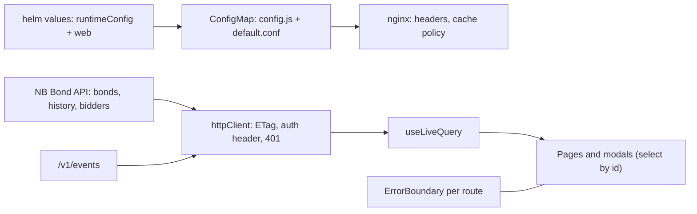

# NB UI correctness and hardening — Design

**Status:** Draft
**Created:** 2026-09-28
**Intent:** [`intent.md`](intent.md)
**Builds on:** [`archive/redeem-with-final-coupon/`](../archive/redeem-with-final-coupon/)
(ADR 0005 lifecycle), [`archive/coupon-closure-review-fixes/`](../archive/coupon-closure-review-fixes/)
(work-queue Coupon payout page), the bond soft-delete pattern (`DELETE /v1/bonds/{isin}` +
`includeDisabled`).

## Decision Summary

Fix each finding in the layer that owns it, correctness first, then serving, then cleanup.

- **Live data is the source of truth for a dialog.** Modals hold an identifier, never a row
  snapshot, and re-select from the live query on every render (U2).
- **The HTTP client owns the reaction to 401.** `httpClient.js` already owns the
  `Authorization` header; it also becomes the single place that calls
  `auth.handleUnauthorized()`, for REST and for the stream (U7).
- **Failures stay local.** The router never throws; a page-level error boundary keyed by route
  keeps navigation alive, and a root boundary catches the rest (U4).
- **Bidder removal is a soft delete in the system-of-record table.** An additive
  `disabled_at` column, no schema-version bump, no projection rebuild; the API mirrors the bond
  pattern (`DELETE` disables idempotently, `includeDisabled` lists); the UI warns about
  holdings computed from data it already loads (U8).
- **History is shown where the lifecycle lives.** A card on the bond detail page, reading the
  existing history endpoint once its ordering is fixed elsewhere (U3).
- **Serving policy lives in chart values.** One ConfigMap renders both `config.js` and the
  nginx server config, so CSP origins derive from the same `runtimeConfig` values and the
  existing checksum annotation rolls the pod on any change (U9).



## Current-State Evidence

All `Verified` items were read in the repository on 2026-09-28 at `db92409`. Line numbers
refer to that commit.

### Repository Evidence

| Finding | Evidence | Consequence |
|---|---|---|
| **Verified.** Tile counts start as `{ total, staged, auctioning, outstanding }` and only increment known keys; there is no Matured tile, although the filter offers `matured` | `src/pages/BondsPage.jsx:66-72`, `:114-131`, `:149`; API enum `staged, auctioning, outstanding, matured` in `services/nb-bond-api/src/contracts/bonds.ts:17` | Every matured bond counts in Total but in no tile |
| **Verified.** The row object is stored (`setPayTarget(b)`) and passed as `bond`; the modal derives `holders`, `isFinal`, `rateBps`, and totals from that prop | `src/pages/CouponPayoutPage.jsx:227`, `:241`; `src/pages/PayCouponModal.jsx:47-67` | Live refreshes replace `data` but not `payTarget`; the preview can show interim amounts for what is now the final period, or old holders, while the server pays the current holder set (`holders: null`) |
| **Verified.** Hint and empty state promise coupon history "on the Bonds page"; Bonds and bond detail show only `made/total`; `BondsApi.listBondHistory` has no caller | `CouponPayoutPage.jsx:110-115`, `:150`; `src/api/bondsApi.js:41-46`; `grep listBondHistory src` | The promised history is unreachable in the UI |
| **Verified.** History endpoint fetches `limit × 4` rows per table `ORDER BY block, id` (oldest first), then sorts descending and slices; `before` is applied after the fetch | `services/nb-bond-api/src/compose.ts:117-148`; `ingestion-db.ts:489-503`, `:547-562` | For a bond with more than 400 rows in one table the newest rows (the closure) are missing, and paging by `before` can return nothing. Owned by `ingestion-projection-correctness` |
| **Verified.** `parseHash` calls `decodeURIComponent` unguarded; `useRoute` calls it in the `useState` initialiser and in the `hashchange` listener; no error boundary exists anywhere | `src/hooks/useRoute.js:24`, `:28`, `:55`, `:58`; `grep -r ErrorBoundary src` empty; `src/main.jsx` | On load with `#/bonds/%E0` the throw happens during render and React unmounts the root (blank page). On a later `hashchange` the throw happens in the listener, so the route silently does not change until a reload, which then blanks the page |
| **Verified.** `request()` throws `HttpError` on any non-2xx and never calls the auth provider; only the stream loop calls `auth.handleUnauthorized()` on 401 and returns silently on 403 | `src/api/httpClient.js:143`; `src/sync/LiveUpdatesProvider.jsx:71-75` | With `LIVE_UPDATES=false`, or when a REST call is the first to see the expired token, the operator sees "HTTP 401" toasts and error cards instead of the login page. A 403 on the stream ends live updates with no indication |
| **Verified.** `entraAuth.handleUnauthorized()` is idempotent (`markSessionExpired` guards and notifies once); `noneAuth.handleUnauthorized()` is a no-op | `src/auth/entraAuth.js:130-135`, `:219-221`; `src/auth/noneAuth.js:23` | Calling it from the client on every 401 is safe in both modes |
| **Verified.** UI delete is `window.confirm` then `BiddersApi.deleteBidder`; API route checks only unrevealed sealed bids on open auctions, then `DELETE FROM bidders` | `src/pages/BiddersPage.jsx:65-80`; `services/nb-bond-api/src/app.ts:806-833`, `:896-924`; `ingestion-db.ts:704-707` | The signing key is gone while the address may still hold bond units (and keep receiving coupons) or wNOK. The page header says delete is "hard-blocked when on-chain bids reference them" (`BiddersPage.jsx:7`), which overstates the guard |
| **Verified.** `bidders` is a system-of-record table created with `CREATE TABLE IF NOT EXISTS`, excluded from projection drops; `SCHEMA_VERSION` bumps drop and rebuild projection tables only; there is no `ALTER TABLE` precedent | `ingestion-db.ts:38-50`, `:284-293`, `:407-446` | A new column needs an idempotent additive step, not a version bump |
| **Verified.** Seeding inserts the fixture roster only when `COUNT(*)` is 0; the fixture-override reconcile replaces a row by delete plus insert | `services/nb-bond-api/src/bidders.ts:181-200`, `:214-243` | Today, hard-deleting every bidder reseeds the fixtures on the next boot. With soft delete the count stays non-zero; the reconcile must carry `disabled_at` into the replacement row |
| **Verified.** No route-level bidder tests exist; `tests/bidders.test.ts` covers the service functions against an in-memory DB | `grep -rn v1/bidders services/nb-bond-api/tests` empty | U8 adds service tests plus the route cases that need no chain |
| **Verified.** Coupon payout page reads `{ data, loading, error, reload }` only; `refreshError` is dropped | `CouponPayoutPage.jsx:43-47`; `useApi` returns `refreshError` (`src/hooks/useApi.js:40-44`) | A failed background refresh leaves stale rows with no signal |
| **Verified.** No custom nginx config; image is `nginxinc/nginx-unprivileged:1.30.3-alpine` by tag | `Dockerfile:19`, `:41-45`; `common/images.yaml:54-55` | No CSP, `X-Frame-Options`, `nosniff`, `Referrer-Policy`; `Server` header shows the version; `index.html` and `config.js` get heuristic browser caching |
| **Verified.** `vite build` emits source maps; the current `dist/` has two `.map` files of about 1.2 MB each; `public/*` is copied into `dist/`, so `config.template.js`, `config.js`, and the logo ship in the image | `vite.config.js:10`; `ls services/nb-ui/dist` | Image carries maps and dead files; the Dockerfile comment "we don't ship a default config.js" is wrong (the mount masks the shipped copy) |
| **Verified.** `LIVE_UPDATES` is emitted unquoted; other values use `quote` | `helm/templates/configmap.yaml:21` | `--set-string runtimeConfig.liveUpdates='x; …'` becomes executable JavaScript in `config.js` |
| **Verified.** Deployment has no `resources` and no `automountServiceAccountToken` | `helm/templates/deployment.yaml` | Unbounded pod; a service-account token mounted into a static file server that never calls the Kubernetes API |
| **Verified.** Fonts load at runtime from a third-party CDN | `index.html:7-12`; stacks fall back to system fonts (`src/styles.css:47-49`) | A CSP must allow those origins, and offline or privacy-restricted browsers fall back silently |
| **Verified.** Unused code: selectors `selectBond`, `selectAuction`, `selectAuctionInList`, `selectHolders`, `selectBids`, `selectAllocation`, `selectLatestAuctionTx` (and `selectAllAuctions` is used only inside `selectors.js`); `Fmt.durationToYears`; CSS `.divider`, `.lc-decision`, `.row-between`, `.section-title`, `.stack-2/3/4`; `public/norges-bank-logo.svg` referenced only by a comment | `grep` over `src` and `tests` | Dead surface; `AGENTS.md` still documents the selectors |
| **Verified.** Finalisation sends `testMode`; the API route never reads it and the OpenAPI operation does not declare it | `src/api/auctionsApi.js:59-64`; `services/nb-bond-api/src/contracts/auctions.ts:266-279`; `app.ts:729` | Undeclared parameter; misleads readers into thinking test mode affects finalisation |
| **Verified.** Central Bank tile reads "pays coupon, buyback, redemption"; Banking page shows a "Government-nominated" KPI reading `token.government.nominated` | `src/pages/CentralBankPage.jsx:190`; `src/pages/BankingPage.jsx:293-311`; fixtures in `tests/BankingPage.test.jsx:32`, `:43` | Pre-ADR-0005 wording; the tile throws a `TypeError` if the API drops `government` first |
| **Verified.** Stale docs: `AGENTS.md` (selectors list, `config.template.js` for envsubst, init container in the checklist, `reopenAuction` pattern), `public/config.js:2-4`, `DEVELOPMENT.md` (envsubst paragraph, `nginx-unprivileged:1.27`, "CSP from defaults is permissive enough", `reopenAuction` follow-up, a mislabelled link at line 33), `Dockerfile:43-45` | files as listed | Docs describe a deployment shape and a feature state that no longer exist. The `docs/KNOWN_ISSUES.md` reopen entry and the nb-ui cloud-wording lines are owned by the `documentation-refresh` plan |
| **Verified.** Duplication: "Not authorised" block three times; `isMutationAccepted` toast branch in five handlers; `formatNok` and `formatWnok` differ only by the ×1000 and the `''` case; `UNIT_NOMINAL` hard-coded as `1000n` and `* 1000`; `window.confirm` three times; the Show-disabled storage key literal duplicated | `App.jsx:101-136`; `BondsPage.jsx:76`, `AuctionsPage.jsx:80`, `CouponPayoutPage.jsx:81`, `AuctionDetailPage.jsx:64,81,102`; `src/utils/format.js:30-49`; `PayCouponModal.jsx:26`; `BiddersPage.jsx:66`, `BankingPage.jsx:117`, `CentralBankPage.jsx:53`; `BondDetailPage.jsx:72` vs `BondsPage.jsx:20` | Low-risk drift; optional phase |

### Runtime Evidence

- **Verified:** `npx vitest run` in `services/nb-ui`: 25 files, 125 tests pass (2026-09-28).
- **Needs verification:** the nginx-unprivileged image's `/etc/nginx/conf.d/default.conf`
  shape (listen 8080, root path) before replacing it; resource usage of the `web-server`
  container for request and limit values; whether the entra-mode token flow needs `frame-src`
  in addition to `connect-src` (read `entraAuth.js` and confirm in a deployment that uses
  entra; locally only `none` runs).

### Existing Test Coverage and Gaps

- Covered: Bonds list, filter, disabled toggle; bond detail disable gate and ISIN-typed
  confirm; coupon page queue, payable gating, preview amounts, reserve warning; bidder roster
  render and modal opening; `httpClient` headers, errors, stream parsing; stream 401 and 403
  in `LiveUpdatesProvider`; auth gate and entra plugin.
- Not covered: `parseHash`, any error boundary, REST 401, tile sums, modal behaviour under
  live change, bidder delete, history, `AuctionDetailPage` close/cancel/finalise,
  `FinaliseAuctionModal`, `PlaceBidModal`, `CreateAuctionModal` RATE/PRICE/BUYBACK gating,
  `CreateBondModal` submit, the wNOK and TBD modals, and chart rendering.

## Significant Findings

| Priority | Finding | Why it matters | Plan response |
|---|---|---|---|
| Important | U2 stale coupon preview | Money-moving confirmation can show different amounts, or interim instead of final wording, from what executes | Phase 2 |
| Important | U8 hard delete of a key-bearing roster row | Irrecoverable loss of the only key for an address that may hold assets | Phase 3 |
| Important | U4 blank app on bad link or render error | Any single fault takes down the whole operator surface | Phase 1 |
| Important | U7 401 handled only on the stream | Expired sessions surface as raw errors with live updates off | Phase 1 |
| Important | U9 unquoted `LIVE_UPDATES` | Chart value becomes executable script | Phase 5 |
| Follow-up | U1 tile sums, coupon page refresh errors, U9 headers and caching, cleanup, docs | Wrong or misleading display; hygiene | Phases 2, 5, 6 |
| Dependency | History endpoint returns oldest rows and filters `before` after the fetch | U3 card would miss the closure rows on large bonds | Phase 4 waits for `ingestion-projection-correctness` |

## Invariants

- `httpClient.js` stays the only module that calls `fetch`, attaches `Authorization`, and now
  reacts to 401. Pages never call the auth provider for this.
- Coupon eligibility comes only from the server's `coupon.payable`; the UI never derives it
  from wall-clock time.
- The Coupon payout page stays a work queue: issued, not disabled, not matured, with supply or
  remaining periods. History lives on the bond detail page.
- System-of-record tables are never dropped or rebuilt; the bidder column change is additive
  and idempotent and needs no `SCHEMA_VERSION` bump.
- A disabled bidder's address is still a chain holder: coupons and closure payouts continue to
  resolve it on-chain; disabling changes only the roster and impersonated bid entry.
- One source for runtime configuration: chart `runtimeConfig` values feed both `config.js` and
  the CSP origins.
- No new npm package, image, or copied third-party file without approval.

## Field and Source Classification

| Field or concept | Current source | Target source | Class/owner | Freshness or fallback rule |
|---|---|---|---|---|
| Bond status counts | `listBonds` statuses, three of four counted | Same, all four counted | derived / UI | Recomputed on every live refresh |
| Coupon preview (holders, final period, amounts) | Row snapshot at click time | Live `listBonds` entry selected by ISIN | projected / API; derived / UI | Re-derived each render; confirm disabled when the bond is gone, matured, or `payable` is false and no submit is in flight |
| Bond history rows | Not shown | `GET /v1/bonds/{isin}/history` | projected / API | Live query on `BONDS`; limit 500, newest first once the endpoint is fixed |
| Session validity after 401 | Stream only | Any API response | auth provider state | `handleUnauthorized` idempotent |
| Live-updates availability | Not exposed | Provider `status` | presentation-only | `forbidden` after a stream 403; cleared on auth change |
| Bidder active flag | Row existence | `bidders.disabled_at` (NULL = active) | configured, system of record / API | Written by `DELETE` (disable) and restore |
| Bidder holdings warning | Not shown | `wnokBalance` from the bidder DTO; bond units from `listBonds` `holders` | projected / API; derived / UI | Both queries already live on the page |
| CSP `connect-src` origins | None | `runtimeConfig.apiBaseUrl` origin, auth authority origin in `entra` mode, `web.csp.extraConnectSrc` | configured / chart | Rendered at install; pod rolls on change via checksum |
| `UNIT_NOMINAL` | Two literals | One exported UI constant mirroring `BondToken.UNIT_NOMINAL` | configured (contract constant) / UI | Changes only with a contract redeploy; API exposure is a follow-up |

## Target Architecture

### Ownership and Dependency Direction

- `src/hooks/useRoute.js`: `parseHash` uses a local `safeDecode` that returns the raw segment
  when decoding fails. A raw `%E0` then reaches the API, which rejects it (invalid ISIN or
  unknown auction), and the page's existing `ErrorState` shows the reason. No new route type.
- `src/components/ErrorBoundary.jsx`: the one class component in the package (React offers no
  hook equivalent); `getDerivedStateFromError` plus `componentDidCatch` logging to the console.
  Props: `fallback` render function and `resetKey`. Used twice: in `main.jsx` around `<App />`
  with a self-contained fallback (no Layout, no toast context) and in `App.jsx` around the
  routed page with `resetKey` set to the route, so navigating away clears the error while the
  top bar keeps working. `AGENTS.md` gains the exception to "no class components".
- `src/api/httpClient.js`: a small `failedResponse(res, body)` helper builds the `HttpError`
  and calls `auth.handleUnauthorized()` when `status === 401`. Both `request()` and
  `streamLiveEvents()` use it. `LiveUpdatesProvider` keeps its "stop on 401" branch but no
  longer calls the provider itself. REST 403 stays a plain `HttpError` (an authorisation
  answer, not a session problem).
- `src/sync/LiveUpdatesProvider.jsx`: the context value gains `status`
  (`disabled | connecting | open | reconnecting | forbidden`) and a `useLiveUpdatesStatus()`
  hook; `Layout` shows a one-line notice when the status is `forbidden` ("Live updates are not
  permitted for this account; use Refresh"). An auth-state change restarts the loop and clears
  `forbidden`.
- `CouponPayoutPage.jsx`: holds `payIsin`; `payTarget` is `(data ?? []).find(b => b.isin ===
  payIsin)` from the unfiltered live list. The modal receives the live bond (or `null`) and a
  `stale` reason when the bond is missing, matured, disabled, or not payable. Adds
  `RefreshState`.
- `PayCouponModal.jsx`: when `stale` is set and `mutation.loading` is false, confirm is
  disabled and a notice explains why. While a submit is in flight the modal ignores the stale
  signal, because the operator's own payment makes the bond non-payable and the live update can
  arrive before the POST response.
- `BondDetailPage.jsx`: new `BondHistoryCard` (same file or `src/pages/BondHistoryCard.jsx`)
  with its own `useLiveQuery([BONDS], () => BondsApi.listBondHistory(isin, { limit: 500 }))`.
  Bond-level events only (`auctionId === null`; auction events already appear in the Auctions
  card). Rows newest first: `BOND_CREATED`, `ISSUANCE_COMPLETE`, `COUPON_PERIOD_PAID` (period
  number, holders paid, coupon total) with its per-holder `COUPON_PAID` rows grouped beneath
  by `paymentNumber`, `REDEEMED`, `MATURED` (payment count, principal, coupon, unsold burned),
  `BOND_DISABLED`. Block number and a transaction link built like `OperationsPage`'s `TxCell`
  (extract it to `src/components/TxLink.jsx` so both pages share it). A note appears when 500
  rows came back. History events carry blocks, not timestamps; the card shows blocks.
- Bidders (API): `services/nb-bond-api/src/ingestion-db.ts`, `bidders.ts`, `app.ts`,
  `contracts/bidders.ts`, regenerated `openapi.json`. UI: `src/api/biddersApi.js`,
  `BiddersPage.jsx`, a new `ConfirmModal` primitive in `src/components/ui.jsx`.
- Chart: `helm/templates/configmap.yaml` renders `config.js` and `default.conf`;
  `deployment.yaml` mounts `default.conf` over `/etc/nginx/conf.d/default.conf` by `subPath`;
  `values.yaml` gains a `web` block (CSP extras, report-only switch) and `resources`.

### Data or State Model

`bidders` gains `disabled_at INTEGER NULL` (unix milliseconds). Applied in `createTables` for
fresh databases and by an idempotent `ensureBidderDisabledColumn(db)` (checks
`PRAGMA table_info(bidders)`, then `ALTER TABLE bidders ADD COLUMN disabled_at INTEGER`) inside
the existing write-handle initialisation transaction. `SCHEMA_VERSION` is unchanged.

Rules:

- `listBidderRows(db, { includeDisabled })` filters `disabled_at IS NULL` by default.
- `getBidderRowByAddress` and `getBidderRowByName` return disabled rows too (callers decide).
- `disableBidder(db, address, now)` sets `disabled_at` when NULL; returns the row; idempotent.
- `restoreBidder(db, address)` clears it (only if the restore decision is accepted).
- `createBidder` conflict messages say "exists (disabled)" when the clashing row is disabled.
- `reconcileFixtureBidderOverrides` copies `disabled_at` into the replacement row.
- `deleteBidderRow` remains only for that reconcile path; no route calls it.
- Seeding still counts all rows, so disabling every bidder no longer reseeds on restart.

### API and Zod Contract

Follow the API's existing conventions (Zod schemas generate `openapi.json`, RFC 7807 errors,
`md5` on resources, `includeDisabled` as on bonds):

- `Bidder` schema: add `disabled: boolean` and `disabledAt: unixMillis | null`.
- `GET /v1/bidders`: `includeDisabled` boolean query parameter, default false.
- `DELETE /v1/bidders/{address}`: operationId `disableBidder` (was `deleteBidder`), summary
  "Disable a bidder (soft delete; key and history retained)". Keeps the unrevealed-bid 409
  guard. 204 when disabled or already disabled; 404 when unknown.
- `PATCH /v1/bidders/{address}` body `{ "disabled": false }` returns the `Bidder` (restore;
  only if accepted). A body with `disabled: true` is rejected with 400 so there is one way to
  disable.
- `POST /v1/bidders/{address}/bids`: 409 `bidder is disabled`.
- `publishLiveChange(['bidders'])` on disable and restore.
- Regenerate `openapi.json`; the API contract test and the UI live-event contract test must
  pass.

UI client: `listBidders({ includeDisabled })`, `disableBidder`, `restoreBidder`; the old
`deleteBidder` name is removed in the same PR (single consumer).

### Consistency and Failure Semantics

- Coupon modal: preview equals the latest projection the UI has seen. The server still resolves
  holders on-chain at submit time, so a projection lag can still differ from chain state; the
  server-side eligibility re-check and the contract's full-supply coverage check make that fail
  loudly rather than pay a partial set (residual risk below).
- History card: the endpoint is read-only and idempotent; the card reloads on bond live
  events. Until the dependency lands, a bond with more than 400 rows in one history table would
  miss its newest rows, which is why the phase is sequenced after the fix.
- 401: the client marks the session expired and still rejects, so callers keep their error
  handling; in `entra` mode the gate flips to the login page with the "expired" notice.
- Bidder disable is a single-row update: no partial state. Restoring a bidder has no chain
  effect.
- Error boundary: a caught error is logged to the console with the component stack; the
  fallback offers "Try again" (resets the boundary) and a link to Bonds.

### Security and Deployment Boundary

nginx server config rendered by the chart (values in `web`):

```text
server_tokens off;
location /assets/  -> Cache-Control "public, max-age=31536000, immutable" + security headers
location = /config.js, location = /index.html, location /  -> Cache-Control "no-cache" + security headers
security headers (one snippet included in every location, because add_header in a location
drops server-level add_header):
  Content-Security-Policy[-Report-Only]:
    default-src 'self'; script-src 'self'; style-src 'self' <font-css-origin?>;
    font-src 'self' <font-origin?>; img-src 'self' data:; connect-src 'self' <api-origin>
    <auth-authority-origin if entra> <extraConnectSrc>; frame-ancestors 'none';
    base-uri 'self'; form-action 'self'; object-src 'none'
  X-Frame-Options: DENY
  X-Content-Type-Options: nosniff
  Referrer-Policy: strict-origin-when-cross-origin
```

- Origins come from `runtimeConfig.apiBaseUrl` (parsed with `urlParse`) and, in `entra` mode,
  `runtimeConfig.authAuthority` or the default authority origin that `src/auth/entraAuth.js`
  falls back to. The font origins appear only while the operator keeps the font CDN.
- `style-src` without `'unsafe-inline'`: React `style` props are applied through the CSSOM,
  which CSP does not block, and the bundle ships no inline `<style>`. If a runtime check shows
  a violation, add `'unsafe-inline'` for styles only and record why.
- `web.cspReportOnly: false` default; `true` switches the header name for diagnosis.
- `config.js` values rendered with `toJson` (strings escaped, booleans literal); `booleanConfig`
  in `src/config.js` already accepts `"true"`/`"false"` strings.
- `automountServiceAccountToken: false`; `resources` from values (requests about 10m CPU and
  16Mi memory, memory limit about 64Mi; tune after measuring).
- Portability: a non-local deployment that does not use this chart must replicate the rendered
  `default.conf`; `DEVELOPMENT.md` Portability Flags says so. No non-local identifiers enter
  the repo.

## Alternatives Considered

- **Bake the nginx config into the image** (static headers) — rejected as the only mechanism:
  `connect-src` depends on runtime config, so baking needs envsubst templates plus a writable
  `conf.d` under `readOnlyRootFilesystem`. Chart rendering reuses the existing ConfigMap and
  checksum rollout.
- **Keep sending `holders: null` but snapshot at open** (today) vs **send the previewed holder
  list explicitly**: the explicit list would make the chain pay exactly the preview or revert,
  at the cost of reverts during projection lag. Deferred; live re-selection closes the reported
  gap with no API change.
- **Hard delete with a stronger guard** (block while holding assets) — rejected: still loses
  the key once the guard passes, and conflicts with the soft-delete preference.
- **A `SCHEMA_VERSION` bump for the bidder column** — rejected: drops and rebuilds every
  projection table for a change that touches none of them.
- **`react-error-boundary` package** — rejected: new dependency for about 30 lines.
- **Route-level "not found" page for malformed links** — rejected for now: unknown sections
  already fall back to Bonds, and passing the raw segment through gives an honest API error
  with no new route. Revisit if the operator wants a dedicated page.
- **Reword U3 only** (drop the history promise) — viable fallback if the dependency slips
  indefinitely; the card is preferred because closure totals (`MATURED` payload) exist nowhere
  else in the UI.
- **JSON-schema validation of UI fixtures with a validator package** — needs a new dependency;
  a key-level check written in the test file is enough for the optional drift guard.

## Decisions

| Decision | Recommendation | Rationale | Operator action required |
|---|---|---|---|
| Bidder restore path | Include `PATCH /v1/bidders/{address}` `{ disabled: false }` | Disabling a seeded dealer is otherwise permanent, and re-importing its key conflicts with the retained row; the endpoint is small | Confirm (if declined, disabled bidders are permanent like disabled bonds) |
| Keep the unrevealed-bid guard on disable | Keep | No behaviour change beyond soft delete; comment corrected | None |
| Web fonts | Keep the CDN for now and allow its two origins in CSP; decide separately between self-hosting and the system font stack | Self-hosting copies third-party font files under a licence more restrictive than Apache-2.0 (inventory update and double confirmation); the system stack changes the look | Choose; approval required for self-hosting |
| nginx image digest pin | Optional; recommend doing it with the next nginx bump, not in this plan | Pin change touches `common/images.yaml`, the Dockerfile default, and licence inventory | Approve if wanted now |
| Source maps | `build.sourcemap: false` | Source is public, so maps reveal nothing new, but they are 2.5 MB served to anyone; `vite dev` keeps maps | None |
| Refresh-error display on the other pages without `RefreshState` (`BiddersPage`, `BondDetailPage`, `GlobalRegistryPage`, `OperationsPage`) | Fold into Phases 2–3 since two of those pages are already touched | Same one-line defect as the Coupon payout page | Confirm fold-in; otherwise it stays a follow-up |
| `UNIT_NOMINAL` | One exported UI constant; API exposure is a follow-up | Contract constant; changes only with a redeploy | None |
| Optional phases 7–9 | Land after Phases 1–6, each on its own PR, only when requested | Low risk, low urgency | Release per phase |
| ADR | None needed | No load-bearing architectural choice; soft delete follows the established bond pattern | None |

## Residual Risks

- The coupon preview can still differ from chain state during projection lag; the server
  re-check and the contract's coverage rule make that a failed payment, not a wrong one.
- CSP can block something only a browser shows (for example an entra-mode token call). The
  report-only switch and the optional local header check mitigate; entra mode is not
  exercisable locally.
- A rollback of the API to a pre-U8 image ignores `disabled_at`, so disabled bidders reappear
  as active. Documented; no data loss.
- `ErrorBoundary` does not catch errors in event handlers or async code; those still surface
  through existing toasts and error states.
