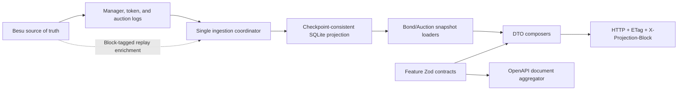

# Projection-Aligned API And Zod Contract — Implementation Plan

**Status:** Complete
**Date:** 2026-07-13
**Updated:** 2026-07-14
**Scope:** `services/nb-bond-api/`, `services/nb-ui/`, generated OpenAPI, and supporting documentation
**Builds on:** PR #224, `nb-application-architecture-improvements-plan.md`, and items 1, 2, and 8 in `backend-design-improvements-backlog.md`

**Implementation result:** Phases 1–8 are complete. Bond and Auction reads come
from one atomic SQLite checkpoint, mutations actively advance the same
serialized ingestion coordinator and fall back to `202 MutationAccepted`, and
the API/UI expose only replayable lifecycle states. Every HTTP feature now owns
its Zod contracts and OpenAPI path fragment; `src/openapi/document.ts` only
assembles those fragments and shared responses.

The local projection was rebuilt from block zero on 2026-07-14. Bidder, bank,
and operation-attempt counts were unchanged across the rebuild (3, 2, and 8),
the API returned projection block 81, and the projected supply for the deployed
bond matched `totalSupplyByPartition` at block tag 81. The current local fixture
had zero issued supply and no holders, so non-zero mint/transfer/burn balance
cases remain covered by deterministic reducer and replay tests rather than that
single live fixture. Repeated unchanged reads also produced a stable ETag and a
`304 Not Modified` response.

## Decision Summary

Move the bond and auction read models toward one checkpoint-consistent SQLite
projection, while keeping Besu as the source of truth and Zod as the single HTTP
contract source.

This is a sandbox implementation, so the design deliberately avoids a second
database, message broker, generated client package, generic repository layer,
or contract changes whose only purpose is read optimization.

The implementation should:

1. Fix projection reducer correctness before trusting projected balances.
2. Project bond lifecycle, supply, coupon, holder, auction metadata, bid, and
   allocation fields from reproducible chain data.
3. Read each bulky DTO from one explicit SQLite checkpoint.
4. Return an updated DTO only when ingestion includes the mutation receipt
   block; otherwise return an honest `202` committed-but-projection-pending
   response rather than stale data or a false failure.
5. Split Zod contracts and OpenAPI path ownership by feature without creating a
   second schema source.
6. Remove or explicitly implement API states that are currently not durable,
   especially the no-op auction rejection path.
7. Keep health monitoring separate from SSE invalidation, but reduce healthy UI
   polling to once per minute and retain faster degraded-state feedback.



## Why This Work Is Needed

The API currently composes a bond from two points in time:

- SQLite projection rows at the ingestion checkpoint; and
- live contract reads at the current chain head.

That can produce a valid-looking but internally inconsistent DTO. For example,
the live supply can reflect a finalisation block while projected auction history
still reports the auction as closed.

PR #224 reduces this by adding a bounded post-mutation checkpoint wait,
request-scoped read reuse, and projection-first auction status. It does not make
the complete Bond or Auction DTO a checkpoint snapshot.

The Zod/OpenAPI catalog has also started splitting into `src/contracts/`, but
most feature DTOs, requests, paths, and document assembly still live together in
`src/schemas.ts`.

## Verified Current-State Findings

### Data And Projection

- Besu is authoritative. Projection tables are disposable and must be fully
  rebuildable from chain data.
- Preserved `bidders`, `banks`, and `operation_attempts` tables are systems of
  record and must remain outside projection reset/migration drops.
- `composeBond()` still performs live reads for maturity, coupon values,
  maturity state, total supply, token/manager addresses, and holder balances.
- `composeAuction()` still performs live reads for metadata, sealed bids,
  allocations, maturity duration, and contract addresses.
- The ingestion loop reads BondManager and BondToken logs, but not BondAuction
  logs. BondAuction already emits full creation metadata and submitted bid
  ciphertext/hash/index values.
- BondToken emits `IsinIssued`, `IsinEnabled`, `IsinExtended`, and
  `IsinReduced`, but ingestion does not currently reduce those events into bond
  state.
- BondManager emits `BondIssuanceComplete`, `BondRedemptionComplete`, and
  per-holder `CouponPaid` events, which are sufficient to derive important
  lifecycle and coupon progress fields.

### Correctness Defects To Fix First

1. **Double application of mint/redeem balances.** BondToken mint and
   redeem operations emit both an `IsinMinted`/`IsinRedeemed` event and the
   underlying ERC-1410 `TransferByPartition`. The current decoder treats both
   event families as balance deltas. A single mint or burn therefore credits
   or debits a holder twice. Live balance reads currently mask much of this;
   switching to projection-first balances without fixing it would expose the
   error.
2. **Zero-address pseudo-balances.** The generic transfer reducer writes both
   sides even for mint/burn transfers. The zero address should never become a
   projected holder.
3. **Unstable allocation timestamp.** Both live on-chain allocation composition
   and the local closed-auction allocation calculation ultimately use
   `Date.now()` for `computedAt`, so an unchanged allocation can produce a new
   md5/ETag on every request. The close block timestamp for a proposal and the
   finalisation block timestamp for a final allocation are stable,
   chain-derived values.
4. **Auction rejection is not durable.** `approve:false` currently sends no
   transaction and persists no state, while the API/UI contract contains a
   `rejected` status. The refreshed auction therefore remains closed. A local
   projection row would violate projection purity because replay cannot recover
   it.
5. **Bond status names are not lifecycle-truthful.** A staged, zero-supply bond
   is currently labelled `minting`; an issued bond can remain `minting` until
   its first coupon payment.

## Source Classification

The target composer must classify every field before implementation.

| DTO field family          | Current source                    | Target source                   | Notes                                                                                                  |
| ------------------------- | --------------------------------- | ------------------------------- | ------------------------------------------------------------------------------------------------------ |
| Bond identity/disabled    | projection + live handles         | projection                      | `BondCreated`, `BondDisabled`, token issue/disable events                                              |
| Maturity duration         | live BondToken                    | projection                      | `BondCreated` / `IsinIssued` transaction data                                                          |
| Maturity date             | live BondToken                    | projection                      | derive from `IsinEnabled` block timestamp + maturity duration                                          |
| Coupon duration/rate      | live BondToken                    | projection                      | `IsinEnabled`                                                                                          |
| Last coupon/payment count | live BondToken                    | projection                      | finalisation timestamp initially; then max `CouponPaid.paymentNumber` and its block timestamp          |
| Matured flag              | live BondToken                    | projection                      | `AllCouponsPaid`; validate against replayed lifecycle                                                  |
| Total supply              | live BondToken                    | projection                      | canonical partition transfer reducer; never double-count high-level token events                       |
| Holder balances           | DB candidates + live verification | projection                      | canonical `TransferByPartition`, excluding zero address                                                |
| Bond status               | mixed derivation                  | projection-derived domain rule  | staged → auctioning → outstanding → matured → redeemed                                                 |
| Auction lifecycle         | projection with chain fallback    | projection                      | manager lifecycle events                                                                               |
| Auction metadata          | live BondAuction                  | projection                      | BondAuction `AuctionCreated` plus manager bond address                                                 |
| Sealed bids               | live BondManager/BondAuction      | projection                      | `BidSubmitted` / `BidCancelled`                                                                        |
| Final allocations         | live BondAuction                  | projection enrichment           | deterministic `getAllocations(id, { blockTag })` at finalisation block because the event omits entries |
| Allocation computedAt     | request clock                     | projection                      | close block timestamp while proposed; finalisation block timestamp once final                          |
| Contract addresses        | repeated live reads               | app/static context              | registry-bound deployment data; not lifecycle state                                                    |
| Coupon payable            | latest chain timestamp            | projection checkpoint timestamp | matches the latest block the DTO represents                                                            |

### Projection-Enrichment Rule

Projection purity does not require every value to appear directly in an event.
A block-tagged contract read performed while replaying a known event is allowed
when it is:

- deterministic at that block;
- persisted with the source block/log position;
- repeatable during a full resync; and
- never sourced from request-local or operator-local state.

Use this for final allocation entries because `AuctionFinalized` does not emit
them. Do not add a Solidity event solely for this sandbox read model while the
ERC-3643 migration is expected to replace the current bond contracts.

## Target Data Model

Exact names may change during implementation, but keep the model explicit and
feature-oriented.

### `bond_state` Projection

One current row per ISIN:

- `isin`, `partition`, `bond_address`, `disabled`
- `maturity_duration`, `maturity_date`
- `coupon_duration`, `coupon_yield`
- `last_coupon_payment`, `coupon_payment_count`, `is_matured`
- `total_supply`, `offering`
- `ever_issued`, `redemption_complete`
- `updated_block`, `updated_log_index`

Amounts remain decimal strings in SQLite and API JSON. Never coerce uint256
values through JavaScript `Number`.

### Existing `balances`

Retain the table, but make `TransferByPartition` the sole canonical balance
movement source:

- mint: credit non-zero `to` only;
- burn/redeem: debit non-zero `from` only;
- transfer: debit `from`, credit `to`;
- ignore `IsinMinted` and `IsinRedeemed` for balance arithmetic, while they may
  still contribute history/lifecycle facts;
- never write the zero address as a holder.

Update `bond_state.total_supply` in the same SQLite transaction as balance
deltas, or derive it from balances inside the same read snapshot. Prefer an
explicit total updated by mint/burn deltas so list reads do not repeatedly sum
all holders.

### Auction Projection

Extend `auctions` and add focused child tables:

- auction metadata: owner, end, offering, public key, auction type, bond,
  status, and finalisation block timestamp;
- `auction_bids`: auction ID, bid index, bidder, ciphertext, plaintext hash,
  cancelled flag, source block/log;
- `auction_allocations`: auction ID, position, bidder, units, rate, type, source
  block;
- retain immutable event/history tables for transaction references.

Do not persist decrypted bid plaintext. Unseal projected ciphertext at compose
time with the existing sealing key, preserving the current restart/key caveat.

### Checkpoint Snapshot

Add a synchronous `loadBondSnapshot()`/`loadAuctionSnapshot()` read boundary
that loads all required projection rows under one SQLite read transaction and
returns:

- the DTO source records;
- `asOfBlock`;
- the checkpoint block timestamp.

No `await` or chain call is allowed while the SQLite snapshot transaction is
open. Optional/static enrichment happens after the snapshot has been captured
and must not change lifecycle values.

Expose the checkpoint as `X-Projection-Block` on projection-backed responses
and document the header in OpenAPI. Keep it out of DTO md5 calculation.

## Honest Mutation Consistency Contract

The existing bounded wait avoids indefinite requests, but timeout can still
lead to a response composed before the receipt block is projected.

Replace passive waiting with one ingestion coordinator shared by the polling
loop and mutation services:

1. Transaction is mined and the receipt block is known.
2. `advanceProjectionTo(receipt.blockNumber)` acquires the ingestion lock and
   processes missing ranges synchronously.
3. If the checkpoint reaches the receipt block, compose and return the updated
   DTO (`200` or `201`).
4. If the transaction committed but projection advancement cannot complete
   within the bound, return `202 MutationAccepted` containing only public-safe
   transaction reference, target resource, and `projectionPending:true`.
5. Never return a generic failure after a committed transaction; that invites
   unsafe retries.
6. SSE resource notifications remain post-projection-commit. A pending client
   refreshes when the corresponding notification arrives.

Add a Zod `MutationAccepted` response contract and declare `202` on every
affected mutation. UI mutation APIs must accept the documented union and show
“committed; waiting for read model” rather than treating `202` as an error.

## Health Monitoring After SSE

Do not remove `/v1/health` polling. SSE and health have different contracts:

- SSE invalidations tell mounted queries that a resource may have changed.
- `/v1/health` reports RPC reachability, chain head, ingestion-loop state,
  projection lag, and recent ingestion failures.

An open SSE connection therefore does not prove that Besu or ingestion is
healthy. Use an adaptive UI cadence instead:

- probe immediately when the UI loads;
- poll every 60 seconds while healthy;
- poll every 10 seconds while degraded so resync/recovery remains visible;
- exponentially back off unreachable checks from 10 seconds to 60 seconds;
- make no requests while the tab is hidden;
- probe immediately and resume when the tab becomes visible;
- keep manual Refresh/Reconnect/Resync actions immediate.

These constants remain UI implementation details for this sandbox; do not add
a new runtime setting until an operator actually needs to tune them per
environment.

## Bond Status Contract

Replace the misleading status model in the same contract-breaking slice as the
projection switch.

Recommended enum and precedence:

1. `redeemed`: issuance happened, redemption completed, and supply is zero.
2. `matured`: final coupon/maturity signal is present and supply remains.
3. `auctioning`: the latest relevant auction is open or closed awaiting
   finalisation/cancellation.
4. `outstanding`: issuance happened and supply is greater than zero.
5. `staged`: partition exists but no issuance has completed.

Keep `disabled` as the existing independent boolean, not another status.
Treat missing required projection facts as `503`, not `unknown`; remove
`unknown` unless a concrete, user-visible state remains that legitimately
cannot be classified.

Update Zod, OpenAPI, UI filters/badges, fixtures, and tests atomically.

## Auction Rejection Decision

Recommended sandbox choice: remove the no-op rejection action and `rejected`
status from the active API/UI contract until the chain can represent it.

- Change finalisation request to an approve-only operation, or remove
  `approve:false` from its Zod union.
- Remove the Reject control and unreachable `rejected` presentation branches.
- Document cancellation as the existing durable negative terminal action.

Alternative: add an on-chain `rejectAuction` transition and event, then project
it normally. Do not persist rejection only in SQLite; that would be erased on
resync and would violate the source-of-truth model.

## Zod And OpenAPI Target Structure

Keep one source of truth, organized by feature:

```text
src/contracts/
  common.ts
  bonds.ts
  auctions.ts
  bidders.ts
  banking.ts
  central-bank.ts
  health.ts
  operations.ts
  live-events.ts

src/openapi/
  document.ts
  shared-responses.ts
```

Each feature contract module owns:

- request/parameter schemas;
- response DTO schemas;
- inferred TypeScript types;
- its OpenAPI path fragment or a colocated exported path builder.

The document module only combines tags, security, shared responses, feature
paths, and component registration. It must not redefine feature fields.

Additional rules:

- Keep internal decrypted-bid validation separate from HTTP DTOs.
- Export schemas needed by composer/service tests; do not export only inferred
  types.
- Add direct Zod conformance tests for every composer result and mutation
  response variant.
- Add generated-document checks for unique operation IDs, declared security,
  valid component references, documented response headers, and frontend live
  resource enum alignment.
- Do not add runtime response validation to every production request. Validate
  composers directly in tests; optionally enable boundary validation only in
  local development if it materially helps debugging.
- Do not introduce an OpenAPI-generated frontend client in this work.

## Implementation Phases

### Phase 0 — Characterization And Contract Decisions

1. Add a field/source inventory test fixture for staged, open-auction,
   finalised, partially settled, coupon-paid, matured, redeemed, disabled, and
   buyback bonds.
2. Record current live-call counts and DTO/OpenAPI snapshots.
3. Confirm the approve-only rejection decision and the new bond status enum.
4. Confirm every projected field is reproducible from an event or a block-tagged
   replay read.

Exit: contract-breaking choices are explicit before schema or UI changes.

### Phase 1 — SSE-Era Health Traffic Shaping

1. Change healthy polling from seven seconds to 60 seconds.
2. Retain a 10-second degraded cadence and exponential unreachable backoff.
3. Preserve the immediate load, visibility-return, and manual reload probes.
4. Update timer, hidden-tab, degraded recovery, and cleanup tests.

Exit: healthy tabs make at most one background health request per minute, while
degraded recovery remains visible without conflating SSE with health.

### Phase 2 — Projection Reducer Correctness

1. Make `TransferByPartition` the canonical balance reducer.
2. Ignore zero-address sides and prevent high-level mint/redeem event double
   application.
3. Bump the projection schema version so existing incorrect balances are
   discarded and rebuilt from canonical transfers.
4. Add reducer tests for mint, transfer, burn, redemption, replay, two holders in
   one transaction, and log-order variations.
5. Fix deterministic allocation `computedAt` using block timestamp.
6. Rebuild the local projection and compare projected balances to live
   `balanceOfByPartition`/`totalSupplyByPartition` for test fixtures.

Exit: projected balances and ETags are trustworthy before live verification is
removed.

### Phase 3 — Bond State Projection

1. Bump the projection schema version and add `bond_state`; preserve every
   system-of-record table.
2. Decode/reduce `IsinIssued`, `IsinEnabled`, `IsinExtended`, `IsinReduced`,
   `BondIssuanceComplete`, coupon events, maturity completion, redemption
   completion, and disable/re-create events.
3. Resolve unique source block timestamps once per block during ingestion.
4. Maintain state and balances in the same database transaction as checkpoint
   advancement.
5. Add full replay and restart/idempotency tests.

Exit: all bond lifecycle/coupon/supply/holder fields are available at one
checkpoint.

### Phase 4 — Auction Metadata, Bids, And Allocations

1. Add BondAuction as an ingestion log source.
2. Project creation metadata and bid submitted/cancelled events.
3. Define precedence to avoid double-reducing manager and auction lifecycle
   events: BondAuction owns metadata/bids; BondManager owns business lifecycle
   and DvP outcome history.
4. At finalisation, read allocations at the event block tag and persist them as
   reproducible enrichment.
5. Add replay tests for RATE, PRICE, BUYBACK, cancellation, duplicate bidders,
   partial fills, and partial DvP outcomes.

Exit: Auction DTO lifecycle/metadata/bids/allocations no longer require
request-path chain reads.

### Phase 5 — Snapshot Composers And Honest Read-Your-Writes

1. Add projection snapshot loaders and checkpoint headers.
2. Switch bond and auction composers field-by-field to snapshot input.
3. Remove live holder verification and lifecycle contract reads.
4. Add the shared ingestion coordinator and synchronous
   `advanceProjectionTo()` path.
5. Add the `202 MutationAccepted` fallback and UI handling.
6. Verify SSE publication occurs only after the projection transaction and
   checkpoint are visible.

Exit: every successful DTO represents one projection checkpoint; a lagging
projection is reported honestly rather than hidden.

### Phase 6 — Status And Rejection Contract Cleanup

1. Implement the new bond status derivation over projection facts.
2. Remove the non-durable rejection path unless on-chain support is explicitly
   chosen.
3. Update UI filters, badges, lifecycle controls, fixtures, and user-facing copy.
4. Regenerate OpenAPI and document the deliberate breaking changes.

Exit: every advertised lifecycle state is durable and replayable.

### Phase 7 — Complete Zod/OpenAPI Feature Split

1. Move one feature at a time, preserving exported names during each move.
2. Move path fragments with their feature contracts.
3. Create the small document aggregator and shared response module.
4. Add composer-to-Zod conformance and generated-document integrity tests.
5. Regenerate OpenAPI after every feature move and review semantic diffs.

Exit: no monolithic schema file owns unrelated features, and Zod remains the
only request/response contract source.

### Phase 8 — Documentation And End-To-End Verification

1. Update architecture, service development docs, backlog statuses, and known
   issues.
2. Rebuild projection from block zero in the local sandbox.
3. Compare all projected fixtures against block-tagged contract reads.
4. Exercise mutation success and forced projection-pending flows.
5. Verify stable ETag/304 behavior across unchanged repeated reads.
6. Run all API/UI/build/lint/format/OpenAPI/public-hygiene/link checks.

Exit: code, generated contract, UI behavior, and operational documentation
describe the same consistency model.

## Test Matrix

Required automated coverage:

- event reducer unit tests with synthetic public-safe addresses and hashes;
- exact-once replay and duplicate delivery tests;
- checkpoint rollback/restart tests;
- schema migration preserving bidders, banks, and operation attempts;
- projection rebuild equivalence;
- mixed-resource snapshot tests proving one `asOfBlock`;
- Besu-unavailable GET tests showing projection-backed reads still work;
- required enrichment failure tests during ingestion;
- mutation `200`/`201` caught-up and `202` projection-pending contracts;
- SSE-after-commit ordering;
- Zod acceptance/rejection tests for every DTO and request union;
- OpenAPI operation/security/reference/header integrity;
- frontend status/filter and pending-mutation behavior;
- frontend healthy/degraded/down health cadence, hidden-tab pause, visibility
  recovery, and timer cleanup;
- stable md5/ETag on unchanged allocation and bond reads;
- values above `Number.MAX_SAFE_INTEGER` throughout projection reducers.

## Recommended PR Slices

| PR  | Scope                                                                                  |
| --- | -------------------------------------------------------------------------------------- |
| 1   | Adaptive UI health cadence and focused timer tests                                     |
| 2   | Balance reducer correctness, zero-address handling, deterministic allocation timestamp |
| 3   | `bond_state` schema and event reducers, replay tests                                   |
| 4   | BondAuction ingestion, projected metadata/bids/allocations                             |
| 5   | Snapshot composers, checkpoint response header, RPC-down read tests                    |
| 6   | Ingestion coordinator and `202 MutationAccepted` API/UI behavior                       |
| 7   | Bond status and auction rejection contract cleanup                                     |
| 8   | Remaining Zod/OpenAPI feature split and conformance checks                             |
| 9   | Documentation reconciliation and full local end-to-end evidence                        |

Do not combine reducer correctness with the composer cutover. The current live
reads are a safety net until projection replay has been proven equivalent.

## Acceptance Criteria

- Replaying the same chain range twice produces identical rows and balances.
- A mint/redeem affects each holder and total supply exactly once.
- No zero-address holder row exists.
- Bond and Auction DTO lifecycle fields come from one checkpoint.
- `X-Projection-Block` identifies that checkpoint.
- Ordinary bond/auction GETs succeed from projection while Besu is temporarily
  unavailable, except for explicitly documented non-projected enrichment.
- Updated-parent mutation responses are returned only after the receipt block is
  projected; otherwise the API returns documented `202`, never stale success or
  false transaction failure.
- Repeated unchanged reads have stable DTO md5 and HTTP ETag values.
- Every active lifecycle status is durable and replayable.
- Composer outputs pass their exported Zod response schemas.
- Generated OpenAPI and frontend expectations agree.
- Projection reset never deletes preserved system-of-record data.
- Healthy visible tabs issue at most one automatic `/v1/health` request per
  minute; hidden tabs issue none; degraded status is refreshed every 10 seconds.
- No new package, service, broker, secret, or tenant-specific value is added.

## Explicitly Out Of Scope

- Replacing SQLite or the in-process ingestion loop.
- Multi-replica projection coordination or production SSE fan-out.
- A generic event-sourcing framework or repository abstraction.
- Projecting WNOK/TBD allowlists and every registry feature in the same work.
- OpenAPI client generation or a frontend state-management library.
- Adding allocation events solely to optimize the current contracts.
- Solving the treasury-held-unsold-units contract defect.
- ERC-3643 migration work.
- Production-grade disclosure, retry, observability, or high-availability
  behavior.
- Replacing health monitoring with SSE connection state.

## Residual Trade-Offs

- Projection-backed reads are checkpoint-consistent but intentionally lag chain
  head until ingestion advances.
- A block-tagged allocation read makes replay depend on archive availability for
  old blocks. The local sandbox keeps its chain data; a deployment that prunes
  history must revisit this choice.
- Returning `202` adds a response variant, but it is more truthful than either a
  stale parent DTO or a 5xx after a committed transaction.
- Removing rejection narrows the demo UI, but retaining a button that performs
  no durable action is worse.
- The schema split creates more files. Its value depends on keeping feature
  schemas, inferred types, paths, and conformance tests together.
- A healthy badge may be up to one minute stale in steady state. This is an
  explicit sandbox trade-off; manual refresh and degraded polling remain fast.
